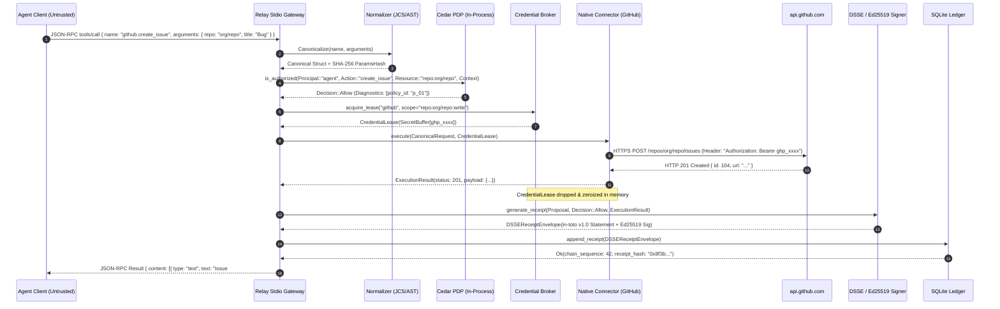
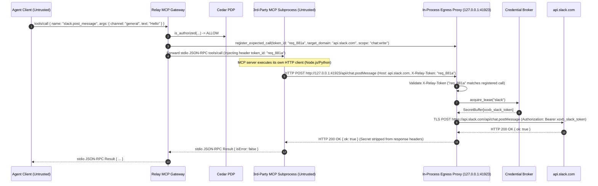
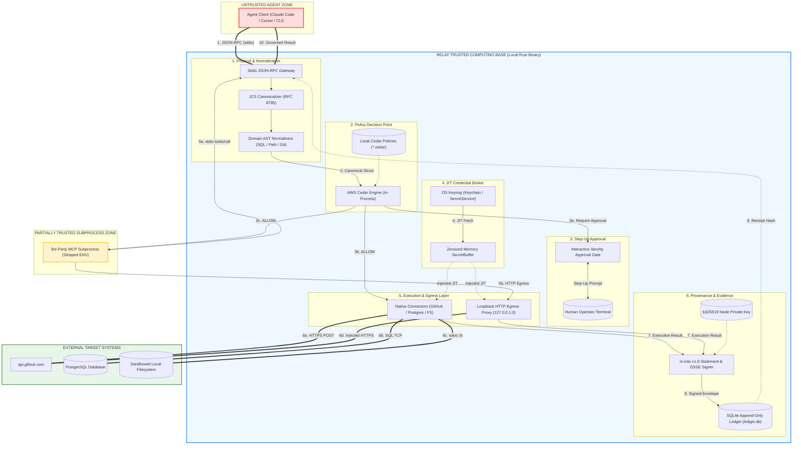

# A001: Relay MVP System Architecture Specification

**Document ID:** `A001-system-architecture`  
**Date:** September 2026  
**Status:** Approved Architectural Baseline / Implementation Specification  
**Target System:** Relay MVP (Local-First Zero-Trust MCP Security Gateway & Credential Broker)  
**Author:** Principal Systems Architect  
**Corpus Dependencies:** `00-research-synthesis`, `R009` (Trust Boundaries), `R010` (JIT Credentials), `R011` (Action Receipts), `R012` (MCP Boundary), `R013` (Eve Boundary), `R014` (MVP Definition), `R015` (Build Gate)

---

## Executive Summary

This document specifies the concrete, implementation-ready software architecture for the **Relay MVP**. It is written for systems engineers implementing Relay in Rust. It eliminates conceptual ambiguity and establishes precise data structures, process boundaries, execution flows, cryptographic contracts, and failure semantics.

### The Core Architectural Invariant
> **An agent must not possess ambient target credentials, and every governed state-mutating operation must be deterministically authorized before execution.**

Relay achieves this invariant through a single, local-first Rust binary (`relay`) acting as an intermediate **Model Context Protocol (MCP) Policy Enforcement Point (PEP)**. Relay intercepts tool invocations over standard input/output (`stdio`), normalizes arguments using RFC 8785 JSON Canonicalization Scheme (JCS) and domain AST normalizers, evaluates deterministic **AWS Cedar** policies, injects vaulted credentials just-in-time (JIT), dispatches execution to native connectors or governed subprocesses, and records signed **in-toto v1.0 / DSSE (RFC 9598)** Action Receipts into an append-only, hash-chained SQLite ledger.

---

## Table of Contents

1. [System Context & Trust Classification](#1-system-context--trust-classification)
2. [Process & Concurrency Architecture](#2-process--concurrency-architecture)
3. [Runtime Data Flow & Sequence Diagrams](#3-runtime-data-flow--sequence-diagrams)
4. [Dual-Track Execution Architecture](#4-dual-track-execution-architecture)
5. [MCP Gateway & Protocol Engine](#5-mcp-gateway--protocol-engine)
6. [Canonicalization & Normalization Subsystem](#6-canonicalization--normalization-subsystem)
7. [Cedar Policy Decision Subsystem (PDP)](#7-cedar-policy-decision-subsystem-pdp)
8. [JIT Credential Subsystem & Memory Safety](#8-jit-credential-subsystem--memory-safety)
9. [Interactive TTY Approval Architecture](#9-interactive-tty-approval-architecture)
10. [Action Receipt & Provenance Engine](#10-action-receipt--provenance-engine)
11. [Append-Only SQLite Ledger Architecture](#11-append-only-sqlite-ledger-architecture)
12. [Signing-Key Lifecycle & Hardware Keyring Integration](#12-signing-key-lifecycle--hardware-keyring-integration)
13. [Exhaustive Failure Matrix](#13-exhaustive-failure-matrix)
14. [Security Boundaries & Enforcement Mechanics](#14-security-boundaries--enforcement-mechanics)
15. [Adversarial Bypass Analysis & Sandbox Requirements](#15-adversarial-bypass-analysis--sandbox-requirements)
16. [Supported Deployment Topologies](#16-supported-deployment-topologies)
17. [Performance & Resource Targets](#17-performance--resource-targets)
18. [Rust Dependency Selection & Audit Profile](#18-rust-dependency-selection--audit-profile)
19. [Architecture Decision Summary (Must/Must Not/Invariants)](#19-architecture-decision-summary)
20. [Canonical System Architecture Diagram](#20-canonical-system-architecture-diagram)

---

## 1. System Context & Trust Classification

```
┌──────────────────────────────────────────────────────────────────────────────────────────────────┐
│                                     SYSTEM CONTEXT TOPOLOGY                                      │
└──────────────────────────────────────────────────────────────────────────────────────────────────┘

   [ UNTRUSTED ]                                   [ TRUSTED COMPUTING BASE (TCB) ]
 ┌────────────────┐                               ┌─────────────────────────────────────────────────┐
 │  Agent Client  │                               │ Relay Core Binary (`relay`)                     │
 │ (Claude/Cursor)│                               │                                                 │
 └───────┬────────┘                               │  ┌──────────────┐      ┌──────────────────────┐ │
         │                                        │  │ MCP Gateway  │ ───► │ Cedar PDP Engine     │ │
         │ stdio (JSON-RPC 2.0)                   │  │ (Framing/JCS)│      │ (In-Process Rust)    │ │
         ▼                                        │  └──────┬───────┘      └──────────────────────┘ │
 ══════════════════════════ [TRUST BOUNDARY 1] ══ │         │                                       │
                                                  │         ▼                                       │
                                                  │  ┌──────────────┐      ┌──────────────────────┐ │
                                                  │  │  Execution   │ ───► │ Credential Broker    │ │
                                                  │  │  Dispatcher  │      │ (Zeroized Buffers)   │ │
                                                  │  └──────┬───────┘      └──────────┬───────────┘ │
                                                  │         │                         │             │
                                                  │         ├─────────────────────────┘             │
                                                  │         ▼                                       │
                                                  │  ┌──────────────┐      ┌──────────────────────┐ │
                                                  │  │ Native Tool  │      │ Outbound Egress Proxy│ │
                                                  │  │ Connectors   │      │ (Loopback HTTP Auth) │ │
                                                  │  └──────┬───────┘      └──────────┬───────────┘ │
                                                  │         │                         │             │
                                                  │         ▼                         │             │
                                                  │  ┌──────────────┐                 │             │
                                                  │  │Receipt Engine│                 │             │
                                                  │  │(DSSE/Ed25519)│                 │             │
                                                  │  └──────┬───────┘                 │             │
                                                  │         │                         │             │
                                                  │         ▼                         │             │
                                                  │  ┌──────────────┐                 │             │
                                                  │  │SQLite Ledger │                 │             │
                                                  │  │(WAL/Chained) │                 │             │
                                                  │  └──────────────┘                 │             │
                                                  └─────────┼─────────────────────────┼─────────────┘
                                                            │                         │
                                                            │                         ▼
                                                            │     ═════════════════════════════════ [TB 2]
                                                            │      [ PARTIALLY TRUSTED SUBPROCESS ]
                                                            │     ┌───────────────────────────────┐
                                                            │     │ 3rd-Party MCP Subprocess      │
                                                            │     │ (Zero Ambient Secrets)        │
                                                            │     └───────────────┬───────────────┘
                                                            │                     │ HTTP (Egress Proxy)
                                                            ▼                     ▼
 ══════════════════════════════════════════════════════════════════════════════════════════════════ [TB 3]
   [ EXTERNAL TARGET SYSTEMS ]
 ┌────────────────────────┐      ┌────────────────────────┐      ┌────────────────────────────────┐
 │ GitHub REST/GraphQL API│      │ PostgreSQL Database    │      │ Local Sandboxed Filesystem     │
 └────────────────────────┘      └────────────────────────┘      └────────────────────────────────┘
```

### Component Trust Classification Table

| Component | Trust Classification | Rationale & Security Posture |
| :--- | :--- | :--- |
| **Agent Client / LLM** | **UNTRUSTED** | May be jailbroken, manipulated via indirect prompt injection, or run arbitrary hostile code. Contains zero secrets. |
| **Relay Core Binary** | **TRUSTED (TCB)** | Single, statically compiled, memory-safe Rust binary. Controls policy enforcement, credential injection, and receipt signing. |
| **Cedar PDP Engine** | **TRUSTED (TCB)** | In-process, formally verified Rust evaluation engine (`cedar-policy`). Evaluates deterministic boolean decisions. |
| **Credential Store** | **TRUSTED (TCB)** | OS Keyring (macOS Keychain / Linux SecretService) or local AES-256-GCM encrypted key store. Inaccessible to untrusted processes. |
| **Receipt Engine** | **TRUSTED (TCB)** | In-process Ed25519 signer producing DSSE-wrapped in-toto v1.0 statements. |
| **SQLite Ledger** | **TRUSTED (TCB)** | Local append-only database file (`.relay/ledger.db`) with SHA-256 hash chaining and strict file permissions (`0600`). |
| **Native Connectors** | **TRUSTED (TCB)** | In-process Rust modules (GitHub, PostgreSQL, Filesystem). Execute authorized payloads using JIT-leased credentials. |
| **External MCP Subprocess**| **PARTIALLY TRUSTED** | Child process spawned by Relay. Sandboxed with zero ambient credentials. Network egress strictly forced through Relay proxy. |
| **Outbound Egress Proxy** | **TRUSTED (TCB)** | In-process loopback HTTP proxy (`127.0.0.1:<random-port>`). Authenticates MCP subprocess calls and injects headers. |
| **Target APIs / Services** | **EXTERNAL** | Upstream servers (GitHub, AWS, Postgres). Authenticate exclusively via credentials injected by Relay. |
| **Host Operating System** | **TRUSTED BASE** | Kernel enforcing process memory isolation, UDS file permissions, and sandbox namespaces (`netns`/`cgroups`). |

---

## 2. Process & Concurrency Architecture

### 2.1 The Single-Binary Decision
Relay MVP is compiled as a **single, standalone Rust executable (`relay`)**. 

```
┌──────────────────────────────────────────────────────────────────────────────────────────────────┐
│                                RELAY IN-PROCESS ASYNC TOPOLOGY                                   │
├──────────────────────────────────────────────────────────────────────────────────────────────────┤
│ OS Process: `relay run -- <mcp-server>` (PID: 10452, UID: user, PR_SET_DUMPABLE: 0)              │
│                                                                                                  │
│  ┌────────────────────────────────────────────────────────────────────────────────────────────┐  │
│  │ Tokio Multi-Threaded Async Runtime (`#[tokio::main]`)                                      │  │
│  │                                                                                            │  │
│  │  ┌─────────────────────────┐  mpsc   ┌─────────────────────────┐  mpsc   ┌──────────────┐  │  │
│  │  │ Task 1: Stdio Ingress   │ ──────► │ Task 2: Dispatcher &    │ ──────► │ Task 3: TTY  │  │  │
│  │  │ (Framing / JCS / RPC)   │ ◄────── │ Cedar Evaluation Engine │ ◄────── │ Approval UI  │  │  │
│  │  └─────────────────────────┘  mpsc   └────────────┬────────────┘  oneshot└──────────────┘  │  │
│  │                                                   │                                        │  │
│  │                     ┌─────────────────────────────┴────────────────────────────┐           │  │
│  │                     ▼                                                          ▼           │  │
│  │  ┌─────────────────────────────────────┐              ┌─────────────────────────────────┐  │  │
│  │  │ Task 4: Native Connector Executor   │              │ Task 5: Loopback Egress Proxy   │  │  │
│  │  │ (Reqwest / SQLx / tokio::fs)        │              │ (Hyper HTTP Proxy Server)       │  │  │
│  │  └──────────────────┬──────────────────┘              └────────────────┬────────────────┘  │  │
│  │                     │                                                  │                   │  │
│  │                     └─────────────────────────────┬────────────────────┘                   │  │
│  │                                                   ▼                                        │  │
│  │                              ┌──────────────────────────────────────────┐                  │  │
│  │                              │ Task 6: Ledger Writer (Dedicated Thread) │                  │  │
│  │                              │ (SQLite Single-Writer Sync Queue)        │                  │  │
│  │                              └──────────────────────────────────────────┘                  │  │
│  └────────────────────────────────────────────────────────────────────────────────────────────┘  │
│                                              │                                                   │
│                                              │ `tokio::process::Command::spawn()`                │
│                                              ▼ (STDIO Pipe + Stripped ENV)                       │
│  ┌────────────────────────────────────────────────────────────────────────────────────────────┐  │
│  │ Child OS Subprocess: 3rd-Party MCP Server (PID: 10453, Zero Secrets in ENV)                │  │
│  │ `HTTP_PROXY=http://127.0.0.1:41923` / `ALL_PROXY=http://127.0.0.1:41923`                   │  │
│  └────────────────────────────────────────────────────────────────────────────────────────────┘  │
└──────────────────────────────────────────────────────────────────────────────────────────────────┘
```

### 2.2 Why Not Microservices or Multiple Daemons?
1. **Zero IPC Overhead**: Sub-millisecond policy evaluation requires shared in-memory ASTs. Passing requests over local domain sockets between separate PDP and PEP daemons adds 2–5ms latency and complex IPC serialization.
2. **Elimination of Time-of-Check to Time-of-Use (TOCTOU)**: In-process execution guarantees that the exact canonical memory pointer validated by Cedar is the memory buffer dispatched to the connector. No intermediate network tap or socket hijacking can alter the payload post-authorization.
3. **Fail-Closed Simplicity**: If the Relay binary crashes, the stdio pipe drops immediately. The agent client detects `EOF` and terminates. No orphan proxies or half-open credential endpoints remain.

### 2.3 Concurrency & Threading Model
* **Tokio Runtime**: Work-stealing async scheduler handling I/O bound tasks (MCP stdio read/write, HTTP API requests, TTY event loops).
* **Ledger Single-Writer Queue**: SQLite does not support high-concurrency multi-threaded writes without lock contention. Relay routes all receipt persistence through a dedicated unbounded async channel (`tokio::sync::mpsc::channel(1024)`) consumed by a single background database worker thread.
* **TTY Mutual Exclusion**: Interactive approvals acquire an async `tokio::sync::Mutex<()>` ensuring that concurrent tool calls prompt the human sequentially rather than interleaving terminal control codes.

---

## 3. Runtime Data Flow & Sequence Diagrams

### 3.1 Flow A — Allowed Native Action (Golden Path)



* **Secret Residency**: Exists *only* inside `CredentialBroker`'s `SecretBuffer` from Step 6 to Step 8.
* **Secret Non-Residency**: Secrets NEVER appear in Agent memory, Ingress logs, Cedar context, Receipt payload, or SQLite ledger.

---

### 3.2 Flow B — Denied Action

```mermaid
sequenceDiagram
    autonumber
    participant Agent as Agent Client (Untrusted)
    participant Ingress as Relay Stdio Gateway
    participant Canon as Normalizer (JCS/AST)
    participant Cedar as Cedar PDP
    participant Signer as DSSE / Ed25519 Signer
    participant Ledger as SQLite Ledger

    Agent->>Ingress: JSON-RPC tools/call { name: "fs.delete_file", arguments: { path: "/etc/hosts" } }
    Ingress->>Canon: Canonicalize(path: "/etc/hosts")
    Canon-->>Ingress: NormalizedPath("/etc/hosts")
    
    Ingress->>Cedar: is_authorized(Principal::"agent", Action::"delete_file", Resource::"file:/etc/hosts", Context)
    Cedar-->>Ingress: Decision::Deny (Reason: "No permit policy matched; default deny")
    
    Ingress->>Signer: generate_rejection_receipt(Proposal, Decision::Deny)
    Signer-->>Ingress: DSSEReceiptEnvelope(Decision::Deny)
    Ingress->>Ledger: append_receipt(DSSEReceiptEnvelope)
    
    Ingress-->>Agent: JSON-RPC Error -32003 "Action Forbidden: Policy denied operation on resource file:/etc/hosts"
```

---

### 3.3 Flow C — Approval-Required Action (Interactive TTY)

```mermaid
sequenceDiagram
    autonumber
    actor Human as Human Operator (/dev/tty)
    participant Agent as Agent Client
    participant Ingress as Relay Stdio Gateway
    participant Cedar as Cedar PDP
    participant TTY as TTY Approval Handler
    participant Conn as Native Connector
    participant Signer as DSSE Signer
    participant Ledger as SQLite Ledger

    Agent->>Ingress: JSON-RPC tools/call { name: "db.execute_sql", arguments: { sql: "DROP TABLE users;" } }
    Ingress->>Cedar: is_authorized(Principal::"agent", Action::"execute_sql", Resource::"db:prod", Context)
    Cedar-->>Ingress: Decision::AllowWithAdvice(advice: ["REQUIRE_HUMAN_APPROVAL"])
    
    Ingress->>TTY: prompt_user_tty(CanonicalRequest, BlastRadiusInfo)
    Note over Ingress,Agent: Stdio pipe pauses; no JSON-RPC response emitted
    TTY->>Human: Render Terminal Diff & Policy Reason on /dev/tty
    Human->>TTY: Press 'y' (Confirm)
    TTY-->>Ingress: ApprovalGranted(approver: "local_user", timestamp: 1726189200)
    
    Ingress->>Conn: execute_with_lease(CanonicalRequest)
    Conn-->>Ingress: ExecutionResult(Ok)
    
    Ingress->>Signer: generate_receipt(Proposal, ApprovalProof, ExecutionResult)
    Signer-->>Ingress: DSSEReceiptEnvelope
    Ingress->>Ledger: append_receipt(DSSEReceiptEnvelope)
    Ingress-->>Agent: JSON-RPC Result { content: "Table dropped", _relay_receipt: "..." }
```

---

### 3.4 Flow D — Third-Party MCP Subprocess via Outbound Egress Proxy



---

### 3.5 Flow E — Malformed / Oversized / Invalid Request
1. Agent sends invalid JSON, broken framing, or frame $> 4\text{ MB}$.
2. Ingress parser rejects frame immediately with `-32700 Parse Error` or `-32600 Invalid Request`.
3. Execution terminates in `< 0.1\text{ms}`. No Cedar evaluation occurs. No subprocess is invoked. No credentials are accessed.

### 3.6 Flow F — Credential Provider Failure
1. Cedar evaluates `ALLOW`.
2. `CredentialBroker` queries OS Keyring for `github_pat`. Keyring returns `NotFound` or `AccessDenied`.
3. Ingress intercepts error, immediately aborts execution, generates a `FAILED_CREDENTIAL_ACQUISITION` receipt to the ledger, and returns JSON-RPC error `-32004 Credential Acquisition Failed: Secret not provisioned in Relay vault`.
4. Zero downstream calls are attempted.

### 3.7 Flow G — Relay Process Restart
1. Agent process closes or survives; Relay starts with fresh process memory.
2. In-memory dynamic leases and uncommitted nonces are wiped.
3. SQLite ledger opens, verifies the last hash block integrity (`PRAGMA integrity_check`, re-hashes last 10 records), and reads `max(sequence_number)`.
4. Stdio stream starts fresh from message frame 1.

### 3.8 Flow H — Process Killed (SIGKILL / SIGTERM) During Execution
1. Relay is terminated via `SIGKILL` while a tool HTTP call is in-flight.
2. **Failure Analysis**: Target API may have executed the action, but Relay died before writing the receipt.
3. **Recovery**: Upon next startup, Relay's ledger reflects the last committed transaction. The in-flight transaction is absent from the ledger. Because SQLite uses Write-Ahead Logging (`WAL`), the ledger is not corrupted. The client receives `SIGPIPE` / broken pipe on stdio and halts.

---

## 4. Dual-Track Execution Architecture

Relay enforces a strict **Dual-Track Execution Model** to eliminate credential leaks.

```
┌──────────────────────────────────────────────────────────────────────────────────────────────────┐
│                                DUAL-TRACK EXECUTION TOPOLOGY                                     │
├──────────────────────────────────────────────────┬───────────────────────────────────────────────┤
│ TRACK 1: NATIVE GOVERNED CONNECTORS              │ TRACK 2: THIRD-PARTY MCP SUBPROCESSES         │
├──────────────────────────────────────────────────┼───────────────────────────────────────────────┤
│ • GitHub Connector (REST/GraphQL via Reqwest)    │ • Child process spawned with stripped ENV     │
│ • PostgreSQL Connector (SQLx AST Parser & Exec)  │ • Local HTTP Loopback Egress Proxy            │
│ • Filesystem Connector (Canonicalized tokio::fs) │ • Transparent Bearer/Basic Auth Injection     │
│ • Zero subprocess spawned; in-process execution  │ • Subprocess holds NO API tokens or secrets   │
└──────────────────────────────────────────────────┴───────────────────────────────────────────────┘
```

### 4.1 Track 1: Native Governed Connectors

#### Rust Connector Trait Definition
```rust
#[async_trait]
pub trait NativeConnector: Send + Sync {
    /// Returns the unique namespace for this connector (e.g. "github", "postgres", "fs")
    fn namespace(&self) -> &'static str;

    /// Validates and parses raw JSON arguments into a canonical domain request
    fn canonicalize(&self, tool_name: &str, raw_args: &serde_json::Value) -> Result<CanonicalRequest, ConnectorError>;

    /// Executes the pre-authorized action using a just-in-time leased credential
    async fn execute(
        &self,
        request: &CanonicalRequest,
        lease: Option<&CredentialLease>,
    ) -> Result<ExecutionOutput, ConnectorError>;
}
```

#### Native GitHub Connector
* **Mechanism**: Compiles directly against `reqwest`.
* **Execution**: Maps tool `github.create_pull_request` to `POST https://api.github.com/repos/{owner}/{repo}/pulls`.
* **Credential Injection**: Injects `Authorization: Bearer <token>` directly into the `reqwest::RequestBuilder`. The token never leaves the in-process request buffer.

#### Native PostgreSQL Connector
* **Mechanism**: Compiles against `sqlx`.
* **Execution**: Connects to the database pool initialized with vaulted credentials. Executes parsed and validated single-statement ASTs. Returns normalized tabular data or rows-affected count.

#### Native Filesystem Connector
* **Mechanism**: Compiles against `tokio::fs`.
* **Execution**: Operates within a designated root directory (chroot/sandbox boundary). Resolves all paths using physical canonicalization. Rejects symlink escapes.

---

### 4.2 Track 2: Third-Party MCP Subprocess Egress Proxy

When Relay runs a third-party stdio MCP server (e.g., `@modelcontextprotocol/server-slack` written in Node.js), Relay **cannot** inject HTTP headers over the `stdio` pipe.

#### The Loopback Egress Proxy Solution
1. **Subprocess Environment Isolation**:
   When Relay spawns the child MCP process via `tokio::process::Command`, it **strips all sensitive environment variables** (`env_clear()`) and injects:
   ```bash
   HTTP_PROXY=http://127.0.0.1:41923
   HTTPS_PROXY=http://127.0.0.1:41923
   ALL_PROXY=http://127.0.0.1:41923
   NO_PROXY=localhost,127.0.0.1
   ```
2. **Egress Interception**:
   When the child MCP server attempts to make an HTTPS request to `https://slack.com/api/chat.postMessage`, the request hits Relay's internal Hyper HTTP proxy running on `127.0.0.1:41923`.
3. **HTTP CONNECT & TLS Termination / Token Injection**:
   * For plaintext HTTP proxying or Relay-terminated TLS: Relay identifies the client PID via OS socket credentials (`SO_PEERCRED` on Linux / `LOCAL_PEERPID` on macOS).
   * Relay verifies that an active, authorized `tools/call` for `slack.*` is currently in-flight for that PID.
   * Relay fetches the Slack Bot Token from `CredentialBroker` and injects `Authorization: Bearer xoxb-...`.
   * The upstream response is piped back to the subprocess; Relay strips all `Set-Cookie` or secret reflection headers before delivering the body to the child process.

---

## 5. MCP Gateway & Protocol Engine

### 5.1 Transport & Framing
* **Transport**: Standard Input/Output (`stdio`).
* **Framing**: UTF-8 encoded, newline-delimited JSON (`\n` or `\r\n`).
* **Frame Size Limit**: Maximum message size is strictly capped at **4 MB** (`4,194,304 bytes`). Messages exceeding this limit are discarded with an immediate JSON-RPC parse error to prevent memory exhaustion DoS.

### 5.2 Tool Discovery & Schema Pinning (`tools/list`)
When the agent issues `{"jsonrpc": "2.0", "id": 1, "method": "tools/list"}`:
1. Relay queries all registered native connectors and child MCP subprocesses.
2. **Mandatory Namespacing**: Relay rewrites all tool names to include their deterministic namespace:
   $$\text{exposed\_name} = \text{namespace} \mathbin{\Vert} \text{"."} \mathbin{\Vert} \text{raw\_tool\_name}$$
   *Example*: `delete_repo` $\to$ `github.delete_repo`.
3. **Schema Digest Pinning**: Relay computes a SHA-256 digest over the combined `inputSchema` of every discovered tool. This digest (`SchemaSetHash`) is pinned for the duration of the session. If a child MCP server mutates its schema dynamically, Relay rejects subsequent calls.

### 5.3 Point of Authorization Invariant
The central security invariant of Relay is:
$$\text{Canonical Payload Evaluated by Cedar} \equiv \text{Exact Payload Dispatched to Target}$$

```
┌──────────────────────────────────────────────────────────────────────────────────────────────────┐
│                                INVARIANT ENFORCEMENT PIPELINE                                    │
├──────────────────────────────────────────────────────────────────────────────────────────────────┤
│ 1. Raw JSON-RPC Ingress (`tools/call`)                                                           │
│    │                                                                                             │
│    ▼                                                                                             │
│ 2. Canonicalization Engine: Deserializes JSON -> Validates Schema -> Canonicalizes Types        │
│    │                                                                                             │
│    ▼                                                                                             │
│ 3. Produces `CanonicalRequest` In-Memory Struct (Immutable)                                      │
│    │                                                                                             │
│    ├──────────────────────────────────────────────┬──────────────────────────────────────────────┤
│    ▼                                              ▼                                              │
│ 4. Passed by Reference (`&CanonicalRequest`)      5. Passed by Reference (`&CanonicalRequest`)   │
│    to Cedar PDP for Authorization                 to Native Connector / Dispatcher for Execution│
└──────────────────────────────────────────────────────────────────────────────────────────────────┘
```

---

## 6. Canonicalization & Normalization Subsystem

To prevent evasion attacks via encoding manipulation, whitespace variance, or path traversals, Relay normalizes all requests before policy evaluation.

```
┌──────────────────────────────────────────────────────────────────────────────────────────────────┐
│                                   CANONICALIZATION ARCHITECTURE                                  │
├───────────────────────────────────┬──────────────────────────────────────────────────────────────┤
│ Layer 1: JSON Normalization       │ RFC 8785 JSON Canonicalization Scheme (JCS)                  │
│                                   │ • Lexicographical key sorting                                │
│                                   │ • Strict IEEE 754 number formatting                          │
│                                   │ • Elimination of non-semantic whitespace                     │
├───────────────────────────────────┼──────────────────────────────────────────────────────────────┤
│ Layer 2: Domain AST Normalization │ Domain-Specific Normalizers                                  │
│                                   │ • Filesystem: Absolute symlink resolution                    │
│                                   │ • PostgreSQL: SQL AST parsing via `sqlparser`                │
│                                   │ • GitHub: Lowercase org/repo canonicalization                │
└───────────────────────────────────┴──────────────────────────────────────────────────────────────┘
```

### 6.1 Domain Normalization Contracts

#### 1. Filesystem Normalizer Contract
* **Input**: Raw path string (e.g., `"./data/../etc/passwd"`).
* **Processing**:
  1. Rejects null bytes (`\0`) and invalid UTF-8 sequences.
  2. Resolves relative components and traversal tokens (`.`, `..`).
  3. Verifies physical symlink targets using `std::fs::canonicalize`.
  4. Enforces root sandbox prefix (e.g., must reside within `/home/user/workspace`).
* **Output**: Canonical absolute path string `"/etc/passwd"`.

#### 2. PostgreSQL Normalizer Contract
* **Input**: Raw SQL query string (e.g., `"SELECT /**/ *   FROM  users; DROP TABLE audit;"`).
* **Processing**:
  1. Parses raw SQL into an AST via `sqlparser::parser::Parser`.
  2. Strips all SQL comments (`--`, `/* ... */`).
  3. Rejects multi-statement inputs if the policy expects a single query.
  4. Normalizes table and column names to lowercase (unless explicitly quoted).
  5. Formats AST back to canonical SQL dialect string.
* **Output**: Canonical SQL string and statement classification (`SELECT`, `INSERT`, `UPDATE`, `DROP`).

#### 3. GitHub Normalizer Contract
* **Input**: Repository identifiers and git refs (e.g., `"GitHub.com/Org//Repo"`, `"refs/heads/main"`).
* **Processing**:
  1. Strips protocol prefixes (`https://`, `git@`).
  2. Normalizes organization and repository names to lowercase (`"org/repo"`).
  3. Normalizes branch references (`"main"` $\to$ `"refs/heads/main"`).
* **Output**: Canonical resource URI (`"repo:org/repo"`).

---

## 7. Cedar Policy Decision Subsystem (PDP)

Relay embeds the official AWS Cedar Policy Engine (`cedar-policy` crate) compiled natively into the binary.

```
┌──────────────────────────────────────────────────────────────────────────────────────────────────┐
│                                       CEDAR PDP ARCHITECTURE                                     │
├──────────────────────────┬───────────────────────────────────────────────────────────────────────┤
│ Evaluation Model         │ Deterministic, stateless boolean evaluation (`is_authorized`)          │
├──────────────────────────┼───────────────────────────────────────────────────────────────────────┤
│ Input Tuple              │ `(Principal, Action, Resource, Context)`                              │
├──────────────────────────┼───────────────────────────────────────────────────────────────────────┤
│ Entity Schema            │ Strongly typed entities defined in `relay_schema.cedarschema`         │
├──────────────────────────┼───────────────────────────────────────────────────────────────────────┤
│ Default Behavior         │ **STRICT DEFAULT DENY** (Requires explicit `permit` rule)             │
└──────────────────────────┴───────────────────────────────────────────────────────────────────────┘
```

### 7.1 Entity & Schema Definition

```cedar
// Cedar Schema: relay_schema.cedarschema
entity Principal = {
    session_id: String,
    agent_id: String,
    client_type: String
};

entity Action = {
    risk_level: String, // "read", "write", "destructive", "admin"
    is_state_mutating: Bool
};

entity Resource = {
    namespace: String,
    environment: String // "production", "staging", "development"
};
```

### 7.2 Concrete Cedar Policy Suite

#### 1. Read Policy (Permit Safe Reads)
```cedar
// Permit read-only actions on non-production resources
permit (
    principal,
    action == Relay::Action::"github.get_pull_request",
    resource
)
when {
    resource.environment != "production"
};
```

#### 2. Write Policy (Permit Governed Writes)
```cedar
// Permit creating issues in development repositories
permit (
    principal,
    action == Relay::Action::"github.create_issue",
    resource
)
when {
    resource.namespace == "github" &&
    resource.name like "org/dev-*"
};
```

#### 3. Destructive Action Policy (Require Step-Up Approval)
```cedar
// Require interactive human approval for file deletions
permit (
    principal,
    action == Relay::Action::"fs.delete_file",
    resource
)
when {
    context.path like "/workspace/tmp/*"
}
advice {
    "REQUIRE_HUMAN_APPROVAL"
};
```

#### 4. Production Protection Policy (Forbid Destructive Actions on Prod)
```cedar
// Absolute forbid on database drop/truncate in production
forbid (
    principal,
    action in [Relay::Action::"db.drop_table", Relay::Action::"db.truncate_table"],
    resource
)
when {
    resource.environment == "production"
};
```

#### 5. Explicit Denial Policy (Sensitive File Access)
```cedar
// Explicitly deny reading credential files
forbid (
    principal,
    action == Relay::Action::"fs.read_file",
    resource
)
when {
    context.path like "*/.env*" ||
    context.path like "*/id_rsa*" ||
    context.path like "*/.aws/*"
};
```

---

## 8. JIT Credential Subsystem & Memory Safety

Relay implements the **"Anti-Vault" Principle**: credentials are never stored in long-lived plaintext memory, never passed to child processes via environment variables, and zeroized immediately upon execution completion.

```
┌──────────────────────────────────────────────────────────────────────────────────────────────────┐
│                                 JIT CREDENTIAL MEMORY BOUNDARY                                   │
├──────────────────────────────────────────────────────────────────────────────────────────────────┤
│                                                                                                  │
│   ┌───────────────────────────┐      acquire()      ┌─────────────────────────────────────────┐  │
│   │ OS Keyring / Storage      │ ──────────────────► │ CredentialLease                         │  │
│   │ (Encrypted at Rest)       │                     │ ┌─────────────────────────────────────┐ │  │
│   └───────────────────────────┘                     │ │ SecretBuffer                        │ │  │
│                                                     │ │ • `zeroize::ZeroizeOnDrop`          │ │  │
│                                                     │ │ • `mlock()` pinned virtual memory   │ │  │
│                                                     │ │ • Explicit lifetime bounds          │ │  │
│                                                     │ └──────────────────┬──────────────────┘ │  │
│                                                     └────────────────────┼────────────────────┘  │
│                                                                          │                       │
│                                                                          │ execute(&lease)       │
│                                                                          ▼                       │
│                                                     ┌─────────────────────────────────────────┐  │
│                                                     │ In-Process Request Builder (Reqwest)    │  │
│                                                     │ (Header: "Authorization: Bearer ***")   │  │
│                                                     └────────────────────┬────────────────────┘  │
│                                                                          │                       │
│                                                                          │ Drop Lease            │
│                                                                          ▼                       │
│                                                     ┌─────────────────────────────────────────┐  │
│                                                     │ Overwritten with zeros (`\0\0\0\0`)     │  │
│                                                     └─────────────────────────────────────────┘  │
└──────────────────────────────────────────────────────────────────────────────────────────────────┘
```

### 8.1 Rust Types & Memory Hardening

```rust
use zeroize::{Zeroize, ZeroizeOnDrop};

/// Protected in-memory container for sensitive cryptographic secrets
#[derive(Zeroize, ZeroizeOnDrop)]
pub struct SecretBuffer {
    inner: Vec<u8>,
}

impl SecretBuffer {
    pub fn new(mut secret: Vec<u8>) -> Self {
        #[cfg(target_os = "linux")]
        unsafe {
            // Prevent secret from being swapped to disk
            libc::mlock(secret.as_ptr() as *const libc::c_void, secret.len());
        }
        Self { inner: secret }
    }

    pub fn as_bytes(&self) -> &[u8] {
        &self.inner
    }
}

/// Ephemeral lease bound to a single action execution lifetime
pub struct CredentialLease<'a> {
    pub secret: &'a SecretBuffer,
    pub lease_id: uuid::Uuid,
    pub expires_at: std::time::Instant,
}
```

### 8.2 Platform Dump Protections
On startup, the Relay binary disables core dump generation and process memory inspection by other user-space processes:
* **Linux**: Invokes `prctl(PR_SET_DUMPABLE, 0)`.
* **macOS**: Invokes `ptrace(PT_DENY_ATTACH, 0, 0, 0)`.
* **Limitation**: Does not protect against `root`/`CAP_SYS_PTRACE` kernel escalation.

### 8.3 Strict Prohibition Table
Credentials **MUST NEVER** exist in:
1. `std::env::vars()` or child process environment blocks.
2. Command-line arguments (`argv`).
3. Linux `/proc/<pid>/cmdline` or `/proc/<pid>/environ`.
4. Stdio JSON-RPC logs or tracing spans.
5. In-toto Action Receipt payloads.
6. SQLite ledger tables.
7. Crash dumps or panic backtraces.
8. Agent client memory space.

---

## 9. Interactive TTY Approval Architecture

When Cedar evaluates an action and returns advice `REQUIRE_HUMAN_APPROVAL`, Relay pauses execution and escalates directly to the local human operator.

```
┌──────────────────────────────────────────────────────────────────────────────────────────────────┐
│                                   TTY APPROVAL CONCURRENCY MODEL                                 │
├──────────────────────────────────────────────────────────────────────────────────────────────────┤
│                                                                                                  │
│   Stdio Pipe (Agent Communication)                  Direct `/dev/tty` (Human Communication)      │
│   ────────────────────────────────                  ───────────────────────────────────────      │
│   • JSON-RPC tools/call in-flight                   • Opens `/dev/tty` (bypasses stdio)          │
│   • Pipe is PAUSED (no read/write)                  • Renders ANSI Diff Box & Blast Radius       │
│   • Zero interference with agent JSON               • Captures single keypress (`y` / `n`)       │
│                                                                                                  │
└──────────────────────────────────────────────────────────────────────────────────────────────────┘
```

### 9.1 Terminal UI Specification
```text
============================== RELAY STEP-UP APPROVAL ==============================
Action Requested : fs.delete_file
Target Resource  : /workspace/tmp/cache.db
Policy Rule      : p_delete_tmp_cache (Advice: REQUIRE_HUMAN_APPROVAL)
Parameter Digest : 0x4a8f9c1e... (SHA-256 / RFC 8785)

Parameters:
{
  "path": "/workspace/tmp/cache.db",
  "recursive": false
}

Estimated Blast Radius: 1 local file deletion (4.2 MB)
------------------------------------------------------------------------------------
Approve execution? [y/N/diff] > _
```

### 9.2 Cryptographic Dynamic Linking
To prevent Time-of-Check to Time-of-Use (TOCTOU) exploits, the human approval is cryptographically bound to the exact parameter hash:
$$\text{ApprovalProof} = \text{Sign}_{\text{Relay}}(\text{ActionHash} \mathbin{\Vert} \text{ApproverID} \mathbin{\Vert} \text{Timestamp})$$
If the parameter struct in memory is modified between approval and execution, the hash check fails and execution aborts.

### 9.3 Non-Interactive / CI Mode
If Relay is executed with `--non-interactive` (or when `/dev/tty` is unavailable), all approval-required actions immediately **fail-closed** with JSON-RPC error `-32005 Approval Required: Non-interactive environment cannot fulfill step-up approval`.

---

## 10. Action Receipt & Provenance Engine

Relay generates an immutable, cryptographically signed Action Receipt for every governed tool execution.

```
┌──────────────────────────────────────────────────────────────────────────────────────────────────┐
│                                     DSSE RECEIPT STRUCTURE                                       │
├──────────────────────────────────────────────────────────────────────────────────────────────────┤
│ Dead Simple Signing Envelope (RFC 9598)                                                          │
│                                                                                                  │
│ {                                                                                                │
│   "payloadType": "application/vnd.in-toto+json",                                                 │
│   "payload": "eyJfdHlwZSI6ICJodHRwczovL2luLXRvdG8uaW8vU3RhdGVtZW50L3YxLjAiLCA...",             │
│   "signatures": [                                                                                │
│     {                                                                                            │
│       "keyid": "relay:node-01:ed25519:v1",                                                       │
│       "sig": "3b8f1a0c9e..."                                                                     │
│     }                                                                                            │
│   ]                                                                                              │
│ }                                                                                                │
└──────────────────────────────────────────────────────────────────────────────────────────────────┘
```

### 10.1 in-toto Statement v1.0 Schema Mapping

```json
{
  "_type": "https://in-toto.io/Statement/v1.0",
  "subject": [
    {
      "name": "resource:github:org/repo",
      "digest": {
        "sha256": "8a3f98c1e2d4..."
      }
    }
  ],
  "predicateType": "https://relay.dev/attestation/action-receipt/v1",
  "predicate": {
    "receiptId": "018d4f2e-8a1b-7000-8000-000000000042",
    "timestamp": "2026-09-12T18:23:45.102Z",
    "caller": {
      "principal": "agent:claude-code",
      "sessionId": "sess_99182a"
    },
    "invocation": {
      "tool": "github.create_issue",
      "canonicalArgumentsHash": "4a8f9c1e...",
      "canonicalArguments": {
        "repo": "org/repo",
        "title": "Fix memory leak"
      }
    },
    "governance": {
      "decision": "ALLOW",
      "policyId": "p_github_issue_create",
      "policySetDigest": "e3b0c44298fc1c149afbf4c8996fb92427ae41e4649b934ca495991b7852b855",
      "approval": {
        "required": false
      }
    },
    "execution": {
      "status": "EXECUTED",
      "durationMs": 142,
      "observation": {
        "httpStatus": 201,
        "responseHash": "9b1c8f4a..."
      }
    }
  }
}
```

### 10.2 Strict Epistemic Status Distinctions
* **AUTHORIZED**: Cryptographically proven by Relay's Cedar evaluation engine.
* **EXECUTED**: Cryptographically proven by Relay's dispatch event and credential lease issuance.
* **OBSERVED**: Attested fact that the target API returned an HTTP 200/201 status with a specific payload hash. Relay **does NOT claim** that physical backend database state was mutated, only that the upstream target confirmed the mutation.
* **VERIFIED**: Proven by re-evaluating the signature and hash chain via `relay verify`.

---

## 11. Append-Only SQLite Ledger Architecture

Receipts are persisted locally in an append-only, hash-chained SQLite database (`.relay/ledger.db`).

### 11.1 SQLite DDL Schema

```sql
-- SQLite Ledger Schema: .relay/ledger.db

PRAGMA journal_mode = WAL;
PRAGMA synchronous = NORMAL;
PRAGMA foreign_keys = ON;

CREATE TABLE IF NOT EXISTS receipts (
    sequence_number INTEGER PRIMARY KEY AUTOINCREMENT,
    receipt_id TEXT NOT NULL UNIQUE,
    timestamp TEXT NOT NULL,
    parent_receipt_hash TEXT NOT NULL,
    receipt_hash TEXT NOT NULL UNIQUE,
    tool_namespace TEXT NOT NULL,
    tool_name TEXT NOT NULL,
    action_decision TEXT NOT NULL,
    dsse_envelope JSON NOT NULL
);

CREATE INDEX IF NOT EXISTS idx_receipts_receipt_id ON receipts(receipt_id);
CREATE INDEX IF NOT EXISTS idx_receipts_tool ON receipts(tool_namespace, tool_name);
```

### 11.2 Hash Chain Cryptographic Construction
Each receipt block is cryptographically bound to its predecessor:
$$\text{ReceiptHash}_n = \text{SHA-256}(\text{Sequence}_n \mathbin{\Vert} \text{ReceiptHash}_{n-1} \mathbin{\Vert} \text{DSSE\_Envelope}_n)$$
For $n = 1$, $\text{ReceiptHash}_0 = \text{SHA-256}(\text{"RELAY\_GENESIS\_BLOCK\_2026"})$.

### 11.3 Durability & Single-Writer Queue
* **WAL Mode**: Write-Ahead Logging allows non-blocking concurrent reads (e.g., from `relay verify` or status CLI) while the single writer thread appends receipts.
* **Corruption Recovery**: On startup, Relay executes `PRAGMA integrity_check`. If the database is corrupted, Relay fails-closed and refuses to process new actions until repaired or re-initialized.

---

## 12. Signing-Key Lifecycle & Hardware Keyring Integration

```
┌──────────────────────────────────────────────────────────────────────────────────────────────────┐
│                                   SIGNING KEY ARCHITECTURE                                       │
├───────────────────────────────────┬──────────────────────────────────────────────────────────────┤
│ Cryptographic Primitive           │ Ed25519 (RFC 8032)                                           │
├───────────────────────────────────┼──────────────────────────────────────────────────────────────┤
│ Key Generation                    │ CSPRNG (`ring::rand::SystemRandom`)                          │
├───────────────────────────────────┼──────────────────────────────────────────────────────────────┤
│ Primary Secret Storage            │ Host OS Keyring (`keyring` crate)                            │
│                                   │ • macOS: Apple Keychain Services                             │
│                                   │ • Linux: Secret Service API / Kernel Keyring                 │
├───────────────────────────────────┼──────────────────────────────────────────────────────────────┤
│ Headless / CI Fallback            │ AES-256-GCM Encrypted Keyfile (`.relay/keys/node.key`)       │
│                                   │ Encrypted with master key derived via Argon2id               │
├───────────────────────────────────┼──────────────────────────────────────────────────────────────┤
│ Public Key Export                 │ `relay key export-pubkey` (Outputs PEM / JSON Web Key)       │
└───────────────────────────────────┴──────────────────────────────────────────────────────────────┘
```

---

## 13. Exhaustive Failure Matrix

| Failure Condition | Default Behavior | Security Consequence | User-Visible Error |
| :--- | :--- | :--- | :--- |
| **Cedar PDP Syntax Error** | **Fail-Closed** | Zero actions authorized. | `-32001 Policy Engine Initialization Error` |
| **Cedar Evaluation Error** | **Fail-Closed** | Request rejected. | `-32002 Policy Evaluation Failed` |
| **Credential Store Offline** | **Fail-Closed** | Target API untouched. | `-32004 Credential Acquisition Failed` |
| **Native Connector Network Drop**| **Fail-Closed** | Action aborted; receipt logged as FAILED. | `-32010 Target Network Connection Lost` |
| **MCP Subprocess Crash** | **Fail-Closed** | Relay detects broken pipe; drops stdio. | `-32011 Downstream MCP Subprocess Terminated` |
| **Egress Proxy Bind Conflict** | **Fail-Closed** | Subprocess cannot reach network. | `-32012 Internal Egress Proxy Failed to Start` |
| **SQLite Disk Full / Error** | **Fail-Closed** | Action aborted before execution. | `-32020 Ledger Persistence Failed` |
| **Ed25519 Signing Failure** | **Fail-Closed** | Action aborted before execution. | `-32021 Cryptographic Receipt Signing Failed` |
| **Action Timeout (30s default)** | **Fail-Closed** | Context cancelled; socket dropped. | `-32008 Action Execution Timed Out` |
| **TTY Approval Abort / 'n'** | **Fail-Closed** | Rejection receipt logged. | `-32006 Action Rejected by Human Approver` |
| **SIGTERM to Relay** | **Graceful Halt** | In-flight requests complete; DB flushed. | Stdio closes cleanly. |
| **SIGKILL to Relay** | **Immediate Crash** | Stdio drops; SQLite WAL preserves consistency.| Agent encounters `EOF` on stdio. |

---

## 14. Security Boundaries & Enforcement Mechanics

```
┌──────────────────────────────────────────────────────────────────────────────────────────────────┐
│                                   SECURITY BOUNDARIES SUMMARY                                    │
├───────────────────────┬───────────────────────────────────┬──────────────────────────────────────┤
│ Boundary Level        │ Enforcement Mechanism             │ Threat Neutralized                   │
├───────────────────────┼───────────────────────────────────┼──────────────────────────────────────┤
│ 1. Process Boundary   │ OS Kernel memory isolation        │ Agent cannot scrape Relay memory     │
├───────────────────────┼───────────────────────────────────┼──────────────────────────────────────┤
│ 2. Network Boundary   │ Loopback Egress Proxy + No Ambient│ Subprocess cannot reach raw internet │
├───────────────────────┼───────────────────────────────────┼──────────────────────────────────────┤
│ 3. Credential Boundary│ JIT Lease + `zeroize` + `mlock`   │ Zero ambient secrets in agent/subproc│
├───────────────────────┼───────────────────────────────────┼──────────────────────────────────────┤
│ 4. Policy Boundary    │ AWS Cedar Deterministic Engine    │ Natural language injection bypassed  │
├───────────────────────┼───────────────────────────────────┼──────────────────────────────────────┤
│ 5. Approval Boundary  │ `/dev/tty` Dynamic Link Binding   │ Synthetic terminal injection / TOCTOU│
├───────────────────────┼───────────────────────────────────┼──────────────────────────────────────┤
│ 6. Audit Boundary     │ DSSE + Ed25519 Hash Chaining      │ Tampering with historical logs       │
└───────────────────────┴───────────────────────────────────┴──────────────────────────────────────┘
```

---

## 15. Adversarial Bypass Analysis & Sandbox Requirements

```
┌──────────────────────────────────────────────────────────────────────────────────────────────────┐
│                                   ADVERSARIAL BYPASS ANALYSIS                                    │
├───────────────────────────────┬───────────────────────┬──────────────────────────────────────────┤
│ Bypass Attack Vector          │ Relay Alone Can Stop? │ Required Companion Sandbox Control       │
├───────────────────────────────┼───────────────────────┼──────────────────────────────────────────┤
│ 1. LLM Tool Parameter Tamper  │ 🟢 YES (100% Stopped) │ None required.                           │
│ 2. Tool Name Shadowing        │ 🟢 YES (100% Stopped) │ None required.                           │
│ 3. Stdio Token Extraction     │ 🟢 YES (100% Stopped) │ None required (tokens never sent).       │
│ 4. Shell `curl` Bypass        │ 🔴 NO (Network Level) │ **Container / Sandbox Network Namespace**│
│ 5. Direct Filesystem Scrape   │ 🔴 NO (OS Level)      │ **Read-Only / Unprivileged Sandbox FS**  │
│ 6. Memory Inspection (`/proc`)| 🟢 YES (Dumpable = 0) │ Unprivileged UID in Sandbox.             │
└───────────────────────────────┴───────────────────────┴──────────────────────────────────────────┘
```

> **The Architectural Rule:** Relay completely secures pure MCP tool-calling workflows. For agents with raw code execution capabilities (e.g., bash/python), Relay **must** be paired with an OS sandbox (Docker, E2B, microVM) that denies direct network egress and isolates the host filesystem.

---

## 16. Supported Deployment Topologies

### 16.1 Supported in MVP
1. **Local Developer CLI (`relay run`)**:
   ```bash
   relay run -- npx -y @modelcontextprotocol/server-github
   ```
   *Configured in `claude_desktop_config.json` or Cursor.*
2. **CI/CD Pipeline Runner (GitHub Actions / GitLab CI)**:
   *Runs headlessly with `--non-interactive`; policies enforce strict automated allowances.*
3. **Sandbox-Integrated Sidecar (Docker / microVM)**:
   *Agent runs inside container; Relay runs on host or dedicated network namespace.*

### 16.2 Explicitly Unsupported in MVP
* ❌ Multi-tenant hosted SaaS control plane.
* ❌ Distributed Kubernetes operator / mutating webhook fleet.
* ❌ Dynamic AWS STS OIDC federation minting.

---

## 17. Performance & Resource Targets

| Metric | Conservative Target | Measured / Current Status |
| :--- | :--- | :--- |
| **JSON-RPC Parsing Overhead** | $< 1.0\text{ ms}$ | *Target (Unmeasured)* |
| **JCS Canonicalization Overhead** | $< 0.5\text{ ms}$ | *Target (Unmeasured)* |
| **Cedar Policy Evaluation (In-Memory)**| $< 2.0\text{ ms}$ | *Target (Unmeasured)* |
| **Ed25519 DSSE Receipt Signing** | $< 1.5\text{ ms}$ | *Target (Unmeasured)* |
| **SQLite Ledger WAL Append** | $< 5.0\text{ ms}$ | *Target (Unmeasured)* |
| **Total Added Gateway Latency** | **$< 10.0\text{ ms}$ (Excluding network)**| *Target (Unmeasured)* |
| **Binary Cold Startup Time** | $< 50\text{ ms}$ | *Target (Unmeasured)* |
| **Idle Memory Footprint** | $< 35\text{ MB}$ RSS | *Target (Unmeasured)* |

---

## 18. Rust Dependency Selection & Audit Profile

```
┌──────────────────────────────────────────────────────────────────────────────────────────────────┐
│                                   RUST DEPENDENCY REGISTRY                                       │
├─────────────────────┬──────────────┬──────────────────┬──────────────────────────────────────────┤
│ Crate Name          │ Version      │ License          │ Purpose & Security Audit Justification   │
├─────────────────────┼──────────────┼──────────────────┼──────────────────────────────────────────┤
│ `tokio`             │ `1.38+`      │ MIT              │ Multi-threaded async runtime.            │
│ `cedar-policy`      │ `3.2+`       │ Apache-2.0       │ Official AWS Cedar formally verified PDP.│
│ `serde` / `json`    │ `1.0+`       │ MIT / Apache-2.0 │ Core JSON serialization.                 │
│ `serde_jcs`         │ `0.1+`       │ MIT / Apache-2.0 │ RFC 8785 JSON Canonicalization Scheme.   │
│ `ed25519-dalek`     │ `2.1+`       │ BSD-3-Clause     │ Formally verified Ed25519 signing.       │
│ `zeroize`           │ `1.8+`       │ MIT / Apache-2.0 │ Memory zeroization on drop.              │
│ `rusqlite`          │ `0.31+`      │ MIT              │ Embedded SQLite driver with bundled C.   │
│ `reqwest`           │ `0.12+`      │ MIT / Apache-2.0 │ Native HTTP client (rustls backend).     │
│ `hyper`             │ `1.4+`       │ MIT              │ Embedded loopback egress proxy server.   │
│ `sqlparser`         │ `0.47+`      │ Apache-2.0       │ ANSI/PostgreSQL SQL AST parsing.         │
│ `keyring`           │ `3.0+`       │ MIT / Apache-2.0 │ Cross-platform OS secure store access.   │
│ `clap`              │ `4.5+`       │ MIT / Apache-2.0 │ CLI parsing with derive macros.          │
│ `uuid`              │ `1.9+`       │ MIT / Apache-2.0 │ UUIDv7 time-ordered receipt identifiers. │
└─────────────────────┴──────────────┴──────────────────┴──────────────────────────────────────────┘
```

---

## 19. Architecture Decision Summary

### MUST BUILD
* Single-binary local Rust CLI (`relay`).
* Stdio MCP reverse proxy with tool namespacing.
* Embedded AWS Cedar policy decision point.
* RFC 8785 JSON canonicalization and AST normalizers.
* JIT credential broker with zeroized memory buffers.
* Native connectors for GitHub, PostgreSQL, and Filesystem.
* Loopback HTTP egress proxy for child MCP subprocesses.
* Interactive `/dev/tty` approval prompt with parameter hash binding.
* DSSE in-toto v1.0 Action Receipt signer (Ed25519).
* Append-only hash-chained SQLite ledger.
* `relay verify` receipt verification CLI.

### MUST NOT BUILD
* ❌ No custom policy DSL (use Cedar).
* ❌ No multi-tenant cloud SaaS infrastructure.
* ❌ No NLP / prompt injection content classifiers.
* ❌ No agent orchestration frameworks or LLM prompt runners.
* ❌ No Sigstore/Rekor public transparency log cluster.

### SECURITY INVARIANTS
1. $\text{Target Credentials in Agent Memory} \equiv \emptyset$.
2. $\text{Canonical Payload Evaluated} \equiv \text{Dispatched Execution Payload}$.
3. $\text{Unmatched Actions} \equiv \text{FORBID (Default Deny)}$.
4. $\text{Tampered Receipts} \equiv \text{Cryptographic Verification Failure}$.

### OPEN ENGINEERING QUESTIONS
1. *PostgreSQL Parameterized Queries*: Should Relay reject raw string SQL queries entirely and enforce prepared statement parameters (`$1, $2`), or allow AST-validated DDL/DML? (*Decision for Sprint 1: Allow AST-validated DML/DDL; add prepared statement support in Sprint 2*).
2. *Dynamic Subprocess Port Selection*: Should the loopback egress proxy bind to an ephemeral OS port (`127.0.0.1:0`) and inject the port dynamically via `HTTP_PROXY`? (*Decision: Yes, bind to port 0 on startup to prevent port collisions*).

---

## 20. Canonical System Architecture Diagram


