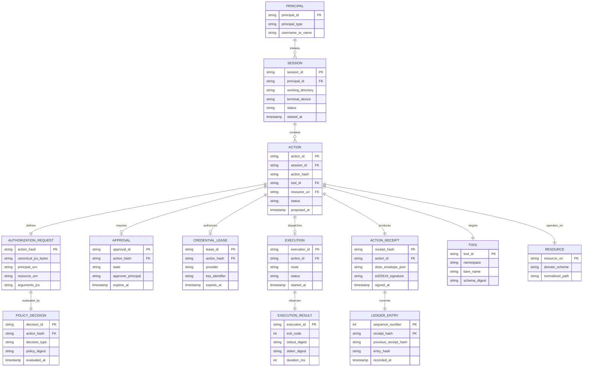

# A002: Relay MVP Canonical Domain Model Specification

**Document ID:** `A002-domain-model`  
**Date:** September 2026  
**Status:** Approved Domain Model Specification  
**Target System:** Relay MVP (Local-First Zero-Trust MCP Security Gateway)  
**Author:** Domain & Security Architect  
**Corpus Dependencies:** `A001-system-architecture`, `R014-mvp-definition`, `R015-build-gate`, `00-research-synthesis`, `R003` (Authority Model), `R009` (Trust Boundaries), `R010` (JIT Credentials), `R011` (Action Receipts), `R012` (MCP Boundary)

---

## Executive Summary

This document specifies the **canonical domain model for the Relay MVP**. It translates the system architecture defined in `A001` into a rigorous, unambiguous set of domain entities, value objects, lifecycle state machines, cryptographic invariants, and relationship boundaries.

### Scope & Domain Discipline
In adherence to the MVP build gate (`R014`, `R015`), this domain model strictly enforces:
1. **Zero Enterprise Bloat:** No distributed multi-tenant tenancy hierarchies, no bespoke policy DSLs, no complex asynchronous approval federation engines, and no speculative multi-agent consensus algorithms.
2. **The "Anti-Vault" Principle:** Secrets are ephemeral memory-only execution primitives. Secrets **never** become persisted domain objects or ledger fields.
3. **Explicit Separation of Proposal, Authorization, and Execution:** An agent's requested action is conceptually distinct from the authorized action, which is distinct from the dispatched execution and the observed result.
4. **Deterministic Identity & Canonical Form:** Cryptographic identity is derived strictly from RFC 8785 JSON Canonicalization Scheme (JCS) and domain-specific AST normalization.

---

## 1. Domain Design Principles

The Relay domain model is governed by nine immutable design principles:

```
┌──────────────────────────────────────────────────────────────────────────────────────────────────┐
│                                   CORE DOMAIN DESIGN PRINCIPLES                                  │
├────────────────────────────────┬────────────────────────────────┬────────────────────────────────┤
│ 1. Immutable Security State    │ 2. Deterministic Authorization │ 3. Canonical Identity          │
│ Security-critical entities are │ Policy evaluation on identical │ Every action and resource has  │
│ append-only and immutable.     │ canonical inputs yields        │ exactly one canonical binary   │
│ Mutability is confined to      │ identical decisions.           │ representation and digest.     │
│ explicit transient state.      │                                │                                │
├────────────────────────────────┼────────────────────────────────┼────────────────────────────────┤
│ 4. Zero Secrets in Domain      │ 5. Epistemological Segregation │ 6. Decoupled Execution         │
│ Persistent entities hold zero  │ Receipts strictly separate     │ Authorization grants right to  │
│ plaintext secrets or keys.     │ Relay assertions, observations,│ execute; execution is a        │
│ Credentials are transient.     │ and external target facts.     │ separate physical attempt.     │
├────────────────────────────────┼────────────────────────────────┼────────────────────────────────┤
│ 7. Receipts are Evidence       │ 8. Explicit State Machines     │ 9. Unambiguous Identifiers     │
│ Receipts attest to what        │ State transitions are total,   │ Entities use typed, prefixed   │
│ occurred; policy authorizes    │ deterministic, and machine-    │ ULIDs or cryptographic hashes; │
│ what may occur.                │ testable.                      │ no ambient or untyped IDs.     │
└────────────────────────────────┴────────────────────────────────┴────────────────────────────────┘
```

### Detailed Principle Rationale

1. **Security-Critical Data is Immutable Where Practical:**  
   Once an `AuthorizationRequest`, `PolicyDecision`, `Approval`, or `ActionReceipt` is finalized, its fields cannot be mutated. State progression is represented by generating successor entities or explicit lifecycle transitions.
2. **Policy Decisions are Deterministic:**  
   The policy engine (AWS Cedar) is a pure function: $f(\text{Request}, \text{Entities}, \text{Policies}) \to \text{Decision}$. Ambient system state (such as wall-clock time or network status) must be passed as explicit, canonical request attributes.
3. **Authorization Inputs Must be Canonical:**  
   To defeat parser-divergence and semantic ambiguity attacks (e.g., Unicode normalization, whitespace smuggling, key reordering, floating-point drift), authorization operates exclusively on RFC 8785 JCS canonicalized byte representations.
4. **Secrets Must Never Become Persisted Domain Objects:**  
   Domain entities like `CredentialLease` contain only authorization metadata (provider, key alias, expiration, scope). The raw secret bytes exist solely in volatile, zeroized memory buffers (`secrecy::SecretString`) during execution dispatch.
5. **Evidence Must Distinguish Fact, Observation, and Assertion:**  
   The domain distinguishes between:
   - **Asserted by Relay:** Statements Relay guarantees under its own signature (e.g., "Policy P evaluated to ALLOW at time T").
   - **Observed by Relay:** Direct sensory inputs (e.g., "Subprocess stdout produced 24 bytes with SHA-256 digest D").
   - **External Fact:** Unverified claims made by external systems or agents (e.g., "GitHub API returned status 200").
6. **Authorization and Execution are Separate Concepts:**  
   Authorization creates a valid `ActionLease` or permission grant. Execution is the physical act of dispatching an I/O operation. An authorized action may fail to execute (e.g., timeout, network partition), and an execution failure does not invalidate the authorization decision.
7. **Receipts are Evidence, Not the Source of Authorization:**  
   A signed `ActionReceipt` is an archival attestation for auditability and non-repudiation. It is generated *after* execution settles and records the entire chain of custody.
8. **State Transitions Must be Explicit:**  
   Entities transition across states via closed finite state machines. There are no implicit side-effects or silent multi-state jumps. Invalid transitions trigger hard domain errors.
9. **Identifiers Should be Stable and Unambiguous:**  
   Entities are addressed either by content-addressed cryptographic digests (`ActionHash`, `SchemaDigest`) or typed, monotonically sortable identifiers (`ActionId: act_...`, `SessionId: sess_...`).

---

## 2. Minimal Canonical Entity Inventory

To prevent architectural bloat, Relay MVP defines exactly **twelve (12) canonical entities** and **four (4) value objects**.

```
┌──────────────────────────────────────────────────────────────────────────────────────────────────┐
│                                   CANONICAL ENTITY INVENTORY                                     │
├───────────────────┬──────────────┬────────────────────────┬─────────────┬─────────────┬──────────┤
│ Entity Name       │ Classification│ Primary Identity       │ Persisted?  │ Immutable?  │ Has Secret│
├───────────────────┼──────────────┼────────────────────────┼─────────────┼─────────────┼──────────┤
│ Principal         │ Entity       │ PrincipalId (URN)      │ Ephemeral   │ Yes         │ NO       │
│ Agent             │ Entity       │ AgentId (URN)          │ Config/DB   │ Yes         │ NO       │
│ Session           │ Entity       │ SessionId (`sess_...`) │ SQLite      │ State-Only  │ NO       │
│ Tool              │ Entity       │ ToolId (`srv.tool`)    │ Config/DB   │ Schema-Pin  │ NO       │
│ Resource          │ Value Object │ ResourceUri (URN)      │ Ephemeral   │ Yes         │ NO       │
│ Action            │ Entity       │ ActionId (`act_...`)   │ SQLite      │ State-Only  │ NO       │
│ AuthorizationReq  │ Value Object │ ActionHash (SHA-256)   │ SQLite/Rcpt │ Yes         │ NO       │
│ PolicyDecision    │ Value Object │ DecisionId (`dec_...`) │ SQLite/Rcpt │ Yes         │ NO       │
│ Approval          │ Entity       │ ApprovalId (`appr_...`)| SQLite/Rcpt │ State-Only  │ NO       │
│ CredentialLease   │ Value Object │ LeaseId (`lease_...`)  │ SQLite/Rcpt │ Yes (Meta)  │ NO       │
│ Execution         │ Entity       │ ExecutionId (`exec_...`)| SQLite     │ State-Only  │ NO       │
│ ExecutionResult   │ Value Object │ OutputHash (SHA-256)   │ SQLite/Rcpt │ Yes         │ NO       │
│ ActionReceipt     │ Entity       │ ReceiptHash (SHA-256)  │ SQLite/FS   │ Yes (Signed)│ NO       │
│ LedgerEntry       │ Entity       │ SequenceNumber (u64)   │ SQLite      │ Yes (Chained)│ NO      │
└───────────────────┴──────────────┴────────────────────────┴─────────────┴─────────────┴──────────┘
```

### Entity Inclusion Rationale

1. **`Principal` & `Agent`:**  
   Distinguishes the actor executing the action (the human user or the autonomous agent runtime) from the tool being invoked.
2. **`Session`:**  
   Binds an active sequence of agent tool calls to an authenticated transport connection, terminal context, and working directory.
3. **`Tool`:**  
   Represents a registered, namespaced MCP capability with an immutable SHA-256 schema digest.
4. **`Resource` (Value Object):**  
   The normalized target URI (file, database table, GitHub repository) being inspected or mutated.
5. **`Action`:**  
   The root domain aggregate representing a single unit of governed work. Owns the state progression from proposal to settlement.
6. **`AuthorizationRequest` (Value Object):**  
   The immutable, canonical input provided to the Cedar policy evaluation engine.
7. **`PolicyDecision` (Value Object):**  
   The immutable outcome (`ALLOW`, `DENY`, `APPROVAL_REQUIRED`) produced by Cedar.
8. **`Approval`:**  
   Captures interactive human confirmation when Cedar returns `APPROVAL_REQUIRED`. Cryptographically bound to the `ActionHash`.
9. **`CredentialLease` (Value Object):**  
   Non-secret metadata describing an ephemeral credential granted for an authorized action.
10. **`Execution` & `ExecutionResult`:**  
    Tracks the physical dispatch attempt across native connectors or subprocess proxies and the resulting exit status, stdout/stderr hashes, and durations.
11. **`ActionReceipt`:**  
    The signed in-toto v1.0 Statement and DSSE Envelope proving end-to-end authorization, approval, and execution.
12. **`LedgerEntry`:**  
    The append-only hash-chained storage node in the local SQLite ledger (`ledger.db`).

---

## 3. Principal and Agent Model

```
┌──────────────────────────────────────────────────────────────────────────────────────────────────┐
│                                   PRINCIPAL & AGENT TOPOLOGY                                     │
├──────────────────────────────────────────────────────────────────────────────────────────────────┤
│                                                                                                  │
│   Principal::User ("principal:user:local:sumeet")                                                │
│      │                                                                                           │
│      ▼ delegates via MCP stdio pipe                                                              │
│   Principal::Agent ("principal:agent:claude-code:v1.2")                                          │
│      │                                                                                           │
│      ├──── Session ("sess_01J8YV1...": CWD=/workspace, TTY=/dev/pts/3)                            │
│      │                                                                                           │
│      └──── (Optional Child Agent: "principal:agent:subagent-researcher")                          │
│                                                                                                  │
│   [ Non-Principal Entities / Infrastructure Components ]                                         │
│   • Tool::GitHub ("github.create_issue") ─────────► Execution Target                             │
│   • Subprocess MCP Server (PID 10842) ────────────► Execution Target / Route                     │
│   • Relay Core Binary (TCB) ──────────────────────► Policy Enforcement Point                     │
└──────────────────────────────────────────────────────────────────────────────────────────────────┘
```

### 3.1 Principal Definition
A **Principal** is an authenticated identity capable of proposing an action. Relay recognizes two principal variants:

```text
Principal := 
    | UserPrincipal  { id: PrincipalId, username: String, auth_context: UserAuthContext }
    | AgentPrincipal { id: PrincipalId, agent_name: String, version: String, parent: Option<PrincipalId> }
```

- **`UserPrincipal`:** Represents the human operator operating the terminal or launching the agent.  
  Canonical ID Format: `principal:user:<realm>:<username>` (e.g., `principal:user:local:sumeet`).
- **`AgentPrincipal`:** Represents the autonomous LLM agent or coding assistant.  
  Canonical ID Format: `principal:agent:<name>:<version>` (e.g., `principal:agent:claude-code:v1.0.4`).

### 3.2 Infrastructure Components are NOT Principals
- **MCP Servers and Native Connectors are Execution Targets / Resources**, not Principals. A tool does not "propose" an action; the agent proposes an action *against* a tool.
- **Relay itself is the Policy Enforcement Point (PEP)**, not a Principal. Relay acts as the referee and attestation authority.

### 3.3 Subagent & Delegation Hierarchy (Future-Proofing)
Even though multi-agent orchestration is managed externally (e.g., Vercel Eve, LangGraph), Relay models delegation through the immutable `parent: Option<PrincipalId>` and `lineage: Vec<PrincipalId>` fields.
- When an agent spawns a subagent, the subagent receives identity `principal:agent:subagent_name` with `parent = principal:agent:parent_name`.
- Cedar policies evaluate authorization against both the leaf agent and the root human user principal via role-based hierarchical entity mapping.

---

## 4. Session Model

A **Session** in Relay represents a continuous, stateful connection between an agent client and Relay's MCP gateway.

```
┌──────────────────────────────────────────────────────────────────────────────────────────────────┐
│                                       SESSION LIFECYCLE                                          │
├──────────────────────────────────────────────────────────────────────────────────────────────────┤
│                                                                                                  │
│   [ MCP `initialize` ] ────────► CREATED                                                         │
│                                     │                                                            │
│                                     ▼ (Assign `sess_...`, record CWD, TTY, env)                  │
│                                   ACTIVE ◄──────────────────────────────┐                        │
│                                     │                                   │                        │
│                                     ├── Action 1 (Proposed/Settled) ────┤                        │
│                                     ├── Action 2 (Proposed/Settled) ────┤                        │
│                                     │                                                            │
│                                     ▼ (Transport disconnect / EOF / SIGINT)                      │
│                                 TERMINATED                                                       │
│                                     │                                                            │
│                                     ▼ (Flush WAL, close SQLite ledger, zeroize buffers)          │
│                                   CLOSED                                                         │
└──────────────────────────────────────────────────────────────────────────────────────────────────┘
```

### 4.1 Session Identity & State
- **SessionId:** Typed ULID string formatted as `sess_<26-char-ulid>` (e.g., `sess_01J8YV1B0Z4A8B9C0D1E2F3G4H`).
- **Session State Attributes:**
  - `session_id`: Unique identifier.
  - `principal`: The authenticated `AgentPrincipal` and `UserPrincipal`.
  - `working_directory`: Canonical absolute path (`/home/sumeet/relay`).
  - `terminal_device`: TTY path for interactive human prompts (`/dev/pts/2` or `/dev/tty`).
  - `started_at`: UTC ISO-8601 timestamp.
  - `ended_at`: Option<UTC ISO-8601 timestamp>.
  - `last_receipt_hash`: SHA-256 hash of the most recent ActionReceipt emitted within this session (maintains in-memory session chain).
  - `status`: `Active | Terminated | Closed`.

### 4.2 Session Replay & Isolation
- Each invocation of `relay run -- <command>` initializes exactly **one** primary Session.
- Sessions are strictly isolated: state, credentials, and in-memory caches never cross session boundaries.
- When an MCP client reconnects, it initiates a **new** Session with a new `SessionId`. Prior session receipts remain immutably recorded in the SQLite ledger.

---

## 5. Tool Model

A **Tool** represents an executable capability exposed to the agent over the Model Context Protocol (MCP).

```
┌──────────────────────────────────────────────────────────────────────────────────────────────────┐
│                                       TOOL IDENTITY SCHEMA                                       │
├──────────────────────────────────────────────────────────────────────────────────────────────────┤
│                                                                                                  │
│   ToolId: "github.create_issue"                                                                  │
│   ├── Namespace: "github" (Server Identifier)                                                    │
│   └── Bare Name: "create_issue" (Function Name)                                                  │
│                                                                                                  │
│   SchemaDigest: SHA-256( JCS( Tool.input_schema ) )                                              │
│   ├── Version: "1.0.0"                                                                           │
│   ├── Route: NativeConnector (In-Process) | SubprocessProxy (Egress Filtered)                    │
│   └── TrustClassification: TCB_Native | Governed_Subprocess                                     │
└──────────────────────────────────────────────────────────────────────────────────────────────────┘
```

### 5.1 Tool Unambiguity Invariant
To prevent **Tool Shadowing Attacks** (where a malicious MCP server registers a tool named `read_file` to intercept calls intended for the local filesystem), Relay enforces:

$$\text{ToolId} := \text{Namespace} \mathbin{\Vert} \text{"."} \mathbin{\Vert} \text{BareToolName}$$

1. **Namespace Binding:** Every tool is strictly namespaced by its configured server identity (e.g., `github.create_issue`, `fs.read_file`, `postgres.query`).
2. **Schema Pinning (`SchemaDigest`):** During initialization (`tools/list`), Relay calculates the SHA-256 digest over the canonical JSON Schema (`inputSchema`) of every tool:
   $$\text{SchemaDigest} = \text{SHA-256}(\text{JCS}(\text{Tool}.\text{inputSchema}))$$
3. **Runtime Schema Invariant:** If a tool's schema changes mid-session or diverges from policy expectations, Relay rejects the invocation immediately.

---

## 6. Resource Model

Relay defines a universal, canonical resource URI system to represent all target assets governed by Cedar policies.

```
┌──────────────────────────────────────────────────────────────────────────────────────────────────┐
│                                    CANONICAL RESOURCE URIs                                       │
├───────────────────┬────────────────────────────────────────────┬─────────────────────────────────┤
│ Target Domain     │ Canonical URI Format                       │ Concrete Example                │
├───────────────────┼────────────────────────────────────────────┼─────────────────────────────────┤
│ Filesystem        │ `file://<absolute-path>`                   │ `file:///home/sumeet/repo/main.rs`│
│ PostgreSQL        │ `postgres://<cluster>/<db>/<schema>/<table>`│ `postgres://prod-db/app/public/users`│
│ GitHub Repository │ `github://github.com/<org>/<repo>`         │ `github://github.com/relay/core`│
│ GitHub Issue/PR   │ `github://github.com/<org>/<repo>/<type>/<id>`│ `github://github.com/relay/core/pull/42`│
│ AWS S3 Object     │ `s3://<bucket>/<key-path>`                 │ `s3://corp-data/reports/q3.pdf` │
│ Generic HTTP API  │ `https://<host>/<path-prefix>`             │ `https://api.stripe.com/v1/refunds`│
└───────────────────┴────────────────────────────────────────────┴─────────────────────────────────┘
```

### 6.1 Resource Parsing & Normalization Rules
1. **Filesystem Canonicalization:** Paths are resolved using physical filesystem canonicalization (`std::fs::canonicalize`), resolving all symlinks, relative segments (`..`, `.`), and case normalization before policy evaluation.
2. **PostgreSQL Normalization:** Database targets are lowercased and mapped to fully qualified cluster/database/schema/table paths.
3. **GitHub Normalization:** URLs are stripped of trailing slashes, converted to lowercase for organization and repository names, and normalized to canonical URNs.

### 6.2 Resource Cedar Entity Representation
In the Cedar policy engine, resources are represented as typed entity IDs:
- `Resource::"file:///workspace/project/src/main.rs"`
- `Resource::"postgres://prod-db/app/public/users"`
- `Resource::"github://github.com/relay/relay/pull/12"`

---

## 7. Action Model (The Central Aggregate)

The **Action** is the central entity in the Relay domain model. It represents a single governed unit of work proposed by an agent.

```
┌──────────────────────────────────────────────────────────────────────────────────────────────────┐
│                                   THE ACTION AGGREGATE ENTITY                                    │
├──────────────────────────────────────────────────────────────────────────────────────────────────┤
│                                                                                                  │
│   ActionId: `act_01J8YV2K...`                                                                    │
│   SessionId: `sess_01J8YV1B...`                                                                  │
│   ProposalTimestamp: 2026-09-12T23:58:00.123Z                                                    │
│                                                                                                  │
│   ┌──────────────────────────────────────────────────────────────────────────────────────────┐   │
│   │ 1. Requested Action (Raw MCP Input)                                                      │   │
│   │    • Raw JSON-RPC Method: "tools/call"                                                   │   │
│   │    • Raw Tool Name: "github.create_issue"                                                │   │
│   │    • Raw Arguments: `{"title": "Bug", "body": "...", "repo": "relay"}`                   │   │
│   └────────────────────────────────────────┬─────────────────────────────────────────────────┘   │
│                                            │ JCS Normalization & Canonical Schema Derivation     │
│                                            ▼                                                     │
│   ┌──────────────────────────────────────────────────────────────────────────────────────────┐   │
│   │ 2. Canonical AuthorizationRequest (Immutable Input to Cedar)                             │   │
│   │    • Principal: Principal::Agent::"claude-code"                                          │   │
│   │    • Action: Action::"github.create_issue"                                               │   │
│   │    • Resource: Resource::"github://github.com/org/relay"                                 │   │
│   │    • Canonical Arguments: JCS( normalized_args )                                         │   │
│   │    • ActionHash: SHA-256( Canonical AuthorizationRequest Bytes )                         │   │
│   └────────────────────────────────────────┬─────────────────────────────────────────────────┘   │
│                                            │ Evaluated by Cedar Engine                           │
│                                            ▼                                                     │
│   ┌──────────────────────────────────────────────────────────────────────────────────────────┐   │
│   │ 3. PolicyDecision: ALLOW | DENY | APPROVAL_REQUIRED                                      │   │
│   └────────────────────────────────────────┬─────────────────────────────────────────────────┘   │
│                                            │ If APPROVAL_REQUIRED -> TTY Approval                │
│                                            ▼                                                     │
│   ┌──────────────────────────────────────────────────────────────────────────────────────────┐   │
│   │ 4. Approval (Optional): Status=APPROVED, Approver="sumeet", BoundToActionHash=ActionHash │   │
│   └────────────────────────────────────────┬─────────────────────────────────────────────────┘   │
│                                            │ If Authorized & Approved -> Dispatch Execution      │
│                                            ▼                                                     │
│   ┌──────────────────────────────────────────────────────────────────────────────────────────┐   │
│   │ 5. Execution: DispatchRoute=Native, JITLease=lease_123, Status=SUCCEEDED                 │   │
│   │    • ExecutionResult: OutputHash=SHA-256( stdout ), ExitCode=0                           │   │
│   └────────────────────────────────────────┬─────────────────────────────────────────────────┘   │
│                                            │ Signed Attestation Generation                       │
│                                            ▼                                                     │
│   ┌──────────────────────────────────────────────────────────────────────────────────────────┐   │
│   │ 6. ActionReceipt: in-toto v1.0 Statement wrapped in DSSE Envelope (Ed25519 Signed)       │   │
│   │ 7. LedgerEntry: Chained SQLite row in `ledger.db`                                        │   │
│   └──────────────────────────────────────────────────────────────────────────────────────────┘   │
└──────────────────────────────────────────────────────────────────────────────────────────────────┘
```

### 7.1 Distinguishing the Action States
To eliminate any ambiguity between what the agent asked, what policy authorized, and what was executed:
1. **Requested Action:** The unparsed, raw JSON payload sent over the MCP stdio pipe.
2. **Authorized Action (`AuthorizationRequest`):** The canonicalized, structured representation evaluated and permitted by Cedar.
3. **Approved Action (`Approval`):** The interactive human consent cryptographically bound to the exact `ActionHash`.
4. **Executed Action (`Execution`):** The physical dispatch through Relay's native connector or loopback proxy with JIT-injected credentials.
5. **Observed Result (`ExecutionResult`):** The verified return code, byte stream digest, and execution duration.

---

## 8. Canonical AuthorizationRequest & ActionHash

The `AuthorizationRequest` is the deterministic, canonical data structure passed to Cedar and hashed to form the `ActionHash`.

```
┌──────────────────────────────────────────────────────────────────────────────────────────────────┐
│                             CANONICAL AUTHORIZATION REQUEST SCHEMA                               │
├──────────────────────────────────────────────────────────────────────────────────────────────────┤
│                                                                                                  │
│  {                                                                                               │
│    "principal": "principal:agent:claude-code:v1.0",                                              │
│    "action": "action:github.create_issue",                                                       │
│    "resource": "github://github.com/relay-governance/relay",                                     │
│    "session_id": "sess_01J8YV1B0Z4A8B9C0D1E2F3G4H",                                             │
│    "tool": {                                                                                     │
│      "name": "github.create_issue",                                                              │
│      "schema_digest": "sha256:7f83b1657ff1fc53b92dc18148a1d65dfc2d4b1fa3d677284addd200126d9069" │
│    },                                                                                            │
│    "arguments": {                                                                                │
│      "title": "Fix buffer overflow in parser",                                                   │
│      "labels": ["bug", "security"],                                                              │
│      "repository": "relay"                                                                       │
│    },                                                                                            │
│    "environment": {                                                                              │
│      "working_directory": "/home/sumeet/relay",                                                  │
│      "timestamp": "2026-09-12T23:58:00Z"                                                         │
│    }                                                                                             │
│  }                                                                                               │
└──────────────────────────────────────────────────────────────────────────────────────────────────┘
```

### 8.1 The ActionHash Derivation Invariant
The **ActionHash** is the SHA-256 digest of the RFC 8785 JSON Canonicalization Scheme (JCS) serialization of the `AuthorizationRequest`:

$$\text{CanonicalBytes} = \text{RFC8785\_JCS}(\text{AuthorizationRequest})$$
$$\text{ActionHash} = \text{SHA-256}(\text{CanonicalBytes})$$

### 8.2 The Non-Bypassable Execution Invariant
$$\text{ActionHash}(\text{PolicyEvaluationInput}) \equiv \text{ActionHash}(\text{ExecutionDispatchInput})$$

Relay guarantees that the tool execution engine receives the **exact canonical arguments** parsed during authorization. Relay never re-parses raw transport JSON for execution. This guarantees:
$$\text{Policy sees } X \implies \text{Execution performs } X$$

---

## 9. PolicyDecision Model

A `PolicyDecision` represents the immutable verdict produced by the embedded AWS Cedar engine.

### 9.1 Decision States
```text
PolicyDecisionType := 
    | ALLOW
    | DENY
    | APPROVAL_REQUIRED
```

### 9.2 Decision Data Attributes
```text
PolicyDecision := {
    decision_id: DecisionId (`dec_...`),
    action_hash: ActionHash,
    decision: PolicyDecisionType,
    evaluated_at: UtcTimestamp,
    policy_digest: Sha256Digest,  // Hash of effective Cedar policy file (`policies.cedar`)
    determining_policies: Vec<String>, // List of Cedar policy IDs (e.g. ["policy_allow_github_read"])
    diagnostics: Vec<String>,    // Detailed Cedar evaluation errors/warnings
    reason: Option<String>       // Sanitized human-readable explanation
}
```

- **Persistence:** Serialized into the SQLite `actions` table and embedded inside the final `ActionReceipt`.
- **Zero Secrets:** Contains only policy evaluation telemetry and rule IDs; contains no secret material.

---

## 10. Approval Model

When Cedar returns `APPROVAL_REQUIRED`, Relay instantiates an `Approval` entity and suspends the action pending interactive human confirmation.

```
┌──────────────────────────────────────────────────────────────────────────────────────────────────┐
│                                      APPROVAL ENTITY SCHEMA                                      │
├──────────────────────────────────────────────────────────────────────────────────────────────────┤
│                                                                                                  │
│   ApprovalId: `appr_01J8YV3M...`                                                                 │
│   ActionHash: `sha256:e3b0c44298fc1c149afbf4c8996fb92427ae41e4649b934ca495991b7852b855`          │
│   PolicyDecisionId: `dec_01J8YV2Z...`                                                            │
│   TerminalDevice: `/dev/pts/2`                                                                   │
│   DisplayedSummary: "Create issue 'Fix bug' on github://github.com/relay/relay"                  │
│   DiffDigest: Option<Sha256Digest> (For file write / patch approvals)                            │
│   State: PENDING | APPROVED | DENIED | EXPIRED | CANCELLED                                       │
│   ApproverPrincipal: Option<"principal:user:local:sumeet">                                      │
│   CreatedAt: 2026-09-12T23:58:01Z                                                                │
│   ExpiresAt: 2026-09-12T23:58:31Z (30-second TTL)                                                │
│   ResolvedAt: Option<UtcTimestamp>                                                               │
└──────────────────────────────────────────────────────────────────────────────────────────────────┘
```

### 10.1 Binding & Security Guarantees
1. **Cryptographic Action Binding:** The approval prompt displays parameters derived strictly from the canonical `AuthorizationRequest`. The human's `APPROVED` decision is cryptographically bound to the `ActionHash`.
2. **Anti-Substitution Guarantee:** If the agent disconnects or sends a different tool call while approval is pending, the approval is immediately transitioned to `CANCELLED`. It is impossible to "approve action X and execute action Y".
3. **Strict Timeout (Fail-Closed):** Approvals default to a 30-second interactive timeout. If the user does not respond within the TTL, the approval transitions to `EXPIRED` and the action is rejected with a JSON-RPC error.

---

## 11. CredentialLease Model

A **CredentialLease** represents the non-secret metadata governing an ephemeral credential issued or brokered for an authorized action.

```
┌──────────────────────────────────────────────────────────────────────────────────────────────────┐
│                                  CREDENTIAL LEASE VALUE OBJECT                                   │
├──────────────────────────────────────────────────────────────────────────────────────────────────┤
│                                                                                                  │
│   LeaseId: `lease_01J8YV4P...`                                                                   │
│   ActionHash: `sha256:e3b0c442...`                                                               │
│   Provider: "github" | "aws_sts" | "postgres" | "loopback_proxy"                                 │
│   KeyIdentifier: "keyring:relay_github_token"                                                    │
│   TargetSystem: "https://api.github.com"                                                         │
│   ScopedResource: "github://github.com/relay/relay"                                              │
│   IssuedAt: 2026-09-12T23:58:02.000Z                                                             │
│   ExpiresAt: 2026-09-12T23:58:07.000Z (5-second execution lease)                                 │
│   State: ISSUED | CONSUMED | EXPIRED | REVOKED                                                   │
│                                                                                                  │
│   [ STRICT BAN: No raw token bytes, secrets, or passwords exist in this struct ]                 │
└──────────────────────────────────────────────────────────────────────────────────────────────────┘
```

### 11.1 The Memory Boundary
- Raw credentials exist exclusively inside the execution dispatcher's volatile memory stack, wrapped in `secrecy::SecretString`.
- As soon as the HTTP request / database query completes, the memory buffer is dropped and zeroized (`zeroize::Zeroize`).
- The `CredentialLease` object written to the SQLite database and ActionReceipt records only the audit metadata (`lease_id`, `provider`, `expires_at`).

---

## 12. Execution and ExecutionResult Model

The `Execution` entity records the physical attempt to run an authorized action.

### 12.1 Execution Entity Attributes
```text
Execution := {
    execution_id: ExecutionId (`exec_...`),
    action_id: ActionId (`act_...`),
    action_hash: ActionHash,
    route: ExecutionRoute, // NativeConnector | SubprocessProxy
    lease_id: Option<LeaseId>,
    status: ExecutionStatus,
    started_at: UtcTimestamp,
    completed_at: Option<UtcTimestamp>,
    duration_ms: Option<u64>,
    result: Option<ExecutionResult>
}

ExecutionStatus := 
    | PENDING
    | RUNNING
    | SUCCEEDED
    | FAILED
    | CANCELLED
    | TIMED_OUT
    | INDETERMINATE  // Process timed out mid-write; physical state unknown
```

### 12.2 ExecutionResult Value Object
```text
ExecutionResult := {
    exit_code: i32,
    stdout_digest: Sha256Digest,  // Hash of raw stdout/result JSON
    stderr_digest: Sha256Digest,  // Hash of stderr output
    output_byte_count: usize,
    is_error: bool,
    sanitized_preview: String     // Truncated preview (max 256 bytes, secrets scrubbed)
}
```

---

## 13. ActionReceipt Model (The Attestation Artifact)

The `ActionReceipt` is the cryptographic attestation produced by Relay upon action settlement.

```
┌──────────────────────────────────────────────────────────────────────────────────────────────────┐
│                                     ACTION RECEIPT SCHEMATIC                                     │
├──────────────────────────────────────────────────────────────────────────────────────────────────┤
│                                                                                                  │
│  in-toto v1.0 Statement (payloadType: "https://in-toto.io/Statement/v1")                         │
│  ├── _type: "https://in-toto.io/Statement/v1"                                                    │
│  ├── subject: [ { name: "ResourceUri", digest: { "sha256": "..." } } ]                          │
│  ├── predicateType: "https://relay.dev/attestation/action/v1"                                    │
│  └── predicate:                                                                                  │
│      ├── ASSERTED BY RELAY:                                                                      │
│      │   • action_id: "act_01J8YV2K..."                                                          │
│      │   • session_id: "sess_01J8YV1B..."                                                        │
│      │   • action_hash: "sha256:e3b0c442..."                                                     │
│      │   • canonical_proposal: { ... }                                                           │
│      │   • policy_decision: { decision: "ALLOW", policy_digest: "..." }                          │
│      │   • approval: { approver: "sumeet", timestamp: "..." }                                    │
│      │   • parent_receipt_hash: "sha256:previous_receipt..."                                     │
│      ├── OBSERVED BY RELAY:                                                                      │
│      │   • execution_status: "SUCCEEDED"                                                         │
│      │   • stdout_digest: "sha256:8f43434..."                                                    │
│      │   • duration_ms: 42                                                                       │
│      └── EXTERNAL FACT:                                                                          │
│          • http_status: 200, github_issue_id: 104                                                │
│                                                                                                  │
│  Wrapped in Dead Simple Signing Envelope (DSSE - RFC 9598)                                       │
│  ├── payload: Base64( in-toto JSON )                                                             │
│  ├── payloadType: "application/vnd.in-toto+json"                                                 │
│  └── signatures: [ { keyid: "relay-ed25519-local-key", sig: "Base64(Ed25519Signature)" } ]       │
└──────────────────────────────────────────────────────────────────────────────────────────────────┘
```

### 13.1 Epistemological Segregation Table

| Quadrant | Domain Meaning | Relay Guarantee |
| :--- | :--- | :--- |
| **ASSERTED BY RELAY** | Statements generated internally by Relay logic. | **100% Guaranteed** by Relay TCB and Ed25519 signature. |
| **OBSERVED BY RELAY** | Direct telemetry measured by Relay on standard I/O pipes. | **100% Guaranteed** as accurate physical observations. |
| **EXTERNAL FACT** | Payloads and statuses returned by third-party upstream servers. | **Attested as Observed**, but external truth is unverified. |
| **SIGNED BY RELAY** | The cryptographic envelope and Ed25519 signature binding. | **Non-repudiable** proof of Relay's governance chain. |

---

## 14. LedgerEntry Model (SQLite Append-Only Hash Chain)

A `LedgerEntry` represents a single row in the local `.relay/ledger.db` database.

### 14.1 Ledger Schema
```sql
CREATE TABLE IF NOT EXISTS ledger (
    sequence_number INTEGER PRIMARY KEY AUTOINCREMENT,
    session_id TEXT NOT NULL,
    action_id TEXT NOT NULL UNIQUE,
    action_hash TEXT NOT NULL,
    receipt_hash TEXT NOT NULL UNIQUE,
    previous_receipt_hash TEXT NOT NULL,
    entry_hash TEXT NOT NULL UNIQUE,
    dsse_envelope_json TEXT NOT NULL,
    recorded_at TEXT NOT NULL
);

CREATE INDEX idx_ledger_session ON ledger(session_id);
CREATE INDEX idx_ledger_action ON ledger(action_id);
```

### 14.2 The EntryHash Formula
$$\text{EntryHash}_n = \text{SHA-256}(\text{sequence\_number}_n \mathbin{\Vert} \text{previous\_receipt\_hash}_n \mathbin{\Vert} \text{receipt\_hash}_n \mathbin{\Vert} \text{recorded\_at}_n)$$

For the genesis entry ($n=1$), $\text{previous\_receipt\_hash}_1 = \text{SHA-256}(\text{"RELAY\_GENESIS\_BLOCK"})$.

---

## 15. Finite State Machines

```
┌──────────────────────────────────────────────────────────────────────────────────────────────────┐
│                                    ACTION STATE MACHINE                                          │
├──────────────────────────────────────────────────────────────────────────────────────────────────┤
│                                                                                                  │
│   [ MCP `tools/call` ] ────────► PROPOSED                                                        │
│                                     │                                                            │
│                      ┌──────────────┴──────────────┐                                             │
│                      ▼ (Cedar ALLOW)               ▼ (Cedar APPROVAL_REQUIRED)                   │
│                  AUTHORIZED                    AWAITING_APPROVAL                                 │
│                      │                             │                                             │
│                      │               ┌─────────────┴─────────────┐                               │
│                      │               ▼ (Human Approve)           ▼ (Human Deny / Timeout)        │
│                      │           APPROVED                     REJECTED ──► SETTLED               │
│                      │               │                                                           │
│                      └───────┬───────┘                                                           │
│                              │ (Acquire Lease & Dispatch Execution)                              │
│                              ▼                                                                   │
│                          EXECUTING                                                               │
│                              │                                                                   │
│                      ┌───────┴───────┐                                                           │
│                      ▼ (Success)     ▼ (Error / Timeout)                                         │
│                  EXECUTED        EXECUTION_FAILED                                                │
│                      │               │                                                           │
│                      └───────┬───────┘                                                           │
│                              │ (Sign DSSE Receipt & Write SQLite Ledger)                         │
│                              ▼                                                                   │
│                           SETTLED                                                                │
│                                                                                                  │
│   [ Cedar DENY from PROPOSED ] ──────────────────────────────────────────► REJECTED ──► SETTLED │
└──────────────────────────────────────────────────────────────────────────────────────────────────┘
```

### 15.1 Action State Transitions Table

| Source State | Event / Trigger | Target State | Invariants & Security Actions |
| :--- | :--- | :--- | :--- |
| `PROPOSED` | Cedar Policy evaluates to `ALLOW` | `AUTHORIZED` | Canonical `AuthorizationRequest` generated and hashed. |
| `PROPOSED` | Cedar Policy evaluates to `DENY` | `REJECTED` | Reason logged; no execution dispatched; fails closed. |
| `PROPOSED` | Cedar Policy evaluates to `APPROVAL_REQUIRED` | `AWAITING_APPROVAL` | `Approval` entity created; TTY prompt displayed; 30s timer started. |
| `AWAITING_APPROVAL`| User approves via TTY (`y`) | `APPROVED` | Approval record updated with user principal; timer cancelled. |
| `AWAITING_APPROVAL`| User denies (`n`) or TTL expires | `REJECTED` | Action aborted; no credentials leased; fails closed. |
| `AUTHORIZED` / `APPROVED` | Execution dispatcher starts I/O | `EXECUTING` | Ephemeral `CredentialLease` issued; memory buffer active. |
| `EXECUTING` | Tool run finishes with exit code | `EXECUTED` | Output hashed; credentials zeroized immediately. |
| `EXECUTING` | Timeout or transport disconnect | `EXECUTION_FAILED` | Process killed (`SIGKILL`); credentials zeroized immediately. |
| `EXECUTED` / `EXECUTION_FAILED` / `REJECTED` | Receipt signed & recorded | `SETTLED` | DSSE envelope signed; ledger row committed; MCP reply returned. |

---

## 16. Machine-Testable Domain Invariants

```
┌──────────────────────────────────────────────────────────────────────────────────────────────────┐
│                                   MACHINE-TESTABLE INVARIANTS                                    │
├─────────┬────────────────────────────────────────────────────────────────────────────────────────┤
│ Invariant│ Formal Invariant Rule                                                                 │
├─────────┼────────────────────────────────────────────────────────────────────────────────────────┤
│ D-001   │ An Action in `REJECTED` state MUST have ZERO associated `Execution` entities.          │
│ D-002   │ Every `Approval` entity MUST match the exact `ActionHash` of its parent `Action`.      │
│ D-003   │ A `CredentialLease` MUST NOT have a TTL exceeding 60 seconds in MVP.                   │
│ D-004   │ A `Receipt` MUST be signed with an Ed25519 key verified against the local keystore.    │
│ D-005   │ No persisted SQLite row or JSON receipt file may contain raw credentials or tokens.   │
│ D-006   │ `ToolId` MUST consist of both a non-empty namespace and a non-empty bare tool name.    │
│ D-007   │ The `ActionHash` evaluated by Cedar MUST equal the `ActionHash` passed to Execution.   │
│ D-008   │ A `Receipt` is proof of Relay authorization and observation, NOT external remote truth.│
│ D-009   │ `LedgerEntry[n].previous_receipt_hash` MUST equal `LedgerEntry[n-1].receipt_hash`.     │
│ D-010   │ When an interactive approval times out, the Action MUST transition to `REJECTED`.    │
│ D-011   │ An `Execution` in `TIMED_OUT` state MUST result in immediate zeroization of leased creds│
│ D-012   │ Every resource URI MUST parse into a valid, normalized scheme (file, postgres, github)│
│ D-013   │ `Session` termination MUST force cancellation of all `AWAITING_APPROVAL` actions.      │
│ D-014   │ Schema modification of an active Tool mid-session MUST trigger an invalidation fault. │
│ D-015   │ All canonical byte serializations MUST conform strictly to RFC 8785 (JCS).            │
└─────────┴────────────────────────────────────────────────────────────────────────────────────────┘
```

---

## 17. Entity Relationships & Domain ER Diagram



---

## 18. Persistence Mapping

```
┌──────────────────────────────────────────────────────────────────────────────────────────────────┐
│                                   PERSISTENCE TIER MAPPING                                       │
├───────────────────────┬──────────────┬────────────────────────┬──────────────────────────────────┤
│ Entity / Value Object │ Storage Tier │ Persistence Mechanism  │ Security & Retention Policy      │
├───────────────────────┼──────────────┼────────────────────────┼──────────────────────────────────┤
│ `Principal`           │ Ephemeral    │ In-Memory (Session)    │ Discarded on process termination │
│ `Session`             │ Persistent   │ SQLite `sessions` table│ Retained in `ledger.db`          │
│ `Tool`                │ Configuration│ Config / SQLite cache  │ Re-validated on startup          │
│ `Resource`            │ Ephemeral    │ Derived Value Object   │ Ephemeral parsing                │
│ `Action`              │ Persistent   │ SQLite `actions` table │ Retained in `ledger.db`          │
│ `AuthorizationRequest`│ Persistent   │ SQLite & Receipt JSON  │ Canonical JCS payload stored     │
│ `PolicyDecision`      │ Persistent   │ SQLite & Receipt JSON  │ Full audit trace stored          │
│ `Approval`            │ Persistent   │ SQLite & Receipt JSON  │ TTY decision trace stored        │
│ `CredentialLease`     │ Persistent   │ SQLite & Receipt JSON  │ METADATA ONLY. Zero secrets.     │
│ Raw Credential Secret │ VOLATILE MEM │ `secrecy::SecretString`│ Dropped & zeroized after call    │
│ `Execution`           │ Persistent   │ SQLite `executions` tbl│ Status and timestamps stored     │
│ `ExecutionResult`     │ Persistent   │ SQLite & Receipt JSON  │ SHA-256 digests and exit codes   │
│ `ActionReceipt`       │ Persistent   │ SQLite & `.relay/rcpt/`│ DSSE envelope signed files       │
│ `LedgerEntry`         │ Persistent   │ SQLite `ledger` table  │ Hash-chained append-only journal │
│ Signing Key (Ed25519) │ OS Keyring/FS│ Keyring / Encrypted file`0600` permissions on disk        │
└───────────────────────┴──────────────┴────────────────────────┴──────────────────────────────────┘
```

---

## 19. Serialization Contracts

```
┌──────────────────────────────────────────────────────────────────────────────────────────────────┐
│                                  SERIALIZATION BOUNDARY MATRIX                                   │
├───────────────────────┬──────────────────────┬──────────────────────┬────────────────────────────┤
│ Boundary Layer        │ Format / Standard    │ Deterministic / JCS? │ Authoritative vs Derived   │
├───────────────────────┼──────────────────────┼──────────────────────┼────────────────────────────┤
│ 1. MCP Ingress/Egress │ JSON-RPC 2.0 (UTF-8) │ No (Transport JSON)  │ Transport Only             │
│ 2. Canonical Auth Req │ RFC 8785 JCS Bytes   │ **YES (Strict JCS)** │ **AUTHORITATIVE**          │
│ 3. Cedar PDP Context  │ Cedar Entity JSON    │ Derived from JCS     │ Derived Context            │
│ 4. in-toto Statement  │ in-toto v1.0 JSON    │ **YES (Canonical)**  │ **AUTHORITATIVE EVIDENCE** │
│ 5. DSSE Envelope      │ RFC 9598 DSSE JSON   │ Standard Base64 JSON │ Authoritative Envelope     │
│ 6. SQLite Ledger Row  │ SQLite Types / Text  │ Standard SQL Row     │ Persistent Mirror          │
└──────────────────────────────────────────────────────────────────────────────────────────────────┘
```

---

## 20. Naming and ID Conventions

Relay uses **prefix-encoded, type-safe identifiers** combining a readable domain tag and a 26-character Crockford Base32 ULID:

```text
SessionId:           sess_01J8YV1B0Z4A8B9C0D1E2F3G4H
ActionId:            act_01J8YV2K1A2B3C4D5E6F7G8H9J
DecisionId:          dec_01J8YV2Z001122334455667788
ApprovalId:          appr_01J8YV3M99AABBCCDDEEFFGGHH
LeaseId:             lease_01J8YV4PFFEEDDCCBBAA998877
ExecutionId:         exec_01J8YV5Q1234567890ABCDEFGH

ActionHash:          sha256:e3b0c44298fc1c149afbf4c8996fb92427ae41e4649b934ca495991b7852b855
SchemaDigest:        sha256:7f83b1657ff1fc53b92dc18148a1d65dfc2d4b1fa3d677284addd200126d9069
ReceiptHash:         sha256:ca978112ca1bbdcafac231b39a23dc4da786eff8147c4e72b9807785afee48bb
```

---

## 21. Domain Decisions Summary

### 21.1 Canonical Entities Approved for MVP
1. `Principal` (User and Agent variants)
2. `Session` (Local-first MCP connection context)
3. `Tool` (Namespaced capability with pinned `SchemaDigest`)
4. `Resource` (Universal normalized URI value object)
5. `Action` (Root aggregate governing action lifecycle)
6. `AuthorizationRequest` (Canonical JCS input to Cedar)
7. `PolicyDecision` (Immutable Cedar evaluation output)
8. `Approval` (Interactive human step-up entity)
9. `CredentialLease` (Metadata-only temporary credential lease)
10. `Execution` (Physical dispatch record)
11. `ExecutionResult` (Observed stdout/stderr digests and exit code)
12. `ActionReceipt` (DSSE-wrapped in-toto signed attestation)
13. `LedgerEntry` (Append-only SQLite hash chain entry)

### 21.2 Explicitly Rejected Entities
- ❌ `TenancyHierarchy` / `Organization` / `Workspace`: Out of scope for local-first MVP.
- ❌ `PolicyAuthoringSession` / `PolicyDraft`: Policies are version-controlled flat files (`policies.cedar`).
- ❌ `SecretVaultStore`: Relay stores no secrets in SQLite; raw secrets live in the OS keyring.
- ❌ `MultiPartyConsensusVote`: Out of scope; MVP supports single-operator TTY approvals.
- ❌ `PromptTranscriptArchive`: Relay governs actions, not LLM chat token transcripts.

### 21.3 Security-Critical Invariants
- **Fail-Closed Default:** Any parse error, schema divergence, timeout, or missing key immediately aborts action execution.
- **Single Source of Truth:** `ActionHash` binds authorization, approval, execution, and receipt.
- **Zero Secrets in Persistence:** No secret tokens or keys are ever serialized to disk.

### 21.4 Open Questions for Implementation
1. **TTY Prompt Multiplexing:** When `relay` runs inside an IDE (Cursor, VS Code) without a direct TTY attached to stdio, should Relay open `/dev/tty` directly or fall back to an external IPC socket for the approval CLI? *(Resolution: Open `/dev/tty` directly on Unix; fallback to error if no interactive terminal exists).*
2. **PostgreSQL AST Parser Overhead:** Should the SQL AST normalizer run in-process using `sqlparser-rs` or execute a parameterized query plan? *(Resolution: In-process `sqlparser-rs` with read-only whitelist rules for MVP).*

---

## Conclusion

The Relay MVP Domain Model provides a compact, complete, and mathematically verifiable foundation for implementing the Relay security gateway in Rust. By strictly isolating proposal, authorization, and execution into immutable domain artifacts, Relay achieves its core product guarantee with zero architectural bloat.
