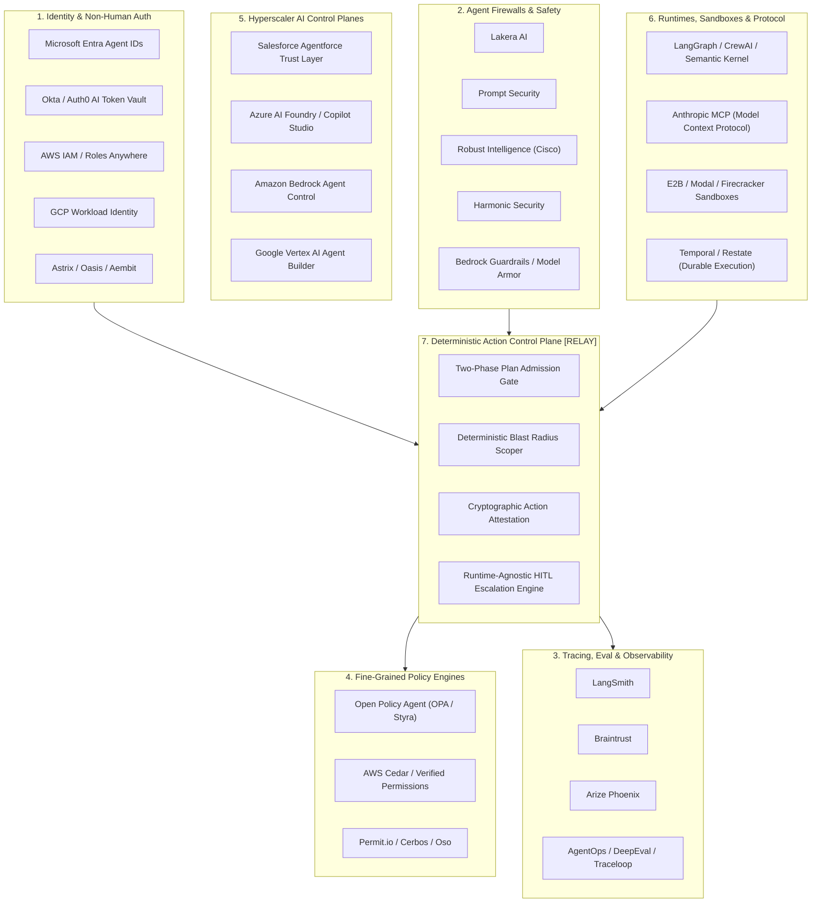

# R001: AI Agent Governance, Authorization, Control-Plane, and Security Market Study

**Document ID:** `R001-agent-governance-market`  
**Date:** September 2026  
**Status:** Complete / Research Baseline  
**Target Project:** Relay (Infrastructure for governing AI-agent actions)

---

## Executive Summary

The AI agent ecosystem in 2026 is transitioning rapidly from conversational copilots to autonomous multi-agent task execution systems with direct access to enterprise APIs, data stores, shell environments, and transactional SaaS tools. As agents gain write access and autonomy, enterprise risk shifts from *content generation hazards* (hallucination, offensive language) to *operational state-mutation hazards* (unauthorized financial transactions, unauthorized data exfiltration, irreversible cloud resource destruction, unintended workflow cascading).

This research report evaluates whether **"agent authority/control"** is emerging as a distinct, defensible infrastructure layer, where current vendors stop short, and where the product hypothesis of **Relay** (*"Agents should propose actions, while deterministic infrastructure determines whether those actions are authorized, approved, and executed"*) intersects with existing and emerging market categories.

### Key Finding Snapshot
1. **The term "AI Governance" is heavily overloaded**: 80%+ of products marketing "agent governance" deliver either *runtime content filtering* (firewalls/guardrails) or *post-hoc telemetry* (observability/tracing). 
2. **Deterministic action interception is rare**: Most runtime governance tools sit at the **L7 Model Proxy layer** (inspecting prompts and LLM completions) rather than at the **L7 Tool/Execution boundary** (evaluating deterministic pre-execution invariants on API payloads).
3. **Identity is fragmenting into two camps**: Enterprise IAM incumbents (Okta, Entra, AWS IAM) govern *service accounts and OAuth token exchange*, while AI-native runtimes manage ephemeral session tokens. Neither natively understands multi-step *semantic intent* or dynamic action blast radius.
4. **Plan-level (pre-execution) governance is an open vacuum**: Almost no commercial product implements a formal **Two-Phase Commit (Plan -> Evaluate -> Approve -> Execute)** across heterogeneous agent frameworks. Current systems either intercept single tool calls synchronously via middleware or let the agent execute until an external API rejects the call.
5. **Relay's differentiation is plausible but narrow**: Relay cannot win as an identity provider, a model router, an observability dashboard, or an LLM guardrail. Relay's only defensible structural position is as a **runtime-agnostic, deterministic action admission controller and plan-commit engine** (the "Kubernetes Admission Controller / Terraform Plan-Apply for AI Agents").

---

## Table of Contents

1. [Market Taxonomy & Mental Models](#1-market-taxonomy--mental-models)
2. [Market Map & Landscape (2026)](#2-market-map--landscape-2026)
3. [Competitor & Capability Matrices](#3-competitor--capability-matrices)
4. [Analysis of Adjacent Infrastructure Precedents](#4-analysis-of-adjacent-infrastructure-precedents)
5. [Direct Answers to the 16 Research Questions](#5-direct-answers-to-the-16-research-questions)
6. [Architecture Comparison: Paradigms for Agent Control](#6-architecture-comparison-paradigms-for-agent-control)
7. [Commoditization vs. Underdeveloped Capabilities](#7-commoditization-vs-underdeveloped-capabilities)
8. [Relay Positioning: Redundancy Risks vs. Plausible Differentiation](#8-relay-positioning-redundancy-risks-vs-plausible-differentiation)
9. [Platform Vendor Threats & Ecosystem Gravity](#9-platform-vendor-threats--ecosystem-gravity)
10. [Strongest Conclusions](#10-strongest-conclusions)
11. [Claims Relay Must NOT Make Without Further Evidence](#11-claims-relay-must-not-make-without-further-evidence)

---

## 1. Market Taxonomy & Mental Models

When vendors and practitioners use the term "Agent Governance", they conflate seven fundamentally distinct layers of the technical stack:

```
+-----------------------------------------------------------------------------+
| Layer 7: Post-Hoc Tracing & Eval (LangSmith, Braintrust, Arize, Traceloop)  |  <- Observability
+-----------------------------------------------------------------------------+
| Layer 6: Model Content Guardrails (Lakera, Bedrock Guardrails, Model Armor) |  <- LLM Input/Output
+-----------------------------------------------------------------------------+
| Layer 5: Framework Middleware (LangGraph Interrupt, CrewAI Flow Gates)      |  <- In-App Logic
+-----------------------------------------------------------------------------+
| Layer 4: Deterministic Action Control Plane [RELAY HYPOTHESIS]              |  <- Plan / Action Gate
|          (Policy Validation, Pre-Commit Blast Radius, Provenance Attestation)|
+-----------------------------------------------------------------------------+
| Layer 3: Protocol & Tool Proxies (MCP Proxies, Envoy ext_authz, Kong AI)    |  <- Tool L7 Interception
+-----------------------------------------------------------------------------+
| Layer 2: Fine-Grained Authorization (Cedar / Verified Permissions, OPA, Oso)|  <- Deterministic Authz
+-----------------------------------------------------------------------------+
| Layer 1: Agent & Workload Identity (Entra Agent IDs, Okta Auth0 AI, SPIFFE) |  <- Identity / Token
+-----------------------------------------------------------------------------+
```

### 1.1 The Seven Layers Defined

1. **Non-Human Identity & Credential Vaulting (Layer 1)**:  
   *Focus*: Minting, delegating, and lifecycle-managing cryptographic identity and scoped credentials for autonomous workloads (e.g., OAuth On-Behalf-Of flow RFC 8693, SPIFFE/SPIRE IDs, Microsoft Entra Agent IDs, Auth0 Token Vault, Aembit/Astrix).
2. **Fine-Grained Authorization Engines (Layer 2)**:  
   *Focus*: Evaluating whether a known principal $P$ has permission to perform action $A$ on resource $R$ under context $C$. Uses declarative, domain-specific languages (e.g., Cedar, Rego/OPA, Polar/Oso, Zanzibar models).
3. **Protocol & Tool Interception Proxies (Layer 3)**:  
   *Focus*: Network-level or protocol-level reverse proxies that inspect tool calls (e.g., Model Context Protocol (MCP) servers, REST tool gateways, Envoy `ext_authz` filters).
4. **Deterministic Action Admission & Plan Control (Layer 4 — Relay Domain)**:  
   *Focus*: Intercepting agent *intent proposals* and planned multi-step trajectories before state execution; validating deterministic constraints, calculating blast radius, managing asynchronous human-in-the-loop (HITL) escalations, issuing cryptographically signed execution tickets, and recording non-repudiable action lineage.
5. **Runtime Framework-Specific Middleware (Layer 5)**:  
   *Focus*: State graph halting mechanisms built inside specific agent orchestration libraries (e.g., LangGraph `interrupt()`, AutoGen human input modes, Semantic Kernel filters).
6. **Prompt & Completion Firewalls (Layer 6)**:  
   *Focus*: Natural language inspection at the LLM ingress/egress. Detects jailbreaks, prompt injection, toxicity, PII leaks, and hallucinations (e.g., Lakera, Prompt Security, Robust Intelligence/Cisco, Model Armor).
7. **Observability, Tracing & Evaluation (Layer 7)**:  
   *Focus*: Passive telemetry ingestion, span tracing, cost monitoring, offline regression testing, and LLM-as-a-judge scoring (e.g., LangSmith, Arize Phoenix, Braintrust, OpenInference/Traceloop).

---

## 2. Market Map & Landscape (2026)



### 2.1 Enterprise Identity & Non-Human IAM
* **Microsoft Entra**: Introduces first-class Agent identities in Entra ID. Extends Managed Identities and Service Principals with token exchange for agent workflows acting on behalf of users (On-Behalf-Of / OBO) or independently. Strongly integrated with Microsoft 365 Copilot and Azure AI Foundry.
* **Okta / Auth0**: Launched Auth0 Token Vault and Okta AI Identity. Manages secure connection storage for 3rd-party SaaS tools. Allows an agent to borrow a user's scoped OAuth token without exposing raw secrets to LLM context windows.
* **AWS IAM & IAM Identity Center**: Standard AWS IAM roles, session policies, and permission boundaries. AWS Cedar integration via Amazon Verified Permissions.
* **Google Cloud IAM**: Service Account Impersonation, Workload Identity Federation, and IAM Principal Sets for Vertex AI agents.
* **Non-Human Identity Specialists (Astrix Security, Oasis Security, Aembit)**: Focus on discovery, posture management (NHI-SPM), and secret rotation for machine credentials, service accounts, and agent API keys.

### 2.2 Cloud & SaaS AI Control Planes
* **Salesforce Agentforce**: Provides the "Einstein Trust Layer" with zero data retention guarantees, dynamic grounding, masking, and declarative guardrails. Strictly proprietary to the Salesforce data graph and CRM ecosystem.
* **Microsoft Copilot Studio & Azure AI Foundry**: Embeds DLP, Purview compliance, Entra ID authorization, and Content Safety filters. Deep platform lock-in.
* **Amazon Bedrock (Agents + Guardrails)**: Declarative guardrails (PII masking, denied topics, contextual grounding checks) paired with Bedrock Agents and Action Groups that map OpenAPI schemas to Lambda execution with IAM enforcement.
* **Google Cloud Vertex AI (Agent Builder + Model Armor)**: Sanitizes input/output, sanitizes RAG context, and hooks into Google Cloud IAM policies.

### 2.3 Agent Firewalls & Security Platforms
* **Lakera, Prompt Security, Apex Security, Pillar Security, HiddenLayer, Zenity**: Positioned as real-time proxy firewalls. They inspect LLM request/response streams for jailbreaks, prompt injections, insecure output handling, tool poisoning, and sensitive data leakage.
* *Limitation*: They are probabilistic heuristic/classifier models. They do not maintain deterministic state machines of application invariants.

### 2.4 Agent Observability, Tracing & Evaluation
* **LangSmith (LangChain)**: Gold standard for LangChain/LangGraph tracing. Provides run-trees, token cost accounting, latency attribution, feedback collection, and prompt regression testing.
* **Braintrust**: High-performance AI evaluation, proxy caching, logging, and automated CI/CD scoring for prompts and agent trajectories.
* **Arize Phoenix / OpenInference**: Open-source distributed tracing for AI agents, embedding visualization, and evaluation benchmarks.
* **AgentOps / Traceloop / Helicone**: Specialized agent run tracking, session replay, and OpenTelemetry instrumentation.
* *Limitation*: Strictly passive. They observe what happened after the fact or require application code to explicitly query them for an evaluation score. They are not inline deterministic gates.

### 2.5 Policy Enforcement & Authorization Engines
* **Open Policy Agent (OPA) / Styra**: Industry-standard general-purpose policy engine using Rego. Widely used via Envoy `ext_authz` or Kubernetes admission webhooks.
* **AWS Cedar / Amazon Verified Permissions**: Ultra-fast, formally verifiable authorization engine for RBAC/ABAC. Evaluates deterministic boolean decisions (`ALLOW` vs `FORBID`) in single-digit milliseconds.
* **Permit.io / Cerbos / Oso**: Developer-first authorization layers offering declarative access control (RBAC, ABAC, ReBAC) with live policy syncing and UI for audit trails.

### 2.6 Agent Runtimes & Protocols
* **Model Context Protocol (MCP - Anthropic)**: Standardized JSON-RPC protocol over `stdio`/`SSE` for exposing tools, prompts, and resources to LLMs. Rapidly becoming the standard interface for tool integration. Currently has rudimentary authentication and authorization specifications.
* **Orchestration Runtimes**: LangGraph, CrewAI, LlamaIndex Workflows, Semantic Kernel, Microsoft AutoGen. Provide in-memory execution graphs, state persistence, and native breakpoint/interrupt APIs.
* **Durable Execution Engines**: Temporal.io, Restate.dev. Provide deterministic workflow replay, distributed state durability, and human signal waiting.

---

## 3. Competitor & Capability Matrices

### 3.1 Detailed Competitor Matrix

| Product / Vendor | Primary Category | Identity Mechanism | Enforcement Model | Interception Point | Plan-Level Pre-Execution Gate? | Human-in-the-Loop (HITL) | Trustworthy Cryptographic Evidence | Runtime Agnostic? |
| :--- | :--- | :--- | :--- | :--- | :--- | :--- | :--- | :--- |
| **Microsoft Entra + Azure AI Foundry** | Enterprise IAM / Cloud Control Plane | Entra Agent ID, Managed Identities, OBO Token Exchange | Deterministic RBAC/ABAC + Probabilistic Content Safety | Cloud API Gateway / Azure SDK | ❌ No (Step-by-step tool invocation) | ⚠️ Partial (via Power Automate / Copilot Studio UI) | ⚠️ Partial (Azure Monitor / Entra Sign-in logs, not cryptographic action hashes) | ❌ No (Azure / M365 locked) |
| **Okta / Auth0 AI** | Enterprise Identity / Token Brokering | Auth0 Token Vault, OAuth 2.0, RFC 8693 | Deterministic OAuth Scope Granting | Token Retrieval Endpoint | ❌ No (Governs token issuance, not plan semantics) | ❌ No native workflow | ⚠️ Standard OAuth audit logs | 🟡 Yes (Any runtime calling Auth0 API) |
| **AWS Bedrock + Verified Permissions** | Cloud AI Control Plane + Policy Engine | AWS IAM, SigV4, Bedrock Action Roles, Cedar Policies | Deterministic (Cedar) + Probabilistic (Bedrock Guardrails) | Bedrock API & Lambda Invocation Gateway | ❌ No (Evaluates individual Lambda actions) | ⚠️ Partial (Step Functions / Bedrock Human Evaluation) | ⚠️ AWS CloudTrail (Tamper-evident, but not fine-grained action intent attestation) | 🟡 Partially (Bedrock / AWS centric) |
| **Salesforce Agentforce** | Enterprise SaaS Control Plane | Salesforce User/Org Context & Einstein Trust Layer | Deterministic Platform Permissions + Guardrails | Salesforce Core Transaction Boundary | ❌ No (Single turn execution with inline checks) | ⚠️ Built-in Salesforce approval flows | ⚠️ Platform Event Logs | ❌ No (Salesforce locked) |
| **Lakera / Prompt Security / Zenity** | Agent Firewall / Runtime Security | API Keys / Proxy Session Tokens | Probabilistic Heuristics, Regex, ML Classifiers | L7 HTTP Proxy / Inline Model Proxy | ❌ No (Evaluates prompt/response tokens) | ⚠️ Policy alerts / Slack webhook blockers | ❌ Centralized SaaS audit log | 🟡 Yes (L7 Proxy) |
| **LangSmith (LangChain)** | Observability, Tracing & Eval | API Keys / Project Workspaces | ❌ Passive Telemetry (Non-blocking) | SDK Callbacks / OpenTelemetry Spans | ❌ No (Observes spans post-execution) | ⚠️ Human annotation queues (post-hoc, not inline gates) | ❌ Log storage | 🟡 Yes (LangChain preferred, OpenInference compatible) |
| **Braintrust** | Observability, Eval & Gateway | API Keys / Workspace RBAC | ⚠️ Proxy Rate Limiting & Content Caching (Non-authorizing) | L7 Model Gateway / SDK Tracing | ❌ No (Evaluates prompts & completions) | ❌ No | ❌ Log storage | 🟡 Yes |
| **Open Policy Agent (OPA / Styra)** | General Purpose Policy Engine | Relies on external caller identity (mTLS, JWT) | Deterministic Rego Policy Evaluation | Network Proxy (Envoy ext_authz) or SDK | ⚠️ Possible, but requires caller to supply structured plan schema | ❌ None native (External workflow needed) | ⚠️ Decision logs (Can be signed with external plugins) | 🟢 Yes (Completely agnostic) |
| **AWS Cedar** | Formally Verified Policy Engine | Relies on caller context & principal IDs | Deterministic, Formally Verified Boolean Evaluation | Microservice / API Gateway SDK | ⚠️ Possible if plan is modeled as entity hierarchy | ❌ None native | ⚠️ Fast deterministic decision logs | 🟢 Yes (Open-source engine + AWS Managed) |
| **Permit.io / Cerbos / Oso** | Authorization-as-a-Service | JWT / External Identity Federation | Deterministic RBAC / ABAC / ReBAC | API Gateway / Sidecar / PDP | ❌ No (Evaluates granular `Action` on `Resource`) | ⚠️ Approval workflows for role elevation (Permit Elements) | ⚠️ Centralized signed audit logs | 🟢 Yes |
| **Anthropic MCP (Model Context Protocol)** | Tool & Context Standard | Client-Server handshake (OAuth/Bearer in progress) | Server-side handler logic (No native declarative policy) | JSON-RPC Client-Server Transport | ❌ No (Tool by tool execution) | ⚠️ Prompting user in UI (e.g. Claude Desktop tool acceptance) | ❌ None native | 🟢 Yes (Open specification) |
| **Relay (Target Hypothesis)** | **Deterministic Action Control Plane** | Integrates with Layer 1 (Entra/Okta/SPIFFE) | **Deterministic Action & Plan Admission Engine** | **Bi-directional Tool Proxy & Plan Interceptor** | 🟢 **YES (First-class Two-Phase Plan/Apply validation)** | 🟢 **YES (Native async stateful HITL escalation)** | 🟢 **YES (Cryptographically chained Action Attestation & Proof of Authorization)** | 🟢 **YES (Framework, LLM & Cloud agnostic)** |

---

### 3.2 Deep Capability Matrix

| Capability Dimension | Okta / Entra | Bedrock / Vertex | Lakera / Prompt Sec | LangSmith / Arize | OPA / Cedar | MCP Standard | Relay (Proposed) |
| :--- | :--- | :--- | :--- | :--- | :--- | :--- | :--- |
| **1. Agent Identity Minting** | 🟢 Native | 🟢 Native | ❌ None | ❌ None | ❌ None | ⚠️ Basic | 🟡 Integrates (Does not reinvent) |
| **2. Fine-Grained Tool Authorization** | ⚠️ Scope-level | 🟢 IAM / Cedar | ❌ Heuristic only | ❌ None | 🟢 Native | ❌ Left to server | 🟢 Native Policy Evaluation |
| **3. Multi-Step Plan Validation** | ❌ None | ❌ None | ❌ None | ❌ None | ⚠️ Schema only | ❌ None | 🟢 **Core Focus (Pre-apply gate)** |
| **4. Blast-Radius Calculation** | ❌ None | ❌ None | ❌ None | ❌ None | ⚠️ Custom code | ❌ None | 🟢 **Core Focus (State diffing)** |
| **5. Inline Synchronous Interception** | ⚠️ Auth time | 🟢 At tool call | 🟢 At LLM proxy | ❌ Post-hoc | 🟢 In microservice | 🟢 At RPC boundary | 🟢 **At Action & Plan boundary** |
| **6. Asynchronous Human Approval Gate** | ❌ None | ⚠️ Step Functions | ⚠️ Webhook alert | ❌ None (Eval only) | ❌ None | ⚠️ Host app UI | 🟢 **Stateful, durable HITL engine** |
| **7. Tamper-Evident Action Lineage** | ⚠️ Log stream | ⚠️ CloudTrail | ❌ Log stream | ⚠️ Trace graph | ⚠️ Decision log | ❌ None | 🟢 **Cryptographic Audit Attestation** |
| **8. Real-Time Action Revocation** | 🟢 Token revoke | 🟢 IAM revoke | ❌ Session alert | ❌ None | 🟢 Live policy update| ❌ Disconnect socket | 🟢 **Dynamic Plan Ticket Invalidation** |
| **9. Runtime & LLM Independence** | 🟡 Partial | ❌ Cloud-locked | 🟢 Agnostic | 🟢 Agnostic | 🟢 Agnostic | 🟢 Agnostic | 🟢 **Agnostic** |

---

## 4. Analysis of Adjacent Infrastructure Precedents

To determine why existing systems fail at agent action governance, we must examine the battle-tested paradigms of adjacent infrastructure:

```
+----------------------------------------------------------------------------------------------------+
|                                INFRASTRUCTURE CONTROL PRECEDENTS                                    |
+------------------------------+----------------------------------+----------------------------------+
| Terraform Plan / Apply       | Kubernetes Admission Controllers | AWS IAM Boundaries / STS         |
| -> Two-Phase Commit          | -> Mutating & Validating Webhooks| -> Session Policies & Scopes     |
| -> Blast Radius Inspection   | -> Pre-Commit Schema Invariants  | -> Dynamic Least Privilege       |
+------------------------------+----------------------------------+----------------------------------+
| GitHub Branch Rulesets       | Envoy / Service Mesh ext_authz   | SLSA / Sigstore / in-toto        |
| -> Required Approvals & CI   | -> Decoupled L7 Traffic Intercept| -> Cryptographic Provenance      |
| -> Immutable Merge Gate      | -> Zero-Trust Authorization Tap  | -> Tamper-Evident Attestation    |
+------------------------------+----------------------------------+----------------------------------+
```

### 4.1 Terraform Plan / Apply (Two-Phase Commit for State Mutation)
* **The Mechanism**: Terraform strictly separates execution graph calculation (`terraform plan`) from actual state application (`terraform apply`). The plan file is an immutable, inspectable artifact detailing exact proposed additions, modifications, and destructions. Static analysis engines (e.g., OPA, Conftest, HashiCorp Sentinel, Infracost) evaluate the plan before a single cloud resource is touched.
* **Relevance to Agents**: LLM agents currently operate in an unbuffered **"one-phase"** loop (Reason -> Call Tool -> Apply State Mutation). If an agent decides to delete a database, update 50 customer records, or transfer money, the tool execution is immediate. Agents desperately need a **Plan/Apply separation**: the agent proposes a structured plan graph, a deterministic engine evaluates blast radius and policy, human approvals attach cryptographically to the plan, and execution only proceeds with a signed token for that exact plan.

### 4.2 Kubernetes Admission Controllers (Validating and Mutating Webhooks)
* **The Mechanism**: In Kubernetes, when an entity issues an API request (`kubectl apply`), the request hits the `kube-apiserver`, authenticates, passes authorization (RBAC), and then MUST pass through **Mutating Admission Webhooks** (modifying specs, injecting sidecars) and **Validating Admission Webhooks** (e.g., Gatekeeper/OPA, Kyverno) before being committed to `etcd`. If a validating webhook rejects the object, it is never written to state.
* **Relevance to Agents**: Tool calls generated by agents are equivalent to declarative state-change requests. Agent infrastructure lacks an **"Agent Admission Controller"** sitting between the model's tool-dispatch payload and the backend execution environment that can reject or mutate payloads based on real-time enterprise invariants.

### 4.3 AWS IAM: Permission Boundaries, SCPs, and STS Session Policies
* **The Mechanism**: AWS IAM enforces hierarchical deterministic constraints. An IAM Role may have full Admin privileges, but an **IAM Permission Boundary** or an AWS Organizations **Service Control Policy (SCP)** sets an immutable maximum ceiling on permissions. Furthermore, when calling `sts:AssumeRole`, the caller can pass an ephemeral **Session Policy** that strictly downscopes the role for a single session.
* **Relevance to Agents**: Agents are frequently given static, broad API keys or credentials. Dynamic downscoping based on the specific user prompt, session risk score, and current task step is absent in agent frameworks.

### 4.4 Service Meshes & Envoy `ext_authz`
* **The Mechanism**: In microservice architectures, business logic does not implement raw network security. An Envoy sidecar proxy intercepts all inbound and outbound L7 traffic. For authorization, Envoy invokes an external authorization service (`ext_authz` filter) via gRPC/HTTP, passing headers, body metadata, and TLS client certificates to an engine like OPA or an enterprise PDP.
* **Relevance to Agents**: Agent-to-tool communication (especially over protocols like MCP or REST) requires an out-of-process **L7 Agent Tool Proxy** that functions exactly like Envoy `ext_authz`, decoupling security policies from the agent framework (LangChain, AutoGen, LlamaIndex).

### 4.5 GitHub Branch Protection & CODEOWNERS
* **The Mechanism**: Code changes cannot be applied directly to production branches. A Pull Request generates a diff, runs automated CI checks, enforces code ownership review requirements (`CODEOWNERS`), verifies signed commits, and requires explicit human approval before a merge commit can mutate the `main` branch.
* **Relevance to Agents**: Autonomous agents executing write operations are effectively opening "pull requests" against enterprise infrastructure. Without a structured approval, review routing, and required status check layer, enterprise adoption of high-impact agents is stalled.

### 4.6 Cryptographic Provenance & Attestation (SLSA, Sigstore, in-toto)
* **The Mechanism**: Modern software supply chain security uses cryptographic signatures and signed metadata attestations (`in-toto`) to prove that an artifact was built by an authorized CI pipeline from a specific Git commit hash, preventing unauthorized tampering.
* **Relevance to Agents**: When an agent performs an action on behalf of an enterprise, compliance auditors require proof: *Which model version made the decision? What prompt context was provided? Which human approved it? What policy engine authorized it?* Current systems produce unstructured JSON logs that are trivially modified and cannot serve as legal or compliance evidence.

---

## 5. Direct Answers to the 16 Research Questions

### Q1: What exactly do current products call "agent governance"?
**Answer:** The term is used opportunistically across three disconnected domains:
1. **Model Vendors (Microsoft, Google, AWS, Salesforce)**: Use "governance" to mean **data boundary protection** (preventing customer data from training foundation models), **DLP/PII masking**, and **safety guardrails** (preventing hateful/toxic outputs).
2. **Security Startups (Lakera, Prompt Security, Zenity)**: Use "governance" to mean **prompt injection defense**, shadow-AI discovery, and LLM output sanitization.
3. **Observability Vendors (LangSmith, Braintrust, Arize)**: Use "governance" to mean **evaluation metrics, cost tracking, latency monitoring, and audit logging**.
*Almost nobody currently uses "governance" to mean deterministic pre-execution authorization of state-mutating plans.*

### Q2: Which products govern agent identity?
**Answer:** 
* **Microsoft Entra**: Leads the market with dedicated Agent identities, Workload Identity Federation, and On-Behalf-Of (OBO) token exchange.
* **Okta / Auth0**: Manages agent-to-SaaS identity brokering via Auth0 Token Vault.
* **AWS & GCP IAM**: Treat agents as IAM Roles / Service Accounts, using STS/Workload Identity for short-lived credential assumption.
* **Astrix / Oasis / Aembit**: Manage the posture and lifecycle of non-human service accounts and API keys used by agents.

### Q3: Which govern agent authorization?
**Answer:**
* **AWS Cedar / Amazon Verified Permissions**: Declarative, ultra-fast RBAC/ABAC policy engine.
* **Open Policy Agent (OPA)**: General-purpose Rego-based authorization.
* **Permit.io / Cerbos / Oso**: Fine-grained authorization as a service.
* *Gap*: These engines govern static `(Principal, Action, Resource, Context)` tuples. They do NOT evaluate multi-step probabilistic agent trajectories, cumulative blast radius, or semantic plan graphs.

### Q4: Which govern individual actions?
**Answer:**
* **API Gateways (Kong, Apigee, Envoy ext_authz)**: Can inspect and authorize individual HTTP requests emitted by tools.
* **AWS Bedrock Action Groups**: Lambda functions wrapped with IAM execution roles.
* **Framework Interceptors**: LangChain callbacks, Semantic Kernel filters.
* *Limitation*: Enforcement is isolated to a single atomic API call; the gateway has no visibility into the broader task context or previous actions in the agent's trajectory.

### Q5: Which govern agent plans before execution?
**Answer:**
* **Virtually NONE at the infrastructure layer in 2026.**
* Runtimes like LangGraph, CrewAI, and Semantic Kernel allow developers to write custom code that generates a plan graph and halts before execution, but this is **application-level business logic**, not an independent, deterministic control plane. There is no standard "Plan Admission Controller" in enterprise production today.

### Q6: Which provide human approval?
**Answer:**
* **Framework Runtimes (LangGraph `interrupt()`, Semantic Kernel Breakpoints)**: Provide low-level primitive functions to pause execution state and await human input.
* **SaaS/Workflow Platforms (Salesforce Agentforce, Microsoft Copilot Studio, Power Automate)**: Provide proprietary inbox/chat approval prompts.
* **Temporal / Restate**: Provide durable execution signals where a workflow sleeps until a webhook or API signal resumes it.
* *Gap*: No vendor provides a **runtime-agnostic human approval control plane** that can intercept an MCP tool call or API action across any framework, route it to Slack/Teams/Email with rich diff visualization, collect a signed approval, and resume execution.

### Q7: Which provide action lineage?
**Answer:**
* **Observability Vendors (LangSmith, Arize Phoenix, Braintrust, OpenInference)**: Provide comprehensive visual span trees linking the original prompt -> intermediate LLM reasoning -> tool invocation -> tool output -> final response.
* *Limitation*: Lineage is stored as mutable application logs/spans in a SaaS database. It lacks cryptographic non-repudiation and does not link policy evaluation proofs to execution state.

### Q8: Which provide trustworthy evidence of authorization?
**Answer:**
* **Cloud Infrastructure Logs (AWS CloudTrail, Azure Activity Logs)**: Tamper-evident logging of IAM API calls.
* **Formal Policy Engines (AWS Cedar / Verified Permissions)**: Provide deterministic decision logs with exact policy IDs matched.
* *Gap*: No product provides an end-to-end **Cryptographic Action Receipt** that cryptographically binds `[User Intent Hash + Agent Plan Hash + Cedar/OPA Policy Decision Hash + Human Approval Signature + Tool Execution Payload Hash]`.

### Q9: Which can revoke authority in real time?
**Answer:**
* **IAM Providers (Entra, Okta, AWS IAM)**: Can revoke refresh tokens, disable service principals, or invalidate session credentials in real time.
* **Policy Engines (Permit.io, OPA with live bundles, Cedar)**: Can push policy updates in milliseconds to revoke access to a specific tool or resource.
* *Gap*: In-flight multi-step agent executions cannot be gracefully halted mid-plan across heterogeneous runtimes without severing the entire API connection.

### Q10: Which products intercept actions rather than merely observe them?
**Answer:**
* **Intercepting**: Model Firewalls (Lakera, Prompt Security), API Gateways (Kong, Envoy), Policy Engines (OPA/Cedar embedded in API handlers), Cloud Action Gates (Bedrock Action Groups, Agentforce).
* **Observing Only**: LangSmith, Arize Phoenix, Braintrust, AgentOps, Traceloop, Helicone.

### Q11: Which products are runtime-specific?
**Answer:**
* **LangSmith / LangGraph**: Optimized specifically for LangChain/LangGraph runtimes.
* **Salesforce Agentforce**: Locked entirely to Salesforce platform.
* **Microsoft Copilot Studio / Azure AI Foundry Agent Service**: Deeply tied to Microsoft ecosystem.
* **Semantic Kernel Filters**: Locked to C#/Python Semantic Kernel apps.

### Q12: Which are runtime-agnostic?
**Answer:**
* **Policy Engines**: OPA, AWS Cedar, Permit.io, Cerbos, Oso (evaluate pure JSON inputs).
* **Network & L7 Proxies**: Envoy, Kong AI Gateway, Portkey, LiteLLM.
* **Model Context Protocol (MCP) Proxies**: Any proxy operating at the JSON-RPC MCP standard layer.
* **Identity Providers**: Okta, Auth0, Microsoft Entra (via standard OAuth/OIDC/SAML).

### Q13: What capabilities are commoditized?
**Answer:**
1. **Prompt & Completion Filtering** (Basic regex, toxic language detection, heuristic PII masking).
2. **LLM Gateway Routing & Caching** (Fallback routing between OpenAI/Anthropic/Bedrock, semantic caching, rate limiting).
3. **Basic Span Tracing & Cost Accounting** (Capturing input tokens, output tokens, latency, and tool call names via OpenTelemetry).
4. **Static Secret Vaulting** (Storing API keys in HashiCorp Vault, AWS Secrets Manager, or Auth0 Token Vault).

### Q14: What capabilities appear underdeveloped?
**Answer:**
1. **Deterministic Plan Admission & Blast-Radius Governance**: Pre-execution static analysis of agent plan graphs.
2. **Runtime-Agnostic Human Escalation & Approval Protocols**: Decoupled HITL infrastructure that works across LangGraph, CrewAI, AutoGen, and raw API scripts.
3. **State-Dependent Semantic Authorization**: Evaluating policies that depend on the dynamic delta of the target system (e.g., "Allow action if `affected_records < 10` and `total_value < $5,000`").
4. **Cryptographic Action Attestation & Non-Repudiable Lineage**: Providing mathematically verifiable audit proofs for autonomous actions.
5. **Standardized Protocol-Level Tool Policy Enforcement (MCP Guardrails)**: Declarative, fine-grained policy evaluation embedded directly in MCP client-server communication.

### Q15: Where is Relay likely to be redundant?
**Answer:**
* **Redundant Area 1**: Building an LLM prompt/output safety filter (competing with Lakera, Bedrock Guardrails, Model Armor).
* **Redundant Area 2**: Building an agent observability, tracing, and LLM-eval platform (competing with LangSmith, Braintrust, Arize).
* **Redundant Area 3**: Building an identity provider or OAuth credential store (competing with Okta, Entra, Auth0 Token Vault).
* **Redundant Area 4**: Building a brand-new policy specification language from scratch (competing with Cedar and Rego/OPA).

### Q16: Where could Relay plausibly differentiate?
**Answer:**
* **Plausible Differentiation**: Position Relay as the **Deterministic Agent Action Admission Controller & Execution Control Plane**.
* Specifically:
  1. **Two-Phase Action Protocol (Propose -> Evaluate -> Approve -> Commit)**.
  2. **Runtime-Agnostic Tool & MCP Interception Gateway**.
  3. **Multi-Step Blast-Radius & State-Delta Analyzer**.
  4. **Durable, Asynchronous Human-in-the-Loop Orchestration Engine**.
  5. **Cryptographic Action Provenance & Attestation Engine** (generating immutable receipts of authorization and execution).
  6. **Embedding Established Engines (Cedar / OPA)** for policy logic rather than inventing a proprietary syntax.

---

## 6. Architecture Comparison: Paradigms for Agent Control

```
+---------------------------------------------------------------------------------------------------+
| PARADIGM A: In-Prompt System Instructions ("Constitutional AI / System Prompt Guardrails")        |
| Model -> [LLM Self-Restraint / Prompt Rules] -> Tool Execution                                    |
| Vulnerability: Non-deterministic, trivially bypassed via Prompt Injection & Jailbreaks           |
+---------------------------------------------------------------------------------------------------+
| PARADIGM B: L7 Model Gateway Proxy (LiteLLM, Portkey, Lakera)                                    |
| App -> [Model Proxy: Filter Prompt / Output] -> LLM -> App -> Tool Execution                      |
| Vulnerability: Blind to actual backend state, parameters, and tool execution context              |
+---------------------------------------------------------------------------------------------------+
| PARADIGM C: In-Framework Application Middleware (LangGraph Interrupt, CrewAI Guards)             |
| App [Code Callback -> Halts Loop] -> Tool Execution                                              |
| Vulnerability: Language/Framework locked, scattered security logic, non-standardized audit trails |
+---------------------------------------------------------------------------------------------------+
| PARADIGM D: Relay Deterministic Action Control Plane (Proposed Architecture)                      |
| Agent -> [Propose Plan / Action]                                                                  |
|       -> [Relay Admission Controller: Cedar Policy + Blast Radius + State Check]                 |
|       -> [If High Risk: Asynchronous Durable HITL Escalate -> Human Signs Ticket]                |
|       -> [Relay Issues Cryptographically Signed Execution Token]                                 |
|       -> [Tool / MCP Proxy Executes Action & Returns Signed Attestation]                          |
+---------------------------------------------------------------------------------------------------+
```

### Architectural Tradeoff Matrix

| Dimension | Paradigm A: Prompt Guardrails | Paradigm B: Model Proxy | Paradigm C: In-Framework Middleware | Paradigm D: Relay Action Control Plane |
| :--- | :--- | :--- | :--- | :--- |
| **Deterministic Guarantee** | ❌ 0% (Probabilistic) | ❌ 0% (Probabilistic NLP) | 🟢 100% (Deterministic code) | 🟢 100% (Deterministic engine) |
| **Prompt Injection Resilience**| ❌ None (Primary failure mode) | ⚠️ Moderate (Classifier based)| 🟢 High (Code runs out-of-prompt)| 🟢 Total (Enforced at tool layer) |
| **State & Data Awareness** | ❌ Context-window only | ❌ Model traffic only | 🟢 Full application state | 🟢 Full system & state-delta awareness |
| **Framework Independence** | 🟢 Universal | 🟢 Universal (HTTP) | ❌ Framework specific | 🟢 Universal (MCP / Proxy / SDK) |
| **Operational Scalability** | 🟢 Zero infra | 🟢 Centralized proxy | ❌ Decentralized in app code | 🟢 Centralized control plane |
| **Audit Non-Repudiation** | ❌ None | ⚠️ Proxy logs | ⚠️ Custom app logs | 🟢 Cryptographically signed tickets |

---

## 7. Commoditization vs. Underdeveloped Capabilities

```mermaid
quadrantChart
    title Market Dynamics: AI Agent Governance & Security (2026)
    x-axis Low Technical Defensibility --> High Technical Defensibility
    y-axis High Market Saturation --> High Market Vacuum
    quadrant-1 Plausible Relay Sweet Spot
    quadrant-2 Niche / Specialized
    quadrant-3 Commoditized / Red Ocean
    quadrant-4 Incumbent Territory

    Prompt Firewalls & Guardrails: [0.20, 0.25]
    LLM Model Routing & Caching: [0.15, 0.15]
    Passive Span Tracing (OTel): [0.25, 0.30]
    API Key Storage & Vaulting: [0.35, 0.20]
    
    Enterprise Identity (Entra/Okta): [0.75, 0.20]
    General Authz Engines (Cedar/OPA): [0.85, 0.35]
    
    Two-Phase Plan Admission Gate: [0.85, 0.88]
    Deterministic Blast-Radius Scoper: [0.80, 0.82]
    Cryptographic Action Attestation: [0.90, 0.90]
    Runtime-Agnostic HITL Protocol: [0.75, 0.78]
    MCP Policy & Security Gateway: [0.78, 0.85]
```

### 7.1 Commoditized (Red Ocean — Avoid)
* **Prompt Injection Detectors & Input Classifiers**: Over 30 startups and open-source packages offer BERT/classifier-based prompt inspection. Margins and moat are rapidly eroding.
* **Basic Model Proxy Gateways**: Simple routing, fallback, and rate-limiting proxies (LiteLLM, Portkey, Cloudflare AI Gateway) are widely open-sourced.
* **OpenTelemetry Tracing for LLM Calls**: Tracing spans, capturing prompt/completion text, and calculating token costs is standard table stakes across LangSmith, Arize, Traceloop, and Datadog.

### 7.2 Incumbent-Dominated (Do Not Re-implement)
* **Non-Human Identity & Enterprise User Directories**: Microsoft Entra, Okta, AWS IAM have immense enterprise gravity. Relay must integrate via OIDC/OAuth/SPIFFE, never build a competing identity silo.
* **Core Formal Authorization Language Syntax**: AWS Cedar and OPA Rego have spent years solving formal verification, performance, and AST compilation. Relay should use Cedar/Rego as underlying policy evaluation engines rather than inventing a bespoke policy language.

### 7.3 Underdeveloped & High-Value (The Relay Opportunity Space)
1. **Two-Phase Action Protocol & Blast-Radius Engine**:
   * Pre-execution parsing of agent plans into directed acyclic graphs (DAGs) of proposed state changes.
   * Deterministic calculation of blast radius (e.g., financial limits, number of database rows affected, destructive API operations, cross-system side effects).
2. **Decoupled, Stateful Human-in-the-Loop (HITL) Gateways**:
   * Asynchronous suspension of agent execution with durable state persistence.
   * Multi-channel human escalation (Slack, Microsoft Teams, Webhook, Mobile Push, Email) with cryptographic signature capture upon approval.
3. **Cryptographic Action Attestation & Proof of Authorization**:
   * Generating immutable, signed audit artifacts proving that action $A$ executed at timestamp $T$ with parameter hash $H$ was authorized by policy $P$ and approved by human $U$.
4. **Model Context Protocol (MCP) Security & Policy Proxy**:
   * The explosive adoption of Anthropic's Model Context Protocol creates a universal L7 tool-calling layer. There is currently no enterprise security gateway specifically enforcing fine-grained Cedar/OPA policies, rate limits, and blast-radius constraints on MCP JSON-RPC traffic.

---

## 8. Relay Positioning: Redundancy Risks vs. Plausible Differentiation

```
+----------------------------------------------------------------------------------------------------+
|                                    RELAY STRATEGIC POSITIONING                                     |
+-------------------------------------------------------------------+--------------------------------+
| WHAT RELAY MUST AVOID (Guaranteed Redundancy)                    | WHERE RELAY CAN WIN (Moat)     |
+-------------------------------------------------------------------+--------------------------------+
| ❌ "We are an AI Observability platform" (LangSmith will crush)   | 🟢 The "Kubernetes Admission   |
| ❌ "We are an Agent Identity Provider" (Entra/Okta will crush)    |    Controller" for AI Agents   |
| ❌ "We are an LLM Prompt Firewall" (Lakera/Cisco will crush)      | 🟢 The "Terraform Plan/Apply"  |
| ❌ "We invented a new Policy Language" (Cedar/OPA will crush)     |    Engine for Agentic Actions  |
| ❌ "We are a proprietary Agent Framework" (LangGraph will crush)  | 🟢 The Enterprise MCP Security |
|                                                                   |    & Authorization Gateway     |
+-------------------------------------------------------------------+--------------------------------+
```

### 8.1 The "Why Relay?" Thesis: The Missing Action Gate

If Relay is to succeed as standalone infrastructure, its architectural thesis must be rigorously framed around the **Action & Plan Execution Boundary**:

```
[Agent Runtime (LangGraph / CrewAI / AutoGen / Custom Python)]
                         │
                         ▼ (Proposes Action / Multi-Step Plan)
             ┌───────────────────────┐
             │   RELAY CONTROL PLANE │
             │                       │
             │ 1. Identity & Context │ <── Pulls User/Agent Identity (Entra / Okta / SPIFFE)
             │ 2. Policy Evaluation  │ <── Evaluates Deterministic Policy (AWS Cedar / OPA)
             │ 3. Blast Radius Check │ <── Checks Dynamic State Invariants & Risk Budgets
             │ 4. HITL Escalation    │ <── Pauses & Dispatches Human Approval (Slack/Teams)
             │ 5. Action Ticket Mint │ ──> Signs Cryptographic Authorization Ticket
             └───────────────────────┘
                         │
                         ▼ (Presents Signed Ticket to Execute)
             ┌───────────────────────┐
             │   RELAY TOOL PROXY    │
             │  (MCP / REST / SQL)   │
             └───────────────────────┘
                         │
                         ▼ (Executes Validated Action)
               [Target APIs / Databases / SaaS]
```

### 8.2 Defensibility Prerequisites
For this differentiation to be defensible:
1. **Must be completely runtime-agnostic**: Must work identically whether the agent is built in LangGraph, CrewAI, Semantic Kernel, LlamaIndex, or raw OpenAI API calls.
2. **Must integrate seamlessly with the protocol winner (MCP)**: Native support for Anthropic Model Context Protocol proxying provides an immediate standard insertion point.
3. **Must leverage standard policy primitives**: Compile policies to AWS Cedar or OPA Rego to give enterprise CISOs confidence in formal correctness.
4. **Must support Two-Phase Commit**: Provide a first-class SDK abstraction for `plan = agent.propose()` -> `relay.evaluate(plan)` -> `relay.commit(plan)`.

---

## 9. Platform Vendor Threats & Ecosystem Gravity

| Platform Vendor | Asset / Weapon | Strategic Threat to Relay | Mitigation / Defensive Posture for Relay |
| :--- | :--- | :--- | :--- |
| **Microsoft** (Entra + Azure AI Foundry + Copilot Studio) | Absolute control over enterprise identity (Entra), enterprise office context (M365), and developer tools (GitHub). | Bundling agent governance into Azure AI Foundry and Entra Agent IDs at zero marginal cost. | Position as the **multi-cloud, cross-platform neutral control plane** (protecting AWS + GCP + On-Prem + Salesforce environments where Azure cannot be the neutral arbiter). |
| **Amazon Web Services** (Bedrock + IAM + Verified Permissions) | Deep cloud infrastructure ownership, Cedar policy engine, high-assurance security reputation. | Extending Bedrock Action Groups and IAM session policies to natively cover agent workflows. | Focus on heterogeneous agents spanning SaaS APIs (Salesforce, ServiceNow, Jira, GitHub) outside AWS VPC boundaries. |
| **Google Cloud** (Vertex AI + Model Armor + Workload Identity) | Superior foundation models (Gemini), enterprise data graph (BigQuery), Model Armor. | Packaging runtime security natively into Vertex Agent Builder. | Stay decoupled from foundation model selection; provide seamless governance across multi-LLM architectures. |
| **LangChain / LangGraph** | Massive developer mindshare, dominant Python/JS orchestration framework, LangGraph Platform. | Expanding LangGraph `interrupt()`, LangSmith Fleet, and LangGraph Cloud into enterprise access control. | Support LangGraph as a first-class producer of Relay plan proposals while highlighting that enterprise CISOs will not allow security policy to be hardcoded into Python orchestration scripts. |
| **Anthropic / OpenAI** | Controlling the underlying API protocols (MCP, OpenAI Assistants / Tool Calling specs). | Introducing native protocol-level authorization and human verification primitives into frontier model platforms. | Build directly on top of open standards (MCP) and provide the enterprise policy backend that model providers do not build. |

---

## 10. 5–10 Strongest Conclusions

1. **"Agent Authority/Control" is a real, inevitable standalone problem**: As AI systems transition from conversational outputs to state-mutating execution, enterprise adoption is strictly bottlenecked by the lack of deterministic authorization, blast-radius limits, and non-repudiable auditability.
2. **Current market offerings are misaligned**: 80%+ of "AI governance" tools operate at the wrong layer (LLM text filtering or post-hoc observability). They cannot prevent an authorized agent from executing an unauthorized or catastrophic API payload.
3. **Model self-governance is an architectural dead end**: System prompts, constitutional AI, and LLM-based self-checking are non-deterministic and fundamentally susceptible to prompt injection, context exhaustion, and jailbreaking. Enforcement must be out-of-band and deterministic.
4. **The two-phase commit (Plan/Apply) is the critical missing abstraction**: The paradigm shift from single-step reactive tool calling to structured multi-step plan proposal and deterministic admission evaluation is the most defensible functional gap in the ecosystem.
5. **Relay must not build an Identity Provider or Policy Language**: Competing with Okta/Entra on identity or Cedar/OPA on policy grammar is a fatal distraction. Relay must sit as the *orchestration and admission controller* that binds identity and policy engines to agent tool execution.
6. **The Model Context Protocol (MCP) is the premier tactical wedge**: As MCP emerges as the open standard for tool integration, building the premier **MCP Policy & Authorization Gateway** represents the cleanest entry point for runtime-agnostic action interception.
7. **Human-in-the-Loop cannot remain an in-memory application callback**: Production HITL requires durable, asynchronous, multi-channel state persistence that survives container restarts, network partitions, and multi-day approval latency.
8. **Compliance and legal requirements will demand cryptographic action receipts**: Within 24–36 months, regulatory scrutiny (EU AI Act, SOC2 Type II for AI, FedRAMP) will require non-repudiable proof of authorization for autonomous actions, creating a durable demand for tamper-evident action provenance.

---

## 11. 10 Claims Relay Should NOT Make Without Further Evidence

1. **DO NOT CLAIM: *"Relay solves prompt injection."***  
   *Reason*: Relay does not prevent an LLM from being tricked into generating bad intentions; Relay prevents the resulting bad intentions from passing deterministic authorization gates. Conflating the two invites immediate security disproof.
2. **DO NOT CLAIM: *"Relay is a complete AI Governance platform."***  
   *Reason*: The market equates "AI Governance" with model training data compliance, EU AI Act risk classification, bias auditing, and output toxicity. Relay is specifically an **Action Authorization and Execution Control Plane**.
3. **DO NOT CLAIM: *"Enterprise IAM (Okta/Entra) cannot handle agents."***  
   *Reason*: Okta and Microsoft Entra are investing hundreds of millions into Agent Identity, Token Vaults, and Workload Identity. Relay must complement them, not claim they are obsolete.
4. **DO NOT CLAIM: *"Relay eliminates the need for human review."***  
   *Reason*: Relay automates the deterministic policy boundary and routes high-risk actions to humans; claiming it eliminates human oversight contradicts enterprise zero-trust requirements.
5. **DO NOT CLAIM: *"Existing policy engines (Cedar, OPA) are inadequate for AI."***  
   *Reason*: Cedar and OPA are exceptionally fast, formally verifiable, and battle-tested. The inadequacy is in *extracting intent and calculating blast radius from agent plans*, not in the policy evaluation engines themselves.
6. **DO NOT CLAIM: *"Relay works with zero developer instrumentation across any proprietary agent."***  
   *Reason*: Intercepting agent plans requires either using a supported tool protocol (MCP), an API gateway proxy, or a lightweight SDK wrapper. Zero-touch interception of arbitrary closed-source agent loops is technically impossible without an integration surface.
7. **DO NOT CLAIM: *"LLM-based plan validation is secure."***  
   *Reason*: Using an LLM to validate another LLM's plan introduces second-order non-determinism and vulnerability. Relay's control plane must be fundamentally deterministic.
8. **DO NOT CLAIM: *"Relay replaces LangSmith / Arize / Braintrust."***  
   *Reason*: Relay is an active, pre-execution enforcement gateway, not an offline prompt evaluation or tracing dataset platform. Customers will use both simultaneously.
9. **DO NOT CLAIM: *"MCP is the only tool protocol that matters."***  
   *Reason*: While MCP is growing rapidly, enterprise legacy environments still rely heavily on REST/OpenAPI, GraphQL, gRPC, and direct SQL database connectors.
10. **DO NOT CLAIM: *"Autonomous agents are already widely deployed with write access in Fortune 500 core transaction flows."***  
    *Reason*: As of 2026, most enterprise agents remain in read-heavy sandboxes or narrow pilots precisely because infrastructure like Relay does not yet exist to safely permit write access. The market is pre-scale; Relay is building for the unlock.

---

## Appendix A: Research Bibliography & Reference Standards

* **IETF RFC 8693**: OAuth 2.0 Token Exchange.
* **Anthropic Model Context Protocol (MCP)**: Specification 2024–2026.
* **AWS Cedar**: Formally Verified Policy Language and Evaluation Engine Specification.
* **Cloud Native Computing Foundation (CNCF)**: Open Policy Agent (OPA) & Gatekeeper Admission Webhook Standards.
* **OpenInference & OpenTelemetry (OTel)**: Semantic Conventions for Generative AI and Autonomous Agent Spans.
* **in-toto & SLSA**: Frameworks for Supply Chain Levels for Software Artifacts and Cryptographic Attestations.
* **NIST AI Risk Management Framework (AI RMF 1.0 / Generative AI Profile)**: Governance and Risk Measurement Standards.
