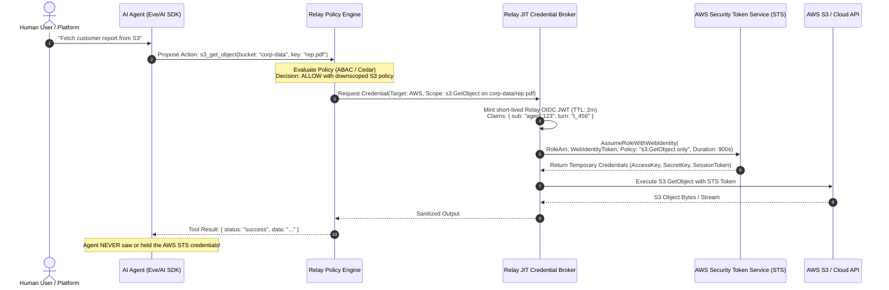
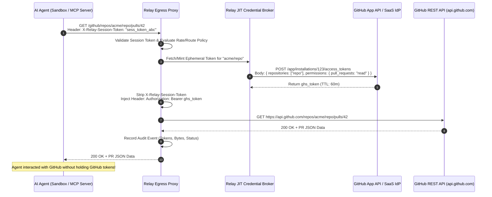
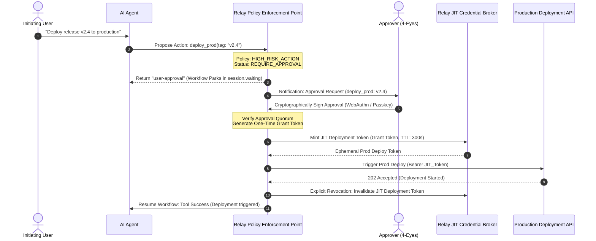

# R010: Just-In-Time (JIT) Credentials for AI Agents — Architecture & Broker Model

**Document ID**: `R010-jit-credentials`  
**Status**: Research & Architecture Proposal  
**Target**: Relay Security & Credential Subsystem  
**Author**: Relay Security Architecture  

---

## 1. Executive Summary & The "Anti-Vault" Principle

### 1.1 The Problem
AI agents operating in modern cloud and SaaS environments need access to external resources (cloud infrastructure, databases, code repositories, APIs) to perform their tasks. Traditional application architectures provision long-lived API keys, IAM credentials, or persistent database connection strings into environment variables or secrets managers.

Giving persistent, broad credentials to an autonomous AI agent creates catastrophic security risks:
1. **Prompt Injection & Exfiltration:** An LLM agent tricked by untrusted context can be coerced into printing, logging, or exfiltrating persistent credentials stored in memory or files.
2. **Blast Radius Expansion:** Broad credentials allow a compromised agent to perform actions far beyond its immediate task.
3. **Absence of Proof & Action Binding:** If an agent holds a shared service account token, the upstream target cannot distinguish between normal agent behavior and malicious lateral movement.

### 1.2 The "Anti-Vault" Principle
A common architectural trap when addressing agent credentials is to build a full-featured, general-purpose secret management platform (a "custom HashiCorp Vault clone"). Building a general-purpose vault requires solving multi-tenant storage encryption, hardware security module (HSM) lifecycle management, master key sharding (Shamir's secret sharing), complex rotation cron jobs, and database secret engine drivers.

**Relay is not a secret store; Relay is a Just-In-Time (JIT) Credential Broker and Policy Enforcement Gate.**

Relay's objective is to **mint, downscope, and inject short-lived, single-purpose credentials at the exact instant an authorized action executes**, leveraging existing identity providers (IdPs), Security Token Services (STS), and cloud workload identity federation rather than storing static credentials at rest.

```
+----------------------------------------------------------------------------------------------------+
|                                    RELAY AS JIT CREDENTIAL BROKER                                  |
|                                                                                                    |
|  [Agent Workflow]  ---(Proposes Action)--->  [Relay Policy Engine]  ---(Evaluates Policy & Scope)  |
|                                                     |                                              |
|                                                     v                                              |
|                                          [JIT Credential Broker]                                   |
|                                                     |                                              |
|                       +-----------------------------+-----------------------------+                |
|                       |                             |                             |                |
|                       v                             v                             v                |
|                 [OIDC / STS]                [External Secret]              [Reverse Proxy /]       |
|                 (AWS/GCP/K8s)               (GitHub App/OAuth)             [Egress Injector]       |
|                       |                             |                             |                |
|                       +-----------------------------+-----------------------------+                |
|                                                     |                                              |
|                                                     v                                              |
|                                 [Short-Lived, Monotonically Downscoped                             |
|                                  Credential Bound to Single Tool Execution]                        |
+----------------------------------------------------------------------------------------------------+
```

---

## 2. Forensic Investigation of Concrete Provider Mechanisms

### 2.1 AWS: STS & Dynamic Session Policies

AWS provides the gold standard for dynamic, short-lived, downscoped credentials via the **AWS Security Token Service (STS)**.

#### Mechanism
1. **Workload Identity Federation (`sts:AssumeRoleWithWebIdentity`)**: Relay acts as an OpenID Connect (OIDC) identity provider with its own JSON Web Key Set (JWKS). Relay signs a short-lived OIDC JWT asserting the agent session ID, turn ID, and tenant ID. AWS STS validates the JWT and assumes an IAM role configured with an OIDC trust policy.
2. **Session Policies (Monotonic Attenuation)**: When calling `AssumeRole` or `AssumeRoleWithWebIdentity`, Relay passes an inline IAM policy in the `Policy` parameter. This session policy acts as a permission filter: the effective permissions are the **intersection** of the IAM role's permissions and the session policy.
3. **Session Tags & Source Identity**: Relay injects `sts:TagSession` and `SetSourceIdentity` (`SourceIdentity: "relay:agent:session_abc:turn_123"`) for immutable CloudTrail audit attribution.
4. **Credential Characteristics**:
   - Return: `AccessKeyId`, `SecretAccessKey`, `SessionToken`.
   - Minimum TTL: 15 minutes (900 seconds) via STS API.
   - Blast Radius: Pinned to specific ARNs (e.g., `arn:aws:s3:::customer-bucket/reports/session_123/*`).

#### AWS RDS PostgreSQL Dynamic IAM Auth
Instead of database passwords, Relay generates an **IAM Database Authentication Token** using `aws rds generate-db-auth-token`.
- Token format: Signed SigV4 URL containing `Action=connect`, host, port, username.
- Validity: Exactly 15 minutes.
- Enforcement: PostgreSQL database validates the SigV4 token against AWS IAM via the `rds_iam` plugin. No static database credentials ever touch Relay or the agent.

---

### 2.2 GitHub: GitHub App Installation Tokens

GitHub provides granular, short-lived tokens via **GitHub Apps**.

#### Mechanism
1. **Relay GitHub App Registration**: Relay is registered as a GitHub App with an asymmetric private key (RSA 2048-bit) and App ID.
2. **JWT Authentication**: Relay mints a short-lived JWT (max 10 minutes) signed by the App's private key.
3. **Installation Access Token Generation**:
   Relay invokes `POST https://api.github.com/app/installations/{installation_id}/access_tokens`.
4. **Dynamic Downscoping**:
   Relay specifies:
   - `repositories`: Explicit array of repository names (e.g., `["relay-client-repo"]`).
   - `permissions`: Granular scope object (e.g., `{"pull_requests": "write", "contents": "read", "issues": "none"}`).
5. **Credential Characteristics**:
   - Token format: `ghs_...` Bearer token.
   - Lifetime: 1 hour (cannot be lowered via API, but Relay can invalidate the token immediately upon action completion via `DELETE /installation/token`).
   - Agent Exposure: Token is injected into the HTTP client or sandbox git credential helper; agent never sees the GitHub App master private key.

---

### 2.3 Vercel: OIDC & Sandbox Firewall Brokering

Vercel provides two distinct credential boundaries: runtime identity and sandbox credential brokering.

#### Mechanism
1. **Vercel OIDC Token (`VERCEL_OIDC_TOKEN`)**:
   - Every Vercel Function execution receives a signed OIDC JWT in `process.env.VERCEL_OIDC_TOKEN`.
   - Claims include `team_id`, `project_id`, `deployment_id`, and `environment`.
   - Relay can consume this token to authenticate that an inbound request originates from a genuine Vercel deployment.
2. **Vercel Sandbox Credential Brokering**:
   - The Vercel Sandbox microVM runs an isolated Linux environment without access to the host `process.env`.
   - Outbound network requests from the sandbox pass through a microVM network firewall.
   - The App Runtime configures network rules with `transform`:
     ```json
     {
       "allow": {
         "api.github.com": [
           {
             "transform": [
               { "headers": { "Authorization": "Bearer ghs_ephemeral..." } }
             ]
           }
         ]
       }
     }
     ```
   - **Crucial Security Property**: The sandbox process (e.g., `curl` or `git`) makes an unauthenticated request; the firewall transparently injects the `Authorization` header. The agent process and model never see the credential.

---

### 2.4 PostgreSQL: Ephemeral Database Credentials

Relay can provision database access using four distinct approaches:

```
+----------------------------------------------------------------------------------------------------+
|                                    POSTGRESQL CREDENTIAL OPTIONS                                   |
+--------------------------+--------------------+-----------------------+----------------------------+
| Approach                 | Minting Engine     | TTL                   | Agent Exposure             |
+--------------------------+--------------------+-----------------------+----------------------------+
| 1. Cloud IAM Auth        | AWS RDS / GCP IAM  | 15 minutes            | Single-use Auth Token      |
| 2. Dynamic DB User       | HashiCorp Vault /  | Configurable (5m-1h)  | Auto-dropped DB Role       |
|                          | Relay Admin Worker |                       |                            |
| 3. Ephemeral mTLS Cert   | Relay / Hashi CA   | 5-15 minutes          | Short-lived X.509 Client   |
| 4. Proxied Query Gate    | Relay Proxy / MCP  | 0 (No credential)     | No DB Access (Query Only)  |
+--------------------------+--------------------+-----------------------+----------------------------+
```

#### The Proxied Query Gate (Recommended Model)
For AI agents, direct TCP connection strings to databases are dangerous because the agent can execute arbitrary SQL dialects, transaction locks, or connection exhaustion attacks.
Instead of minting database passwords:
1. The agent calls a parameterized tool: `db_query({ queryId: "find_customer_by_email", params: { email } })`.
2. Relay validates policy against the query template and parameters.
3. Relay's internal connection pool executes the query with a pre-authenticated service role.
4. Relay sanitizes and returns only the data rows. **Zero database credentials are ever minted or exposed to the agent.**

---

### 2.5 Generic OAuth APIs & SaaS (Slack, Linear, Salesforce, Google)

For third-party SaaS services that do not support dynamic STS role assumption:

#### Mechanism
1. **OAuth 2.0 Token Exchange (RFC 8693)**:
   - When supported by the upstream IdP (e.g., Auth0, Keycloak, Okta), Relay exchanges a subject token (Relay Agent OIDC JWT) for a downstream API access token downscoped to specific audience and scopes.
2. **Vaulted Refresh Token with JIT Access Token Minting**:
   - User completes an interactive OAuth grant once (`authorization_code` flow).
   - The long-lived Refresh Token is stored securely in an encrypted external store (e.g., AWS Secrets Manager or KMS-backed envelope store).
   - When the agent proposes an action (`slack:post_message`), Relay uses the refresh token to mint an ephemeral Access Token (TTL: 5–60 minutes).
3. **Egress Gateway Injection**:
   - The access token is injected at the network proxy layer. The agent receives only a transient handle (`handle: "oauth_ref_xyz"`).

---

### 2.6 Kubernetes: Projected Tokens & Ephemeral SA Impersonation

Kubernetes natively supports short-lived, audience-bound tokens.

#### Mechanism
1. **TokenRequest API (`serviceaccounts/token` subresource)**:
   - Relay calls `POST /api/v1/namespaces/{ns}/serviceaccounts/{sa}/token` with a `TokenRequest` spec.
   - Parameters:
     - `audiences`: Target service or API (e.g., `["https://vault.internal", "https://api.k8s.cluster"]`).
     - `expirationSeconds`: Minimum 600 seconds (10 minutes).
   - Kubernetes API returns an audience-bound, cryptographically signed projected Service Account JWT.
2. **User Impersonation Headers**:
   - For administrative clusters, Relay's controller authenticates with its own master certificate/token and injects HTTP impersonation headers:
     - `Impersonate-User: "relay:agent:session_123"`
     - `Impersonate-Group: "relay:agents:read-only"`
     - `Impersonate-Extra-Tenant: "tenant_abc"`
   - Kubernetes RBAC evaluates the impersonated identity dynamically on every API call.

---

### 2.7 SPIFFE/SPIRE & Short-Lived Certificates

#### Mechanism
1. **Workload Attestation**: SPIRE server issues X.509 SVIDs (SPIFFE Verifiable Identity Documents) to attested agent execution containers.
2. **mTLS Handshake**: The agent's sidecar communicates with upstream internal microservices via mTLS.
3. **Short TTL**: Certificates are rotated every 10–60 minutes automatically.
4. **Relay Application**: SPIFFE/SPIRE is ideal for **internal service-to-service communication** where Relay validates the physical container running the agent before granting capability tokens.

---

## 3. Core Architectural Questions (1–10)

### Q1: Where can Relay mint credentials directly?
Relay can act as an authoritative credential issuer (minting directly) in domains where Relay controls the cryptographic root of trust:
1. **Relay OIDC Identity Tokens (JWTs)**: Relay acts as an OpenID Connect Identity Provider. It publishes its JWKS at `/.well-known/jwks.json` and signs asymmetric JWTs claiming agent session identity, tenant, and turn metadata. Downstream clouds (AWS, GCP, K8s) federate with Relay's OIDC issuer.
2. **Short-Lived Cryptographic Capability Tokens (Macaroons / Biscuits / Signed Nonces)**: Relay mints cryptographically attenuated tokens that encode allowed tool names, parameter hashes, and expiration timestamps.
3. **Internal mTLS Client Certificates**: If Relay runs an internal ephemeral CA (using standard Go `crypto/x509` or Vault CA), Relay can issue 5-minute X.509 client certificates for internal proxy authentication.

### Q2: Where must Relay integrate with an existing identity provider?
Relay **cannot** mint credentials directly for third-party proprietary clouds and SaaS providers where Relay does not own the cryptographic signing keys. In these systems, Relay must integrate via standard federation APIs:
- **Cloud IAM**: AWS STS (`AssumeRoleWithWebIdentity`), GCP Security Token Service, Azure Entra ID Workload Identity.
- **VCS & Developer Platforms**: GitHub API (GitHub App token minting), GitLab API, Bitbucket.
- **Enterprise IAM & SaaS**: Okta, Auth0, Microsoft Entra, Google Workspace, Slack, Salesforce.

### Q3: What credentials should never pass through Relay?
To minimize compliance blast radius (SOC 2, ISO 27001, PCI-DSS) and legal liability:
1. **Master / Root Cloud Credentials**: AWS Root Account keys, GCP Organization Admin credentials, Azure Global Admin tokens.
2. **Payment Card Industry Data (PAN, CVV)**: Stripe/payment tokens must be handled via direct customer-to-processor tokenization.
3. **Master Database Superuser Passwords**: `postgres` superuser credentials or unpartitioned root database connection strings.
4. **Customer Master Private Keys**: Raw SSH private keys, PGP private keys, or enterprise root CA private keys.
5. **Long-Lived Human User Passwords**: Relay only ever accepts federated identity tokens (OIDC, SAML, WebAuthn), never raw user passwords.

### Q4: Should credentials be visible to the MCP server?
**Default: NO. Credentials should be withheld from both the LLM and the Model Context Protocol (MCP) server wherever possible.**
- If the MCP server is hosted inside an untrusted sandbox or third-party container, exposing credentials to the MCP server allows malicious tool code to exfiltrate the token.
- **Architectural Solution: The Governed MCP Proxy**. The MCP server receives an unauthenticated request with a Relay transaction reference (`relayTxId`). The MCP server constructs the raw upstream HTTP request and routes it through Relay's credential-injecting egress proxy, which injects the authorization header on the wire.
- **Exception**: For specialized MCP servers whose sole purpose is to wrap a vendor SDK (e.g., an AWS S3 MCP server), the server may receive a strictly downscoped, 15-minute STS session token restricted to a single S3 prefix.

### Q5: Can Relay inject credentials without exposing them to the agent?
**YES. This is a foundational design requirement.**
There are three concrete mechanisms to achieve zero-credential agent exposure:
1. **Forward/Egress Proxy with Header Injection**: The agent/tool emits standard HTTP requests to `https://proxy.relay.internal/github/repos/owner/repo/pulls`. The proxy verifies the agent's session token, evaluates policy, strips internal headers, injects `Authorization: Bearer ghs_...`, and dispatches to `https://api.github.com`.
2. **Sandbox Firewall Brokering (Vercel / MicroVM / eBPF)**: The microVM hypervisor or eBPF network filter transparently inspects outgoing packets to whitelisted hostnames and injects authentication headers at the network layer.
3. **Tool Parameterization (Server-Side Execution)**: The agent never sees an API or database. It sees abstract tool calls (`transfer_funds({ recipient, amount })`). The tool executor runs in Relay's secure App Runtime, fetches credentials from memory/STS, executes the API call, and returns sanitized JSON results to the agent.

### Q6: What happens when credential acquisition fails?
Relay enforces a strict **Deterministic Fail-Closed Policy**:
1. **Execution Halts**: The proposed tool action is aborted immediately. The tool body is never executed.
2. **Non-Leaking Error Synthesis**: Relay formats a structured, sanitized error message for the model:
   ```json
   {
     "isError": true,
     "errorCode": "CREDENTIAL_ACQUISITION_FAILED",
     "message": "Authorization could not be established for the target service (AWS STS role assumption rejected). Contact your administrator.",
     "retryable": false
   }
   ```
3. **No Secret Leakage in Traces**: Detailed stack traces, raw HTTP response bodies from upstream IdPs, or partial token strings are stripped before entering conversation history.
4. **Audit Alerting**: A security event is recorded in Relay's immutable audit ledger (`CREDENTIAL_BROKER_FAILURE`) with root-cause diagnostics for administrators.

### Q7: What happens when Relay is compromised?
If an attacker compromises Relay's application runtime, the blast radius is strictly constrained by the JIT architecture:
1. **No Vault of Stored Static Secrets**: An attacker cannot dump a database of persistent API keys, because Relay does not store long-lived credentials.
2. **Short Token Lifetimes (Max 15m)**: Any active ephemeral tokens in memory expire within minutes.
3. **Session Policy Downscoping**: An attacker holding Relay's OIDC private key can only assume cloud IAM roles that trust Relay's OIDC issuer. If cloud IAM roles enforce strict trust boundaries, the attacker cannot escalate to root cloud administrator.
4. **Hardware Root of Trust (KMS / HSM)**: Relay's OIDC signing keys are stored in AWS KMS / GCP Cloud KMS / HashiCorp Vault Transit engine, preventing key extraction.

### Q8: How are credentials scoped?
Relay applies **Four-Dimensional Downscoping (4D-Scope)**:
1. **Identity & Principal Dimension**: Token claims bind the action to the human initiator (`user_id`), agent ID, session ID, and turn ID.
2. **Action & Method Dimension**: Permissions are restricted to the exact API verb (e.g., `s3:GetObject` only, denying `s3:PutObject` and `s3:DeleteObject`).
3. **Resource & Namespace Dimension**: Scoped strictly to target ARNs, repository names, database tables, or URL paths (e.g., `repo:org/frontend-repo` only).
4. **Temporal Dimension**: Lifetime is pinned to the minimum feasible duration (e.g., 60 seconds for an HTTP proxy request; 15 minutes for an AWS STS session).

### Q9: How are credentials revoked?
1. **Passive Revocation by Design (Micro-TTLs)**: For credentials with lifetimes under 5 minutes, passive expiration is the most resilient revocation mechanism.
2. **Active Revocation APIs**:
   - **GitHub**: Call `DELETE /installation/token` immediately upon tool completion.
   - **OAuth 2.0**: Call RFC 7009 Token Revocation endpoint (`POST /oauth/revoke`).
   - **AWS IAM**: Apply an inline session revocation policy on the IAM role matching `aws:TokenIssueTime < [revocation_time]`.
3. **Network Cut-Off**: For proxy-injected credentials, Relay terminates the HTTP proxy session or invalidates the connection pool handle instantly.

### Q10: What is the minimum credential architecture for MVP?
The minimum viable architecture requires **zero custom vault implementation**:
1. **Relay OIDC Provider**: A lightweight OIDC discovery & JWKS endpoint to enable AWS/GCP Workload Identity Federation.
2. **GitHub App Client**: Simple RSA-JWT signer to mint short-lived GitHub installation tokens on demand.
3. **AWS STS AssumeRole Broker**: Standard AWS SDK calls with inline session policy downscoping.
4. **Credential-Injecting Reverse Proxy**: A lightweight Node.js/Go HTTP reverse proxy that injects Authorization headers on outbound API calls.

---

## 4. Deliverable: Credential Flow Diagrams

### 4.1 Flow 1: Workload Identity Federation (AWS STS Role Assumption)



---

### 4.2 Flow 2: Credential-Injecting Reverse Proxy (GitHub App / SaaS OAuth)



---

### 4.3 Flow 3: Human-in-the-Loop Multi-Party Approval & JIT Minting



---

## 5. Deliverable: Provider Capability Matrix

| Target Provider | Minting / Assumption Mechanism | Min Scope Granularity | Min TTL | Native Downscoping Support | Relay Integration Complexity | Security & Compliance Risk Rating |
| :--- | :--- | :--- | :--- | :--- | :--- | :--- |
| **AWS** | `sts:AssumeRoleWithWebIdentity` | Fine-grained (ARN, Action, Tag, Condition) | 15 mins (900s) | **Excellent** (Inline Session Policies) | **Low** (Native OIDC Federation) | **LOW** (Standard IAM auditability) |
| **GitHub** | GitHub App Installation Tokens | Per-repository + Category permissions | 60 mins | **High** (Repo + Permission filter) | **Low** (JWT App signature API) | **LOW** (Explicit repo scoping) |
| **Vercel** | Sandbox Credential Brokering / OIDC | Domain-level network policy header transform | Session / Turn duration | **High** (Firewall Header Injection) | **Medium** (Vercel Sandbox API) | **LOW** (MicroVM hardware isolation) |
| **PostgreSQL** | RDS IAM / Proxied Parameterized Query | Table / Row / Param level | 15 mins (IAM) / 0s (Proxy) | **Excellent** (Via Proxy/Tool Engine) | **Medium** (Database driver pool) | **LOW** (No direct SQL access) |
| **Kubernetes** | TokenRequest API / Impersonation | Namespace, Resource, Verb, Audience | 10 mins (600s) | **High** (Projected token audience) | **Medium** (K8s API client) | **MEDIUM** (Requires cluster RBAC design) |
| **Generic OAuth (SaaS)** | RFC 8693 Token Exchange / Refresh Proxy | OAuth Scope strings | 5–60 mins | **Medium** (Vendor-dependent scopes) | **Medium** (Vaulted refresh token store) | **MEDIUM** (Token store protection required) |
| **Cloudflare / Edge** | API Tokens / Worker Bindings | Zone, Service, Account | Custom | **Medium** (Pre-created policy templates) | **Medium** (Cloudflare API) | **LOW** |

---

## 6. Deliverable: Recommended Credential Abstraction

Relay should implement a clean, unified TypeScript abstraction for credential lifecycle management without coupling core logic to any single cloud provider:

```ts
/**
 * Core JIT Credential Interfaces for Relay
 */

export type CredentialType = 
  | "aws_sts_session" 
  | "github_app_token" 
  | "bearer_token" 
  | "mTLS_certificate" 
  | "injected_proxy_handle";

export interface CredentialLease {
  readonly leaseId: string;
  readonly credentialType: CredentialType;
  readonly expiresAt: Date;
  readonly isRevocable: boolean;
  /** Raw credential value; ONLY present in App Runtime, NEVER sent to agent */
  readonly secretPayload?: Readonly<Record<string, string>>;
  /** Opaque proxy handle passed to agent/tools */
  readonly proxyHandle?: string;
  readonly metadata: {
    readonly targetService: string;
    readonly scopedResources: readonly string[];
    readonly sessionId: string;
    readonly turnId: string;
  };
}

export interface CredentialRequest {
  readonly targetService: "aws" | "github" | "vercel" | "postgres" | "oauth_generic";
  readonly actionName: string;
  readonly requestedScope: {
    readonly actions: readonly string[];
    readonly resources: readonly string[];
  };
  readonly sessionContext: {
    readonly sessionId: string;
    readonly turnId: string;
    readonly initiatorId: string;
    readonly tenantId: string;
  };
  readonly maxTtlSeconds?: number;
}

export interface JITCredentialBroker {
  /**
   * Evaluates policy and acquires an ephemeral, downscoped credential lease.
   */
  acquireCredential(request: CredentialRequest): Promise<CredentialLease>;

  /**
   * Explicitly revokes an active credential lease before its natural TTL expiration.
   */
  revokeCredential(leaseId: string): Promise<void>;

  /**
   * Returns a configured fetch/dispatch client that transparently injects credentials.
   */
  createAuthenticatedDispatcher(lease: CredentialLease): (url: string, init?: RequestInit) => Promise<Response>;
}
```

---

## 7. Deliverable: Security Risks & Threat Modeling

| Threat / Attack Vector | Vulnerability Description | Relay Mitigation Strategy |
| :--- | :--- | :--- |
| **T1: Prompt Injection Exfiltration** | LLM is coerced into outputting its credentials in user-facing chat or tool arguments. | **Zero Exposure**: Credentials are proxy-injected or tool-parameterized; the LLM agent never sees or stores the credential. |
| **T2: Confused Deputy & Scope Creep** | Compromised agent uses valid credentials to perform unauthorized actions on neighboring resources. | **Monotonic Downscoping**: AWS STS session policies and GitHub repo filters restrict token authority strictly to the exact target ARN/repo. |
| **T3: Stolen Credential Replay** | An attacker intercepts an ephemeral token from logs or network transit and replays it. | **Micro-TTLs & IP Pinning**: Tokens expire in $\le 15$ minutes; AWS STS credentials can be bound to `aws:SourceIP` condition keys. |
| **T4: Token Orphanage / Leak** | Agent process crashes or is cancelled while an ephemeral token is active. | **Passive Expiration & Async Teardown**: Short TTLs naturally invalidate orphaned tokens; turn cancellation hooks call explicit revocation. |
| **T5: Relay Master Key Compromise** | Attacker compromises Relay's OIDC private key or GitHub App private key. | **Hardware KMS Isolation**: Private keys are hosted in AWS KMS / GCP KMS HSM modules; key material cannot be exported. |

---

## 8. Deliverable: Credential Lifecycle State Machine

```
               +-----------------------+
               | 1. Action Proposed    |
               +-----------+-----------+
                           |
                           v
               +-----------------------+
               | 2. Policy Evaluation  |
               +-----------+-----------+
                           |
            +--------------+--------------+
            |                             |
       (Decision=DENY)          (Decision=ALLOW / APPROVED)
            |                             |
            v                             v
+-----------------------+     +-----------------------+
| Terminate (Fail-Close)|     | 3. Mint / Exchange    |
+-----------------------+     |    (OIDC / STS / App) |
                              +-----------+-----------+
                                          |
                                          v
                              +-----------------------+
                              | 4. Attenuate & Scope  |
                              |    (Session Policy)   |
                              +-----------+-----------+
                                          |
                                          v
                              +-----------------------+
                              | 5. Proxy / Inject     |
                              |    (Execute Action)   |
                              +-----------+-----------+
                                          |
                                          v
                              +-----------------------+
                              | 6. Complete & Audit   |
                              |    (Record Telemetry) |
                              +-----------+-----------+
                                          |
                        +-----------------+-----------------+
                        |                                   |
                  (Auto-Expire)                     (Explicit Revoke)
                        |                                   |
                        v                                   v
            +-----------------------+           +-----------------------+
            | 7. Natural TTL Expiry |           | 8. Explicit API Purge |
            +-----------------------+           +-----------------------+
```

---

## 9. Deliverable: MVP Implementation Recommendation

To deliver robust JIT credentials in Relay MVP without building an unmaintainable custom vault:

### Phase 1: MVP Architecture (The "Lean JIT Broker")
1. **Relay OIDC Issuer**: Implement an RFC 7519 / RFC 7517 OIDC discovery handler in Relay (`/.well-known/openid-configuration` and `/.well-known/jwks.json`). Store the signing key in AWS KMS / GCP KMS.
2. **AWS STS Provider Adapter**: Use `@aws-sdk/client-sts` to perform `AssumeRoleWithWebIdentity` with dynamic JSON session policies generated from Relay policy decisions.
3. **GitHub App Installation Token Broker**: Use `@octokit/auth-app` to mint installation tokens scoped strictly to the repositories involved in the active turn.
4. **Governed Reverse Proxy**: Build a lightweight, streaming HTTP proxy in Node.js/Fastify that injects authorization headers and validates agent session tokens.
5. **No Database Vaulting**: Use Relay Proxied Parameterized Query Tools for database access; do not mint raw database user passwords for agents.

### Phase 2: Post-MVP Extensions
1. HashiCorp Vault / External Secrets Manager integration via standard SPIFFE/OIDC workload federation.
2. Generic OAuth 2.0 RFC 8693 Token Exchange bridge for SaaS integrations (Slack, Linear, Google Workspace).
3. Kubernetes Dynamic TokenRequest & Impersonation controller.

---

## 10. Conclusion

Relay can achieve enterprise-grade just-in-time credential governance **without becoming a secret vault**. By acting as a thin, deterministic broker that combines OIDC Workload Identity Federation, AWS STS session downscoping, GitHub App granular installation tokens, and credential-injecting proxies, Relay eliminates static credentials while keeping the agent completely blind to sensitive token material.
