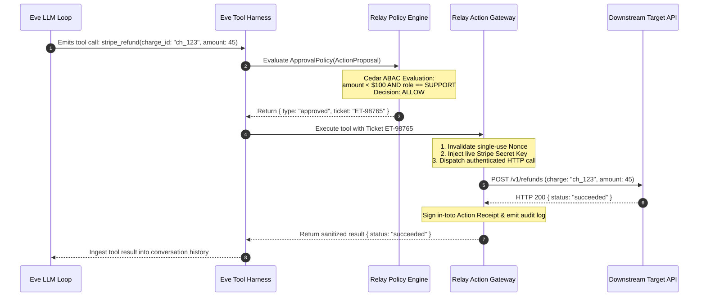
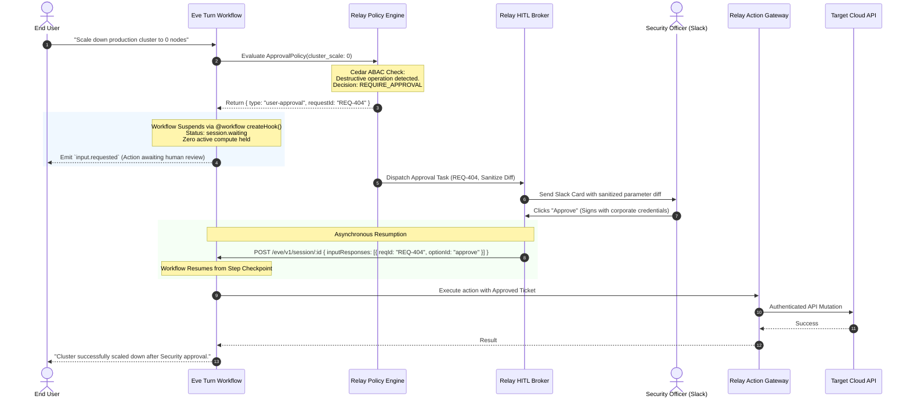
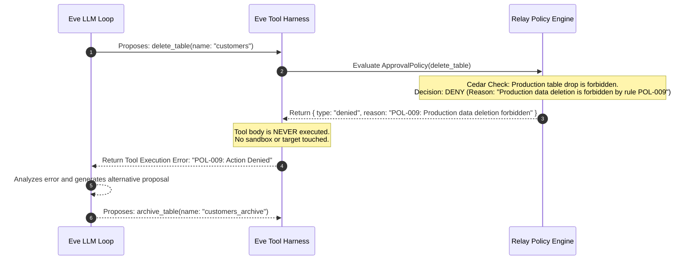

# R013: Architectural Boundary Specification — Vercel Eve & Relay

**Document ID:** `R013-eve-relay-boundary`  
**Status:** Complete / Authoritative Specification  
**Date:** 2026-09-12  
**Target Project:** Relay Architecture & Control Plane Design  
**Context Dependencies:** `R002` (Eve Technical Forensics), `00-research-synthesis` (Ground Truth), `R003` (Authority Model), `R004` (Standards & Interoperability), `R005` (Threat Model)  

---

## Executive Summary

Relay's foundational product hypothesis asserts:  
> *Agents should propose actions, while deterministic infrastructure determines whether those actions are authorized, approved, and executed.*

To implement this hypothesis effectively, Relay must interface cleanly with state-of-the-art agent frameworks without duplicating runtime execution primitives or introducing architectural coupling. This specification establishes the exact technical boundary between **Vercel Eve** (`vercel/eve`) and **Relay**.

### The Core Architectural Division

```
┌──────────────────────────────────────────────────────────────────────────────────────────────────┐
│                                   THE FUNDAMENTAL DIVISION                                       │
├───────────────────────────────────────────────────┬──────────────────────────────────────────────┤
│ VERCEL EVE OWNS (The Agent Execution Plane)       │ RELAY OWNS (The Action Governance Plane)     │
├───────────────────────────────────────────────────┼──────────────────────────────────────────────┤
│ • Prompt assembly & LLM context window management │ • Deterministic Policy Enforcement (ABAC/PEP)│
│ • Tool loop orchestration (`ToolLoopAgent`)       │ • Multi-tenant Identity & Delegation Chains  │
│ • Durable turn workflows (`@workflow/core`)       │ • Zero-Knowledge Credential Vaulting (JIT)   │
│ • Workflow suspension (`session.waiting`)         │ • Multi-party HITL Approval Escalations      │
│ • Sandboxed filesystem/bash compute (`/workspace`)│ • Cryptographic Action Attestation & Receipts│
│ • Subagent hierarchy spawning & task delegation   │ • Egress Action Gateway & Tool Interception  │
└───────────────────────────────────────────────────┴──────────────────────────────────────────────┘
```

By enforcing this boundary, Eve handles the probabilistic, non-deterministic agent loop and durable execution state, while Relay guarantees deterministic security invariants, zero ambient credential exposure, and non-repudiable audit trails.

---

## Table of Contents

1. [System Decomposition & Responsibility Matrix](#1-system-decomposition--responsibility-matrix)
2. [End-to-End Architecture Topology](#2-end-to-end-architecture-topology)
3. [Lifecycle Sequence Diagrams](#3-lifecycle-sequence-diagrams)
4. [Direct Answers to the 10 Architectural Questions](#4-direct-answers-to-the-10-architectural-questions)
5. [Integration Contracts & Protocol Interfaces](#5-integration-contracts--protocol-interfaces)
6. [Failure Modes & Resilience Guarantees](#6-failure-modes--resilience-guarantees)
7. [Recommended Eve Adapter Architecture (`@relay/eve-adapter`)](#7-recommended-eve-adapter-architecture-relayeve-adapter)
8. [The Definitive Boundary Statement](#8-the-definitive-boundary-statement)

---

## 1. System Decomposition & Responsibility Matrix

The separation of concerns between Eve and Relay is organized across six core functional domains:

```
┌──────────────────────────────────────────────────────────────────────────────────────────────────┐
│                                  SYSTEM RESPONSIBILITY MATRIX                                    │
├──────────────────────────┬─────────────────────────────────────┬─────────────────────────────────┤
│ Functional Domain        │ Vercel Eve (Agent Runtime)          │ Relay (Action Control Plane)    │
├──────────────────────────┼─────────────────────────────────────┼─────────────────────────────────┤
│ 1. Agent Runtime         │ • Generates tool calls from LLM     │ • Agnostic to model selection   │
│                          │ • Compiles prompt templates         │ • Ingests normalized proposals  │
│                          │ • Manages token limits & streaming  │ • Never inspects prompt tokens  │
├──────────────────────────┼─────────────────────────────────────┼─────────────────────────────────┤
│ 2. Workflow & Durability │ • Checkpoints steps via `@workflow` │ • Tracks external approval state│
│                          │ • Parks turns at `session.waiting`  │ • Holds no runtime workflow code│
│                          │ • Recovers from process crashes     │ • Resumes Eve via HTTP webhooks │
├──────────────────────────┼─────────────────────────────────────┼─────────────────────────────────┤
│ 3. Approvals & HITL      │ • Emits `input.requested` events    │ • Evaluates policy-mandated HITL│
│                          │ • Slices UI input response batches  │ • Manages Slack/Teams routing   │
│                          │ • Single-session local confirmation │ • Multi-party quorum & signing  │
├──────────────────────────┼─────────────────────────────────────┼─────────────────────────────────┤
│ 4. Identity & Authority  │ • Tracks session `auth.initiator`   │ • Validates composite identities│
│                          │ • Propagates caller claims in app   │ • Computes authority attenuation│
│                          │ • Inherits process-level env vars   │ • Enforces enterprise ABAC/Cedar│
├──────────────────────────┼─────────────────────────────────────┼─────────────────────────────────┤
│ 5. Tool Secrets & Vault  │ • ZERO TARGET SECRETS STORED        │ • Stores third-party API keys   │
│                          │ • Holds only ephemeral Relay token  │ • Injects credentials JIT       │
│                          │ • No access to raw database/SaaS pwd│ • Masks secrets in tool returns │
├──────────────────────────┼─────────────────────────────────────┼─────────────────────────────────┤
│ 6. Tool Execution & Box  │ • Sandboxes local bash/filesystem   │ • Intercepts external tool RPCs │
│                          │ • Runs untrusted scripts in microVM │ • Executes target API mutations │
│                          │ • Normalizes local JSON output      │ • Signs in-toto Action Receipts │
└──────────────────────────┴─────────────────────────────────────┴─────────────────────────────────┘
```

---

## 2. End-to-End Architecture Topology

Relay interfaces with Eve through three distinct adapters: the **Ingress Approval Policy Adapter**, the **MCP Tool Gateway**, and the **Audit Telemetry Hook**.

```
  ┌────────────────────────────────────────────────────────────────────────────────────────┐
  │                                     VERCEL EVE RUNTIME                                 │
  │                                                                                        │
  │  ┌────────────────────────┐        ┌───────────────────┐        ┌───────────────────┐  │
  │  │ User Ingress Channel   │ ─────► │ Turn Workflow     │ ─────► │ AI SDK 7          │  │
  │  │ (HTTP / Slack / Chat)  │        │ (`@workflow/core`)│        │ `ToolLoopAgent`   │  │
  │  └────────────────────────┘        └─────────┬─────────┘        └─────────┬─────────┘  │
  │                                              │                            │            │
  │                                              │ Parks / Resumes            │ Proposes   │
  │                                              │ (`session.waiting`)        │ Tool Call  │
  │                                              ▼                            ▼            │
  │                                    ┌───────────────────┐        ┌───────────────────┐  │
  │                                    │ Eve Input Dispatch│ ◄───── │ Eve Tool Harness  │  │
  │                                    │ (`inputResponses`)│        │ (`ApprovalPolicy`)│  │
  │                                    └─────────▲─────────┘        └─────────┬─────────┘  │
  └──────────────────────────────────────────────┼────────────────────────────┼────────────┘
                                                 │                            │
                                                 │ HTTP Resume Signal         │ Action Proposal (RAPP)
                                                 │ (`POST /eve/v1/...`)       │ Evaluation Request
                                                 │                            │
═════════════════════════════════════════════════╪════════════════════════════╪════════════ [TRUST BOUNDARY]
                                                 │                            │
  ┌──────────────────────────────────────────────┼────────────────────────────┼────────────┐
  │ RELAY CONTROL PLANE                          │                            ▼            │
  │                                              │               ┌──────────────────────┐  │
  │                                              │               │ Relay Ingress PEP    │  │
  │                                              │               │ (RFC 8785 Normalizer)│  │
  │                                              │               └──────────┬───────────┘  │
  │                                              │                          │              │
  │                                              │                          ▼              │
  │                                              │               ┌──────────────────────┐  │
  │                                              │               │ Cedar Policy Engine  │  │
  │                                              │               │ (Deterministic PDP)  │  │
  │                                              │               └──────────┬───────────┘  │
  │                                              │                          │              │
  │                                              │             ┌────────────┴────────────┐ │
  │                                              │             ▼                         ▼ │
  │                                              │      [REQUIRE_APPROVAL]            [ALLOW]
  │                                              │             │                         │ │
  │   ┌────────────────────────┐                 │             ▼                         │ │
  │   │ Approver Interface     │                 │   ┌───────────────────┐               │ │
  │   │ (Slack / Teams / Web)  │ ◄───────────────┼── │ Relay HITL Broker │               │ │
  │   └──────────┬─────────────┘                 │   │ (Quorum / Routing)│               │ │
  │              │                               │   └─────────┬─────────┘               │ │
  │              ▼ Signed Approval Callback      │             │                         │ │
  │   ┌────────────────────────┐                 │             │ Validated               │ │
  │   │ Relay Resume Dispatcher├─────────────────┘             ▼                         │ │
  │   └────────────────────────┘                     ┌───────────────────┐               │ │
  │                                                  │ Execution Ticket  │ ◄─────────────┘ │
  │                                                  │ Minting Authority │                 │
  │                                                  └─────────┬─────────┘                 │
  │                                                            │ Signed Single-Use Ticket  │
  │                                                            ▼                           │
  │                                                  ┌───────────────────┐                 │
  │                                                  │ Relay Action      │ ◄───────────────┼── [JIT Secret Vault]
  │                                                  │ Gateway (Egress)  │                 │
  │                                                  └─────────┬─────────┘                 │
  └────────────────────────────────────────────────────────────┼───────────────────────────┘
                                                               │ Authenticated Outbound Call
                                                               ▼
                                                  ┌────────────────────────┐
                                                  │ Downstream Target APIs │
                                                  │ (GitHub, Stripe, DB)   │
                                                  └────────────────────────┘
```

---

## 3. Lifecycle Sequence Diagrams

### 3.1 Immediate Deterministic Authorization (Fast-Path Allow)



### 3.2 Asynchronous Multi-Party Human Approval (Durable Suspension & Resumption)



### 3.3 Policy Denial & In-Context Model Recovery



---

## 4. Direct Answers to the 10 Architectural Questions

### Q1: Can Eve call MCP through Relay naturally?
**Yes.** Eve integrates with tools via standard tool interfaces. Relay exposes an **MCP Proxy Server** over stdio or Streamed HTTP. In Eve's configuration (`agent/connections/`), the developer points the MCP client connection to the Relay Proxy endpoint. To Eve, Relay behaves as a standard compliant MCP Server exposing discovered tools. When Eve emits `tools/call`, Relay transparently intercepts, authorizes, credentials, and executes the call.

---

### Q2: Should Relay be an MCP proxy or an Eve tool?
**Relay should be an MCP Proxy for external tools, and an `ApprovalPolicy` wrapper for native TypeScript tools.**
* **For MCP Tools (External Ecosystem):** Relay sits as an **MCP Proxy/Gateway** in front of remote or local MCP servers. Eve needs zero custom tool code; it simply targets Relay's MCP endpoint.
* **For Native TS Tools (`defineTool` in Eve):** Relay provides a lightweight library adapter (`createRelayApprovalAdapter`) that attaches to Eve's native `approval` hook.  
* *Anti-Pattern Warning:* Relay must **not** be exposed as a single generic tool (e.g. `relay.call_action(...)`), as this degrades LLM function-calling accuracy and breaks tool schema validation.

---

### Q3: Can Eve accidentally bypass Relay?
**Yes, if architectural defenses are not enforced.** Eve could bypass Relay via:
1. Hardcoding third-party API keys in the Node.js App Runtime and calling `fetch()` directly in tool definitions.
2. Executing `curl` or raw network calls inside Eve's unconstrained sandbox bash tool.
3. Registering direct MCP connections that point straight to external servers rather than Relay.

**The Hardening Controls:**
* **Zero Ambient Credentials:** Downstream API keys are omitted entirely from Eve's `process.env`. Even if Eve attempts direct calls, it lacks valid credentials.
* **Sandbox Egress Network Policies:** Eve's sandbox microVMs are configured with strict firewall rules (`deny-all` egress, allow-listing only the Relay Gateway endpoint).
* **Static Tool Linting:** Pre-commit rules that reject any tool authored without the Relay approval wrapper.

---

### Q4: Which approval mechanism belongs to Eve?
**Eve owns Workflow Suspension & Resumption Transport:**
* Detecting the `user-approval` status returned by the policy adapter.
* Emitting `input.requested` events to the active session stream.
* Freezing active compute using `@workflow/core` durable hooks.
* Setting session state to `session.waiting`.
* Ingesting `inputResponses` over `POST /eve/v1/session/:id` and unpausing the step.

---

### Q5: Which authorization mechanism belongs to Relay?
**Relay owns Enterprise Authorization & Escalation Policy:**
* Determining *whether* an action requires approval based on ABAC policies, blast-radius calculation, and spending limits.
* Determining *who* has legitimate authority to approve (Role, Quorum, Separation of Duties).
* Routing approval tasks to out-of-band enterprise channels (Slack, Teams, Email).
* Verifying cryptographic approver signatures and recording non-repudiable audit receipts.

---

### Q6: Where should policy evaluation occur?
**Policy evaluation occurs strictly inside Relay's Policy Decision Point (PDP).**  
Policy rules never reside inside Eve's prompt context, Node.js memory, or session state. Eve's `approval` adapter sends a structured `ActionProposal` to Relay's embedded Cedar PDP, which evaluates deterministic boolean constraints in sub-millisecond Rust compute and returns the decision.

---

### Q7: How should long-running workflows interact with Relay?
Eve leverages its durable workflow engine (`@workflow/core`):
1. When Relay requires human approval, Eve suspends the turn step and saves a durable snapshot to disk/PostgreSQL.
2. Eve holds **zero open HTTP connections and consumes zero CPU** while waiting.
3. The approval request in Relay can remain pending for minutes, hours, or days.
4. When Relay captures all required approvals, it dispatches an asynchronous HTTP webhook to Eve (`POST /eve/v1/session/:id` with `inputResponses`), waking the workflow exactly where it paused.

---

### Q8: What happens when Relay blocks an action?
When Relay denies a proposal:
1. Relay returns `{ type: "denied", reason: "Policy POL-104 violated: Daily transfer limit reached" }`.
2. Eve's tool harness intercepts the denial, suppresses the `execute()` body, and generates a synthetic `TOOL_EXECUTION_DENIED` tool response.
3. The error message is formatted cleanly and passed back to the LLM in the conversation history.
4. The model reasons over the explanation and either tries an authorized alternative or informs the user of the policy restriction. The workflow remains healthy and does not crash.

---

### Q9: What happens when Relay is unavailable?
**Relay enforces Fail-Closed Semantics:**
* **Synchronous Gating:** If the Relay PEP is unreachable or times out during `ApprovalPolicy` evaluation, the adapter catches the connection error and returns `{ type: "denied", reason: "Relay governance gateway unreachable (Fail-Closed)" }`. The tool execution is blocked.
* **Asynchronous Resumptions:** If Relay is offline while a workflow is parked in `session.waiting`, the Eve workflow safely remains paused in storage until Relay recovers and dispatches the resume signal. No state is corrupted.

---

### Q10: How should Eve subagents map to Relay principals?
Eve subagents map to **Nested Composite Principals** via OAuth 2.0 Token Exchange (RFC 8693):
* When the Root Agent invokes Subagent `analyst-01`, Eve passes an attenuated delegation context.
* Relay constructs the principal chain:
  $$\text{CompositePrincipal} = \langle \text{User: alice}, \text{RootAgent: eve-main}, \text{Subagent: eve-analyst-01} \rangle$$
* Relay evaluates policy against the **intersection** of permissions across all actors in the chain, ensuring a subagent can never obtain greater authority than its parent or the initiating human user.

---

## 5. Integration Contracts & Protocol Interfaces

### 5.1 Ingress Contract: Relay Action Proposal Protocol (RAPP)

Emitted from Eve to Relay PEP during pre-execution gating:

```typescript
export interface RelayActionProposal {
  proposalId: string;           // UUIDv7 (time-sortable)
  sessionId: string;            // Eve Session ID
  turnId: string;               // Eve Turn ULID
  stepIndex: number;            // Durable step counter
  callId: string;               // LLM Tool Call ID
  toolName: string;             // Fully qualified tool identifier (e.g. "github.pr.merge")
  parameters: Record<string, any>; // Raw tool arguments
  principalContext: {
    initiator: string;          // Human user ID (e.g. "usr_alice@corp.com")
    agentId: string;            // Root agent ID (e.g. "eve-primary")
    subagentId?: string;        // Subagent ID if in delegated child session
    delegationChain: string[];  // Array of principal hashes
  };
  clientTimestamp: number;      // Epoch ms
  idempotencyKey: string;       // `${sessionId}:${turnId}:${callId}`
}
```

### 5.2 Policy Decision Response Contract

Returned from Relay PEP to Eve tool harness:

```typescript
export type RelayPolicyDecision = 
  | {
      status: "ALLOW";
      executionTicket: string;  // Signed single-use JWT / token
      ticketExpiresAt: number;  // Epoch ms (TTL <= 60s)
    }
  | {
      status: "DENY";
      reason: string;           // Human-readable policy rationale for the LLM
      policyId: string;         // Identifier of violated Cedar rule
    }
  | {
      status: "REQUIRE_APPROVAL";
      requestId: string;        // Relay approval ticket ID
      sanitizedDiff: object;    // Cleaned JSON payload for display
      escalationTarget: string; // "manager" | "security-team" | "session-user"
    };
```

### 5.3 Asynchronous Resumption Contract

Sent from Relay HITL Broker to Eve Session Endpoint (`POST /eve/v1/session/:id`):

```json
{
  "inputResponses": [
    {
      "requestId": "REQ-404",
      "optionId": "approve",
      "data": {
        "executionTicket": "eyJhbGciOiJFUzI1NiIs...",
        "approvedBy": "usr_bob_security@corp.com",
        "signature": "3045022100a9f8e7...",
        "approvedAt": 1773358920
      }
    }
  ]
}
```

---

## 6. Failure Modes & Resilience Guarantees

```
┌──────────────────────────────────────────────────────────────────────────────────────────────────┐
│                                   FAILURE MODES & RECOVERY TABLE                                 │
├────────────────────────────┬─────────────────────────────┬───────────────────────────────────────┤
│ Failure Scenario           │ Immediate Behavioral Impact │ Deterministic Recovery Guarantee      │
├────────────────────────────┼─────────────────────────────┼───────────────────────────────────────┤
│ 1. Relay PDP Network Drop  │ Eve tool approval policy    │ Adapter returns DENY (Fail-Closed);   │
│    (Synchronous Timeout)   │ throws connection timeout.  │ tool is not executed; model notified. │
├────────────────────────────┼─────────────────────────────┼───────────────────────────────────────┤
│ 2. Eve Process Crash       │ Node.js host crashes mid-   │ `@workflow` re-runs uncommitted step; │
│    during Action Call      │ execution.                  │ Relay rejects replayed ticket nonces. │
├────────────────────────────┼─────────────────────────────┼───────────────────────────────────────┤
│ 3. Approver Denies Request │ Approver clicks "Reject" in │ Relay dispatches `optionId: "cancel"` │
│    in Slack / UI           │ Slack notification card.    │ to Eve; workflow unpauses with denial.│
├────────────────────────────┼─────────────────────────────┼───────────────────────────────────────┤
│ 4. Ticket TTL Expiration   │ Network delay causes ticket │ Action Gateway rejects with 401;      │
│    (Elapsed > 60s)         │ to arrive after expiry.     │ Eve re-proposes action cleanly.       │
├────────────────────────────┼─────────────────────────────┼───────────────────────────────────────┤
│ 5. Malicious Output from   │ Target API returns hidden   │ Relay Action Gateway strips secrets   │
│    Downstream Tool         │ injection or leaked secret. │ and validates schema before Eve read. │
└────────────────────────────┴─────────────────────────────┴───────────────────────────────────────┘
```

---

## 7. Recommended Eve Adapter Architecture (`@relay/eve-adapter`)

To achieve seamless integration, Relay provides a lightweight, zero-dependency client adapter package (`@relay/eve-adapter`) designed specifically for Eve applications.

### 7.1 Approval Policy Adapter (`relayApproval`)

```typescript
// packages/relay-eve-adapter/src/approval.ts
import type { ApprovalContext, ApprovalStatus } from "eve/tools/approval";
import { RelayClient } from "@relay/sdk";

export function createRelayApprovalAdapter(relay: RelayClient) {
  return async (ctx: ApprovalContext): Promise<ApprovalStatus> => {
    try {
      const decision = await relay.evaluateProposal({
        proposalId: crypto.randomUUID(),
        sessionId: ctx.session.id,
        turnId: ctx.session.turn.id,
        stepIndex: ctx.session.turn.stepCount ?? 0,
        callId: ctx.callId,
        toolName: ctx.toolName,
        parameters: ctx.toolInput,
        principalContext: {
          initiator: ctx.session.auth?.initiator ?? "anonymous",
          agentId: ctx.session.agentId ?? "default",
          delegationChain: ctx.session.auth?.delegationChain ?? []
        },
        clientTimestamp: Date.now(),
        idempotencyKey: `${ctx.session.id}:${ctx.session.turn.id}:${ctx.callId}`
      });

      if (decision.status === "ALLOW") {
        // Store the execution ticket in the transient turn context
        ctx.session.transient = ctx.session.transient || {};
        ctx.session.transient[ctx.callId] = decision.executionTicket;
        return "approved";
      }

      if (decision.status === "DENY") {
        return {
          type: "denied",
          reason: `[Relay Policy Denied]: ${decision.reason}`
        };
      }

      if (decision.status === "REQUIRE_APPROVAL") {
        // Triggers Eve's native durable suspension
        return "user-approval";
      }

      return { type: "denied", reason: "Unknown Relay decision status" };
    } catch (error) {
      // Strict Fail-Closed Guarantee
      return {
        type: "denied",
        reason: `Relay Governance Gateway Unavailable: ${(error as Error).message}`
      };
    }
  };
}
```

### 7.2 Tool Wrapper Utility (`defineGovernedTool`)

```typescript
// packages/relay-eve-adapter/src/tool.ts
import { defineTool, type ToolDefinition } from "eve/tools";
import { z } from "zod";
import { RelayClient } from "@relay/sdk";
import { createRelayApprovalAdapter } from "./approval";

export function defineGovernedTool<TInput extends z.ZodTypeAny, TOutput>(
  relay: RelayClient,
  config: {
    name: string;
    description: string;
    inputSchema: TInput;
    execute: (input: z.infer<TInput>, ctx: any) => Promise<TOutput>;
  }
): ToolDefinition {
  return defineTool({
    description: config.description,
    inputSchema: config.inputSchema,
    approval: createRelayApprovalAdapter(relay),
    execute: async (input, ctx) => {
      const ticket = ctx.session.transient?.[ctx.callId];
      // Route through Relay Action Gateway with execution ticket
      return await relay.executeAction({
        toolName: config.name,
        parameters: input,
        ticket: ticket,
        fallbackLocalExecute: () => config.execute(input, ctx)
      });
    }
  });
}
```

---

## 8. The Definitive Boundary Statement

To resolve all ambiguity for systems engineering and implementation teams, the relationship between Eve and Relay is codified in the following invariant:

> ### **The Boundary Axiom**
> 
> **Eve owns the agent reasoning loop, durable workflow lifecycle, in-turn step checkpoints, conversational memory, local sandbox isolation, and workflow suspension transport.**
> 
> **Relay owns the deterministic policy engine, multi-tenant identity delegation, zero-knowledge credential injection, multi-party human approval broker, cryptographic action attestation, and outbound action gateway.**
> 
> **Eve never holds third-party credentials. Relay never manages LLM prompt context.**
